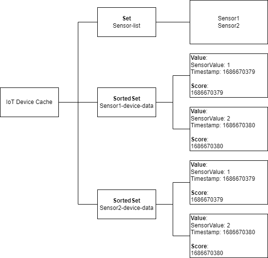

# Storing time series data

Temporarily storing time series data enables you to visualize that data without having to worry about long-term storage costs. Let's think about a common use case for time series data like IoT sensors. Sure, it's useful to see what the recent data looks like, but do you need to keep each sensor value indefinitely? With numerous sensors sending metrics into your database, your storage costs will skyrocket. Storing that data in Momento instead is a great way to take advantage of what Momento does best - storing large volumes of data without having to worry about scaling or long-term storage costs.

You can store related data elements in Momento's collection data types such as [lists](./../api-reference/list-collections.md), [sets](./../api-reference/set-collections.md), and [dictionaries](./../api-reference/dictionary-collections.md). You should pick the appropriate data type for your application's access patterns and data schema. For time series data, you should use Momento's [SortedSet data type](./../api-reference/sorted-set-collections.md). You can read more about `SortedSets` [in this blog](https://www.gomomento.com/blog/were-back-with-another-collection-data-type-sorted-sets).

### Why use SortedSets?

- Sorting your time series data by timestamp makes it easy for client applications to retrieve and display the data in sorted order.
- Limit query responses with the Momento SDK's [SortedSetFetchByRank](./../api-reference/sorted-set-collections.md#sortedsetfetchbyrank) and [SortedSetFetchByScore](./../api-reference/sorted-set-collections.md#sortedsetfetchbyscore) to a certain number of values or values within a certain timespan.

## Storing time series data in the SortedSet
Use the Momento SDK's [SortedSetPutElement](./../api-reference/sorted-set-collections.md#sortedsetputelement) method to insert items into your SortedSet.

Let's consider a workload for storing IoT sensor data in a Momento Cache.

- Each sensor has its own SortedSet.
- Each sensor_value within sensor's SortedSet is a JSON string containing the value and timestamp
i.e. `JSON.stringify("value":1, "timestamp": 1686583076)`
- Each score for the item in the SortedSet is the timestamp of the datapoint. SortedSets use scores to sort the data within the set.

>Code snippet for writing SortedSet into the Cache

```javascript
const item_value = JSON.stringify({"sensor_value": sensor_value, "timestamp": timestamp})

const response = await cacheClient.sortedSetPutElement("sensor_data", `${sensor_id}-sensor-data`, item_value, timestamp)
```

Retrieving time series data from the sorted set:

Use SortedSetFetchByRank to retrieve data from the cache. If you want to retrieve the entire SortedSet, don't pass in any startRank and endRank parameter values.

>Code snippet for SortedSetFetchByRank to retrieve the entire SortedSet

```javascript
const sensor_data = await cacheClient.sortedSetFetchByRank("sensor_data", `${sensor_id}-sensor-data`)
```

If you only want to retrieve a subset of the SortedSet, you could set the startRank and endRank parameter values as follows:

>Code snippet for SortedSetFetchByRank to retrieve a subset of the SortedSet

```javascript
const sensor_data = await cacheClient.sortedSetFetchByRank("sensor_data", `${sensor_id}-sensor-data`, 0, 10)
```

If you only want to retrieve data from a specified time period instead of a specific number of values, you can use [SortedSetFetchByScore](./../api-reference/sorted-set-collections.md#sortedsetfetchbyscore). 

>Code snippet for SortedSetFetchByScore to retrieve a subset of the SortedSet

```javascript
const sensor_data = await cacheClient.sortedSetFetchByScore("sensor_data", `${sensor_id}-sensor-data`, 1686511076, 1686597476)
```

## Considerations for time series data

### Time To Live (TTL) Values

Your SortedSet's [CollectionTTL object](/cache/develop/api-reference/collection-ttl) will be configured depending on how long you want to keep the time series data for each sensor. By default, a SortedSet's TTL will be refreshed any time it is modified, meaning it will keep growing as long as you continue adding elements to it.

:::caution

The CollectionTTL specifies the TTL for the entire collection, in this case, for the entire SortedSet, *not* for setting the TTL of individual elements within SortedSets. The elements within will not expire if the SortedSet does not expire.

:::

### Sensor Index Set

If you have multiple sensors pushing data into your cache, consider adding a Set data type to store all the Sensor ID's. You must pass in a Sensor ID when fetching data from the SortedSets. Your client application can retrieve all the Sensor ID's from this Set prior to fetching the time series data, then fetch data for every sensor from the Sorted Sets.


