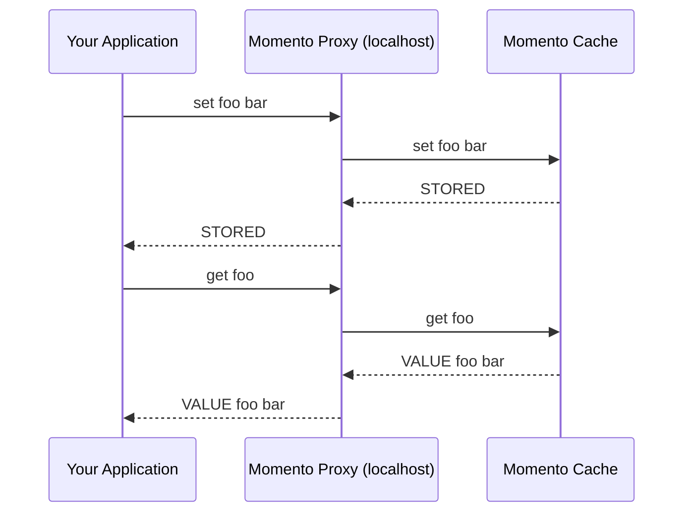

# Momento Proxy

Momento Proxy is a lightweight drop-in replacement for [Memcached](https://memcached.org/) that lets you use Momento Cache *without changing your application code*. This proxy enables Memcached-compatible applications to instantly benefit from Momento's scalable, enterprise-grade caching platform.

## Why it matters

For teams maintaining Memcached-based applications, switching cache providers typically means rewriting application code. Momento Proxy removes that barrier. By acting as a local intermediary, it translates standard Memcached commands (`get` and `set`) into [Momento Cache operations](/cache/develop/api-reference#data-apis), so your system can start using Momento immediately—without a single code change, minimizing your time and effort to get to production.

### Key benefits

- **Zero code changes** — Simply run the proxy locally and redirect your Memcached traffic to it.
- **Language agnostic** — Works with any Memcached-compatible client, including Java, Python, Go, and more.
- **Lightweight and fast** — Built in Rust for performance and low memory overhead.
- **Operational visibility** — Exposes real-time runtime statistics via the Memcached stats command on a dedicated admin port.
- **Command auditing** — Logs cache operations to support audit trails and offline workload analysis.

## How it works

Once configured, Momento Proxy listens on the same ports used by Memcached and forwards incoming `get`/`set` requests to the appropriate Momento Cache. You simply set your application to talk to `localhost` instead of a remote Memcached endpoint.

This sequence diagram shows the lifecycle of a typical set and get operation when using Momento Proxy. Your application sends Memcached-compatible commands to the proxy running on localhost. The proxy translates and securely forwards these requests to the Momento Cache service using your API key. Responses are translated back into the Memcached protocol format before being returned to your application.

### Under the hood

* **Authentication** — All requests are authenticated using your Momento API key.
* **Configuration** — A TOML config file specifies which ports the proxy listens on and which caches it connects to.
* **Translation** — The proxy parses incoming Memcached commands, translates them into Momento API calls, and formats the responses accordingly.
* **Diagnostics** — An admin port is exposed for runtime statistics and operational visibility.

## Roadmap

Momento Proxy will continue to get better and faster. Future improvements are coming soon and include:

- **Local caching in the proxy** — Reduce round-trip latency and avoid cold caches on redeploy.
- **SSD-based caching** — Take advantage of local disk to boost cache performance.

---

Ready to get started? Head over to [Build and Run](/docs/cache/proxy/configuration) to launch Momento Proxy in your environment.

