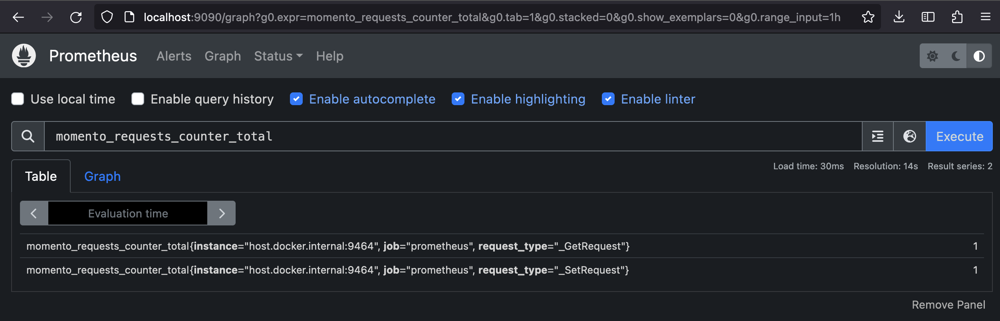
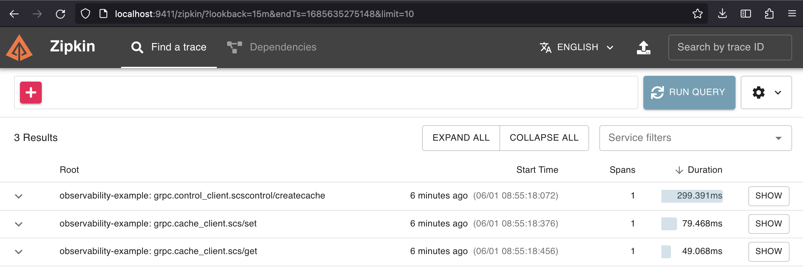

import { SdkExampleCodeBlock } from "@site/src/components/SdkExampleCodeBlock";
// This import is necessary even though it looks like it's un-used; The inject-example-code-snippet
// plugin will transform instances of SdkExampleCodeBlock to SdkExampleCodeBlockImpl
import { SdkExampleCodeBlockImpl } from "@site/src/components/SdkExampleCodeBlockImpl";

# Observability with Momento in Node.js


## Metrics
Metrics are measurements that provide quantitative information about system performance and behavior. They are numerical values captured and recorded over regular intervals, providing statistical data to aid in understanding the trends and patterns in a system.

For Momento specifically, you might desire to capture metrics on the number of requests made, their duration, request or response size, or failure rates. Capture these in the Node.js SDK using a middleware, which intercepts the Momento gRPC calls and responses. Here is an example that uses OpenTelemetry and Prometheus to capture request count faceted by request type:

First, set up metrics in your application:

<SdkExampleCodeBlock language={'javascript'} snippetId={'observability_setupMetrics'} />

Then, create a middleware that captures the metric:

<SdkExampleCodeBlock language={'javascript'} file={'example-metric-middleware.ts'} />

When you create the Momento `CacheClient`, add the middleware and the metric will be incremented with each request:

<SdkExampleCodeBlock language={'javascript'} snippetId={'API_InstantiateCacheClientWithMiddleware'} />

Here is an example of the Prometheus UI displaying the `momento_requests_counter` metric for two calls, a get and a set:


## Traces
Traces provide a detailed timeline of processes within an application, showing the relationship between different components and services involved in a specific request or operation. They allow developers to analyze the sequence and duration of these operations, facilitating a better understanding of how data flows through the system.

The Momento Node.js SDK uses gRPC internally to communicate with the Momento servers. OpenTelemetry provides a capability for auto-instrumenting all gRPC calls with traces. You don't need to add any middleware code to produce these traces, like you do for the metrics. Here is an example that automatically generates traces for these calls and exports them to Zipkin:

<SdkExampleCodeBlock language={'javascript'} snippetId={'observability_setupTracing'} />

This needs to run before any Momento code.

Here is an example of the Zipkin UI displaying traces for a cache creation, a get, and a set:


If the performance of your application is impacted by trace generation, you should consider sampling them to cut down on the number of traces generated. You can do this with OpenTelemetry by setting two environment variables:

```cli
export OTEL_TRACES_SAMPLER="traceidratio"
export OTEL_TRACES_SAMPLER_ARG="0.1"
```
Setting these will ensure that only 10% of traces are created.
