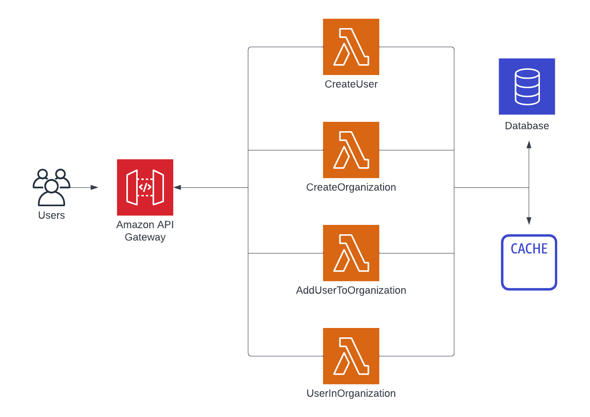

# Introduction and setup

In this tutorial, you will learn how to add a cache to your serverless application with AWS Lambda. To do so, you will use Momento Cache, a cache service built for​​ deep integration with serverless applications. Momento Cache combines instant, elastic, cache storage with a pay-for-value pricing model, and blazing-fast performance.

As you work through this tutorial, you will build a simple account management service for your application. You'll have endpoints for creating users and organizations and for adding users to an organization via memberships. Finally, you'll be able to check whether a user belongs to an organization, a frequently used authorization pattern.

This tutorial includes conceptual material about implementing caching and building serverless applications as well as practical, step-by-step tips for deploying and interacting with your account management service.

One of the key concepts we will discuss is the different approaches to caching, including the tradeoffs of using different caching strategies. To learn more about this, check out our page on [caching patterns](./../../../introduction/common-caching-patterns).

Additionally, this tutorial will show practical aspects of integrating Momento with AWS Lambda. If you want a more succinct reference, check out our guide on [caching with AWS Lambda](./../../guides/caching-with-aws-lambda).

This tutorial has five steps:

1.  Introduction to the tutorial and environment setup.

2.  Deploy a serverless application with API Gateway, Lambda, and DynamoDB.

3.  Install and configure Momento for your application.

4.  Implement a read-aside cache pattern in your application.

5.  Use a write-aside cache pattern for improved performance and cache freshness.

## What we're building

We will be building an account management service for a larger SaaS application.

Our application has support for both Users and Organizations, and Users may take actions on behalf of Organizations. In order to support this, many parts of our application will need to ensure a particular User belongs to a particular Organization.

To handle this, we will be modeling three entities in our service:

- A _User_ entity, which represents a single human user of our application;

- An _Organization_ entity, which represents a group of Users that manage resources within our application;

- A _Membership_ entity, which represents a relationship between a User and an Organization such that the User is allowed to take certain actions within the Organization.

To interact with these entities, we will set up the following HTTP endpoints:

- _CreateUser_ (`POST /users`), which is used for User signup;

- _CreateOrganization_ (`POST /organization`), which is called by a User to create a new Organization;

- _AddUserToOrganization_ (`POST /organization/{organizationName}/members`), which is called by an existing member of an Organization to add a new User to an Organization;

- _UserInOrganization_ (`GET /organization/{organizationName}/members/{username}`), which is called to see if a User belongs to an Organization and fetch details about the User's role in the Organization.

Our application is necessarily simplified in order to focus on the key points we want to teach. There are no endpoints to update Users or Organizations, to list all Members of an Organization, or to remove a User from an Organization. Further, we won't have a true authentication system and will rely on crude measures like passing in a username via an HTTP header.

## Setup

Before we start, let's get your environment set up so that you can follow along with the steps in this tutorial.

First, the tutorial uses Node.js and related dependencies, so you will need to install that on your machine. Please follow the installation instructions on the [Node.js downloads page](https://nodejs.org/en/download/).

Second, we will use the [Serverless Framework](https://www.serverless.com/framework/docs) to build and deploy our serverless application. The Serverless Framework is a CLI tool written in Node.js and can be installed by running the following command in your terminal:

    npm install -g serverless

Third, we will be deploying an application to Amazon Web Services (AWS). To do so, you will need an AWS account and credentials in your environment. If you don't have AWS credentials configured in your local environment, follow the guide from the Serverless Framework documentation on [configuring your environment](https://www.serverless.com/framework/docs/providers/aws/guide/credentials/).

Finally, all the code for this tutorial is available in a GitHub repository. You can clone the code to your machine using the following command:

    git clone git@github.com:momentohq/serverless-tutorial.git

Now that we've set up our environment, let's move on to the next step where we will deploy our serverless application.
