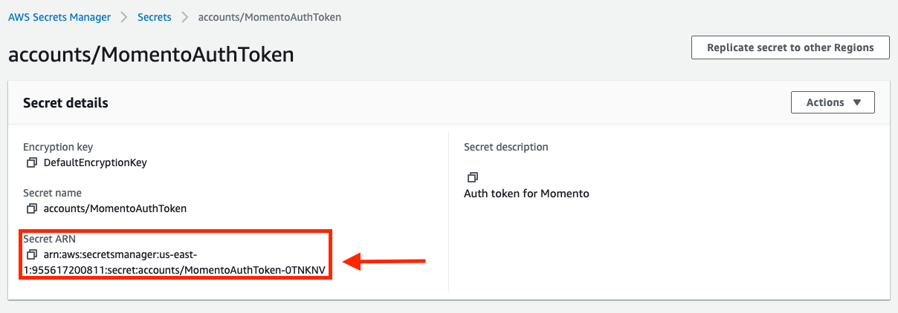

# Configuring Momento Serverless Cache

In the previous step, we deployed a basic serverless application using AWS Lambda, API Gateway, and Amazon DynamoDB. With this, we implemented the basics of account management within our application.

In the next few steps, we're going to add caching to our serverless application using Momento. The account management service will be heavily relied upon by other services, so we want to make sure it is fast and reliable. Using a cache will reduce latency and the load on our primary database.

In this step, we will sign up for the Momento service and configure it for usage in our serverless application. As we do so, we will learn more key concepts about using Lambda correctly, including some subtle details about the runtime model that make a big difference in performance. For this step, we'll be using the `step-2` branch in the [tutorial repository](https://github.com/momentohq/serverless-tutorial/tree/step-2).

If you want to skip the concepts and go directly to the implementation, navigate ahead to the section on [installing and configuring Momento in your serverless application](#installing-and-configuring-momento-in-your-serverless-application).

## Key concepts about the AWS Lambda runtime model

Before we get to the implementation, we're going to examine two concepts that will help us understand how we're configuring Momento in our serverless applications. First, we'll take a look at the Lambda function lifecycle and the concept of cold starts. Then, we'll learn about how to reuse resources within Lambda despite its general statelessness.

### Lambda lifecycle and cold starts

To understand some of the choices we make in our code, we need to understand a bit more about how the Lambda lifecycle works.

As discussed in the previous step, AWS Lambda is event-driven, function-based compute. The first part, event-driven, means that your function is only executed in response to a configured event. There are a number of events you can configure for your Lambda function, from HTTP requests in API Gateway to queue messages in Amazon SQS to a batch of stream records in Amazon Kinesis. Upon the occurrence of your configured event, Lambda will invoke an instance of your code with details of the event. Your function instance will then handle the given event.


When we say Lambda is _function-based compute_, we're talking about how Lambda manages and executes your code. In creating a Lambda function, you upload a ZIP file or a container image that includes your code. You also specify an entrypoint handler for your function, which is an exported function in a specific file.

The interesting part is when these two elements combine. Lambda doesn't keep live instances of your function running by default. Rather, it dynamically creates them as needed.

For example, when you make a POST request to your /users path to create a new User, API Gateway will route the event to your createUser Lambda function to handle the request. The first time you make this request, there won't be a function instance available, so the Lambda service will create a new instance of your function by downloading your code, loading it into memory, and executing it.


This process takes time -- there's the data transfer to actually download the code to an AWS-managed instance, plus the time to read your code from disk, resolve the dependencies, and load the objects into memory. This initial set up time is called a _cold start_ and can add anywhere from 30 milliseconds to a few seconds of latency to your function, depending on a variety of factors. Most optimized applications take less than a few hundred milliseconds for a cold start.

However, in order to enhance efficiency, the Lambda service doesn't create a new function instance for every event that triggers your function. Once a function instance has been created to respond to an event, the Lambda service keeps that function instance running and available for subsequent requests. If a new request comes in, the service will use this idle, running Lambda function instance rather than creating a new instance and waiting for the cold start.


Note that each Lambda function instance will handle at most one event at any given time. Thus, if an event comes in while all existing Lambda function instances are busy handling other events, the Lambda service will spin up a new function instance to handle the event.


There are a few key takeaways here. First, the Lambda service is dynamic -- it will create and destroy function instances according to the amount of traffic you have. If you get a burst of events triggering your Lambda function, the service will spin up multiple function instances to handle each request.

Second, the initial invocation for any particular Lambda function instance will take longer due to the initialization required. This includes downloading your function code, loading the code into memory, and starting the function instance. This additional latency on the initial request to a function instance is commonly called a "coldstart".

Finally, a Lambda function instance can only handle a single event at a time, but the instance might handle multiple requests over a period of time. The Lambda service will keep running instances available after creation in order to rapidly serve subsequent requests. After a period of non-activity, the service may destroy running function instances.

### Service code and object reuse

In the previous step, we looked at the handler code for one of our Lambda functions. One thing we noted was that the handler code was pretty sparse -- it gathered the input to our function, and it returned an output in the expected shape, but most of the work was done via an AccountService class instance.

Let's take a look at our AccountService code now. In the `src/accounts` directory, there is a `service.js` file which contains our AccountService definition. The code should look as follows:


The AccountService implementation is pretty straightforward. The AccountService is implemented as a class, which takes in a DynamoDB client in its constructor. It then has various methods, such as `createUser`, `getUser`, `createOrganization, getOrganization`, that will be used to access and manipulate data across this domain. Nothing is too special about this -- in most senses, a serverless application is just like a normal application.

Navigate to the bottom of the `service.js` file, where you will see the following:


Notice that there is an exported `getAccountService` function. Above the function, there is a global `service` variable that is initialized to `null`. Within the `getAccountService` function, it returns the `service` variable if it has been initialized. If not, it initializes an instance of the service, assigns it to the `service` variable for future use, and returns it to the caller.

Notice that within the getAccountService function, it is calling a `getDynamoDBClient` function. If you look at the `src/clients/dynamodb.js` file for the details of that function, you can see a similar pattern as the AccountService instance, where we reuse a single instance of the client.


So, why are we centralizing client creation, and why are we creating a single instance of a client?

Centralizing client creation is a pattern you might use regardless of your deployment environment, as it simplifies setting configuration values that are common across all users of your client. But using a single instance of our client is an optimization specific to AWS Lambda and its runtime model.

Remember the notes about the Lambda lifecycle in the section above. While a function instance can only handle a single request at a time, the same function instance might serve multiple requests over its lifetime.

While a Lambda function is generally stateless from request to request, you can take advantage of the reuse of a single Lambda function instance to improve performance of your application. When your Lambda function is invoked, everything within the handler function is new on each request. However, variables _outside_ the function, in the global variable scope, can be reused across requests.


In the image above, the variables within our handler are reset on each invocation to our Lambda function. However, the global `counter` variable is persistent across invocations. We can use this strategically to reuse variables, particularly service clients.

When using a service that requires a network request, a large portion of the initial request time is in establishing a connection with the remote service. You have to open a socket, perform TCP handshake and maybe a TLS handshake before you can start sending and receiving data. This process takes time and is comparable to the 'coldstart' you face with your Lambda function.

Just like Lambda reuses function instances to amortize the cost of function initialization over many invocations, we want to reuse our client instance to amortize the cost of connection initialization. Thus, we create our service clients in a global variable space, allowing us to reuse the client and its corresponding connection, reducing latency in subsequent requests to our services.

## Installing and configuring Momento in your serverless application

With our concepts out of the way, let's get down to the details of configuring Momento for use in our serverless application. We'll go through three steps:

- Signing up for Momento and getting an authentication token;

- Storing our authentication token in AWS Secrets Manager;

- Installing and configuring our Momento client.

### Signing up for Momento and getting an authentication token

The first step is to sign up for the Momento service and get our authentication token. The authentication token must be included on requests to the Momento service to authenticate and authorize our requests.

To get a Momento token, you first need to install the Momento CLI. You can do so with Homebrew using the following commands:

```
brew tap momentohq/tap
brew install momento-cli
```

Then, provision a token with the `account signup` command:

```
momento account signup --region us-west-2 --email your-email@example.com
```

Be sure to use the region and email address you want to use for your Momento account. You will receive an email with your Momento access token.

Once you have your token, configure it in your CLI with the `momento configure` command.

```
$ momento configure
Token: // < Enter token from email here.
Default Cache [default-cache]: accounts-cache
Default Ttl Seconds [600]: 30
```

Enter the token into the command, and use a cache named `accounts-cache` as your default cache.

For more on getting started with Momento, you can follow the [getting started guide](./../../../getting-started). You can also learn more about the Momento authentication token in the [Momento Concepts](./../../../learn/how-it-works/#authentication-token) material.

### Storing our authentication token in AWS Secrets Manager

Now that we have our Momento authentication token, we need to make it accessible to our serverless application.

If you look at our `serverless.yml` file, we are able to inject environment variables into our function at runtime using the `environment` property in the `provider` block. However, environment variables are not recommended for storing sensitive values like API keys and other secrets as they can easily be accessed by compromised third-party dependencies in our application.

Instead, we'll use AWS Secrets Manager. AWS Secrets Manager is a dedicated service for handling your secrets with fine-grained permissions and automated secret rotation. We can then retrieve the secret from our Lambda functions using the Secrets Manager API.

Navigate to the [AWS Secrets Manager section of the AWS console](https://console.aws.amazon.com/secretsmanager/home). Make sure you are in the same region you used for your serverless application. Then, click the **Store a new secret** button to add a new secret to Secrets Manager.


This will open the Secrets Manager wizard for creating a new secret.

For the **Secret type**, select "**Other type of secret**". Then, enter "**MOMENTO_AUTH_TOKEN**" for your secret key and paste your authentication token as the secret value.

You can keep the default encryption key. Click the **Next** button to continue the wizard.


On the next screen, give your secret a **Secret name** of "**accounts/MomentoAuthToken**" and enter a quick description of the secret. Then, click **Next.**


The next screen handles secret rotation, which we will not set up here. Click **Next** to continue to the final screen.

On the final page, click the **Store** button to confirm storage of your secret.

You should now see your secret listed on the Secrets Manager page:


Now that we have stored our secret in AWS Secrets Manager, let's configure a Momento client in our serverless application.

### Installing and configuring our Momento client

The final part of this step is to install the Momento SDK and create a client to use in our application. You can make the edits to the application yourself, or you can see the final version for this step using the `step-2` branch of the [tutorial repository](https://github.com/momentohq/serverless-tutorial/tree/step-2).

Let's start by installing the Momento SDK. We're using Node.js for our application, so we can install the Momento SDK using npm:

    npm install @gomomento/sdk

Because we installed the package and added it to our `package.json` file, the Serverless Framework will include it with our Node dependencies in the ZIP files for our Lambda functions.

Note: If you are using a language other than Node for your serverless application, the same basic approach applies. However, if you are using Python, be sure to compile the Python SDK for the Lambda environment as it includes a gRPC library with C extensions. You can find instructions on this in our guide for [using Momento with AWS Lambda](./../../guides/caching-with-aws-lambda#python).

With our SDK installed, we can now create and configure our client.

In the `src/clients` directory, create a directory called `momento.js` with the following contents:

    const AWS = require("aws-sdk");
    const { SimpleCacheClient } = require("@gomomento/sdk");

    MOMENTO_SECRET_ID = "accounts/MomentoAuthToken";
    MOMENTO_DEFAULT_TTL = 60;

    let client = null;

    const getMomentoClient = async () => {
      if (client) return client;
      const token = await getMomentoAuthToken();
      client = new SimpleCacheClient(token, MOMENTO_DEFAULT_TTL);

      return client;
    };

    const getMomentoAuthToken = async () => {
      const sm = new AWS.SecretsManager({
        httpOptions: {
          connectTimeout: 1000,
          timeout: 1000,
        },
      });

      const response = await sm
        .getSecretValue({
          SecretId: MOMENTO_SECRET_ID,
        })
        .promise();

      return JSON.parse(response.SecretString).MOMENTO_AUTH_TOKEN;
    };

    module.exports = {
      getMomentoClient,
    };

You can see this follows a similar pattern as the DynamoDB client we reviewed earlier in this step. It creates an empty global variable, then hydrates that variable the first time the `getMomentoClient` function is called. Subsequent uses of the Momento client for that function instance will reuse the same client and thus benefit from existing connections.

Notice that we're also calling out to AWS Secrets Manager to retrieve the Momento authentication token we stored. You could use the same client-reuse behavior for the Secrets Manager client that we use for the DynamoDB and Momento clients. However, because the Secrets Manager service will only be called once per function instance -- to help initialize the Momento client -- we can skip it in this case.

Now that we have added a way to create and retrieve our Momento cache client, let's add the cache client to our AccountService class. We'll inject a Momento cache client into our instance upon construction so that it can be used when needed by the class.

Navigate to the `src/accounts/service.js` file. Update the `constructor` method for your `AccountService` class so that it looks as follows:

    class AccountService {
      constructor(dynamoDBClient, cacheClient) {
        this._dynamoDBClient = dynamoDBClient;
        this._cacheClient = cacheClient;
      }

Additionally, we want to update our helper function to create and reuse the AccountService instance. Navigate to the bottom of the `src/accounts/service.js` file. Update the `getAccountService` function so it looks as follows:

    module.exports.getAccountService = async (props) => {
      if (service) return service;

      let dynamoDBClient = (props || {}).dynamoDBClient;
      if (!dynamoDBClient) {
        dynamoDBClient = getDynamoDBClient();
      }

      let cacheClient = (props || {}).cacheClient;
      if (!cacheClient) {
        cacheClient = await getMomentoClient();
      }

      service = new AccountService(dynamoDBClient, cacheClient);

      return service;
    };

Notice that the function is injecting a cache client instance into our AccountService instance to satisfy the constructor. The caller of the getAccountService function can provide their own cache client, which can help with testing, but the default behavior is to fetch our reused cache instance with the `getMomentoClient` function we just implemented.

You'll need to import this function into our service module, so add the following import to the top of the `src/accounts/service.js` file:

    const { getMomentoClient } = require("../clients/momento");

Further, `getAccountService()` is now an async function, as the call to `getMomentoClient` is async given that we may need to make a call to AWS Secrets Manager. In each of your handler functions, make sure you update them to `await` the call to `getAccountService()`.

Below is an example from the `createUser` handler:

```javascript
const handler = async (event, context) => {
  const { username, firstName, lastName } = JSON.parse(event.body);

  const accountService = await getAccountService();

  const user = await accountService.createUser({
    username,
    firstName,
    lastName,
  });

  ...
}
```

Finally, we need to make some small updates to our `serverless.yml` file. Our Lambda functions will be calling a new AWS service as part of our changes and thus will need updated IAM permissions that grant our functions the ability to do so.

First, find your secret in the [AWS Secrets Manager console](https://console.aws.amazon.com/secretsmanager/home). Copy the **Secret ARN** value for your secret.



In your `serverless.yml` file, there is an `iam` section within the `provider` block. Add a new IAM statement so that your iam section looks as follows:

      iam:
        role:
          statements:
            - Effect: 'Allow'
              Action:
                - 'dynamodb:GetItem'
                - 'dynamodb:PutItem'
                - 'dynamodb:ConditionCheckItem'
              Resource: !GetAtt 'DynamoDBTable.Arn'
            - Effect: "Allow"
              Action:
                - "secretsmanager:GetSecretValue"
              Resource: "<yourSecretArn>"

Be sure to replace "&ltyourSecretArn>" with the Secret ARN that you copied from the AWS console.

We also want to tell our application the name of the cache we created in Momento. Because this is not a sensitive value, we can inject it as an environment variable.

In the environment section within the provider block, update your application secrets to include the cache name as follows:

      environment:
        TABLE_NAME: !Ref DynamoDBTable
        CACHE_NAME: 'accounts-cache'
        AWS_NODEJS_CONNECTION_REUSE_ENABLED: 1

Our Momento client can use this environment variable to interact with the correct cache in our Momento account.

That's it! You have now installed and configured a Momento client in your serverless application.

In the next step of this tutorial, we'll see how to use our client by implementing a read-aside caching strategy in our application.
