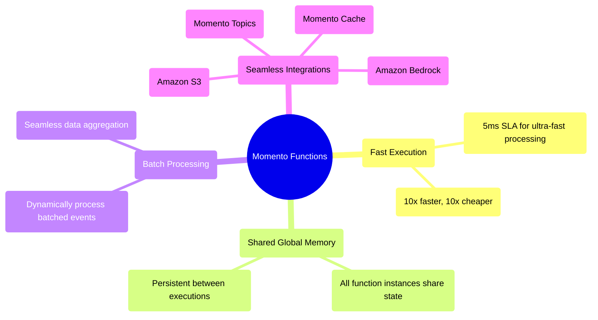

# Momento Functions

*Momento Functions* are a high-speed compute layer designed for processing massive amounts of real-time data. Whether you're aggregating IoT sensor data, handling financial transactions, or enriching event streams with AI, *Momento Functions* allow you to process, transform, and act on data instantly—without managing infrastructure.

Built for extreme scale and performance, functions offer low-latency execution and shared global memory across all running function instances. Unlike general-purpose serverless compute, they do not execute in isolation, allowing all instances of a function to share state for efficient data processing.

## What makes Momento Functions different?
Traditional serverless platforms execute functions in isolation, requiring external coordination for batching, state sharing, and data transformations. Momento Functions remove these limitations:

* Global memory shared across all function instances enables stateful execution without an external database.
* Automatic batching allows functions to process multiple related events in a single execution cycle.
* No concurrency limits means functions can instantly scale to handle millions of invocations per second without cold starts.
* 5ms execution SLA provides ultra-fast response times, 10x faster and 10x cheaper than alternatives.

## What can you build?

### Live analytics and telemetry
Aggregate millions of IoT sensor readings or telemetry beacons per second to power dashboards and automate real-time decision-making.

### Fraud detection and financial transactions
Analyze past transactions stored in shared global memory to detect anomalies, flag suspicious activity, and improve fraud detection accuracy.

### AI-powered data processing
Enrich real-time event streams by invoking Amazon Bedrock AI models, allowing intelligent decision-making at scale.

### Media and entertainment optimization
Analyze viewer engagement data in real-time and dynamically optimize content delivery to improve user experience.
