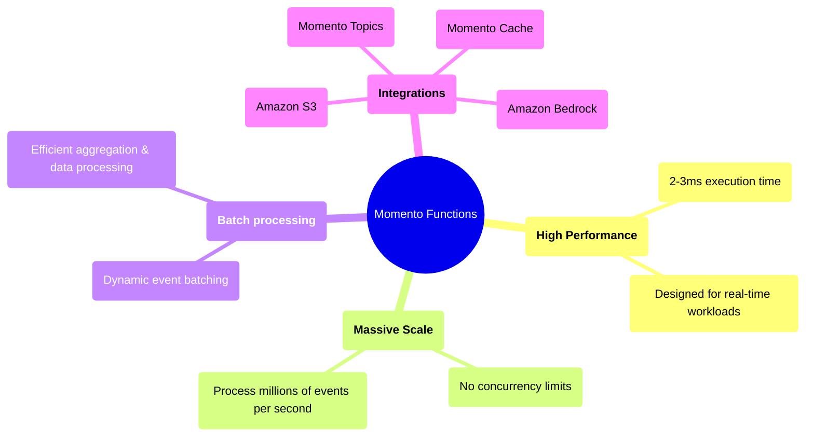

# Momento Functions
*Momento Functions* provide a high-throughput compute layer designed for event-driven applications at massive scale. Whether you're analyzing millions of telemetry events per second, processing real-time financial transactions, or enhancing AI-driven workflows, Momento Functions let you act on data instantly—without managing infrastructure.

Unlike general-purpose serverless platforms, Momento Functions prioritize extreme performance and seamless integration with [Momento Cache](/cache), [Momento Topics](/topics), [Amazon S3](/functions/integrations/s3), and [Amazon Bedrock](/functions/integrations/bedrock).

:::note
Momento Functions execute **synchronously**, returning results immediately upon invocation. Streaming responses **are not supported**.
:::

## What Can You Build?

**Live Analytics & Telemetry**
Process and aggregate **millions of IoT signals or telemetry beacons per second** to power dashboards and automated decision-making.

**Fraud Detection & Financial Transactions**
Detect **anomalous spending patterns in real time**, flag suspicious transactions, and protect users from fraud **as events occur**.

**AI-Powered Data Processing**
Enrich event streams with **AI-generated insights** by dynamically invoking **Amazon Bedrock models** at scale.

**Media & Entertainment Optimization**
Analyze **viewer engagement in real time**, dynamically optimize **content delivery**, and improve **ad targeting** during live events.
