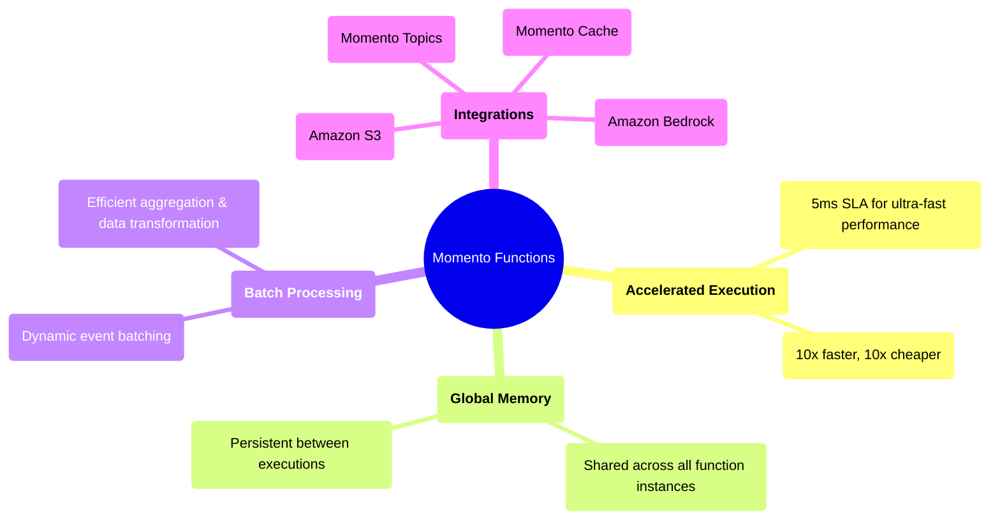

# Momento Functions
*Momento Functions* provide a high-throughput compute layer designed for event-driven applications at massive scale. Whether you're analyzing millions of telemetry events per second, processing real-time financial transactions, or enhancing AI-driven workflows, Momento Functions let you act on data instantly—without managing infrastructure.

Unlike general-purpose serverless platforms, Momento Functions prioritize extreme performance and seamless integration with [Momento Cache](/cache), [Momento Topics](/topics), [Amazon S3](/functions/integrations/amazon-s3), and [Amazon Bedrock](/functions/integrations/amazon-bedrock).

## What makes Momento Functions different?
Traditional serverless platforms struggle with high-frequency event processing because they execute in isolation and require manual coordination for batching. Momento Functions remove these barriers by allowing functions to access batched events dynamically and fan out operations seamlessly. This makes them ideal for high-throughput real-time workloads without the overhead of managing state externally.

## What Can You Build?

### Live analytics and telemetry
Process and aggregate millions of IoT signals or telemetry beacons per second to power dashboards and automated decision-making.

### Fraud detection and financial transactions
Detect anomalous spending patterns in real time, flag suspicious transactions, and protect users from fraud as events occur.

### AI-powered data processing
Enrich event streams with AI-generated insights by dynamically invoking Amazon Bedrock models at scale.

### Media and entertainment optimization
Analyze viewer engagement in real time, dynamically optimize content delivery, and improve ad targeting during live events.
