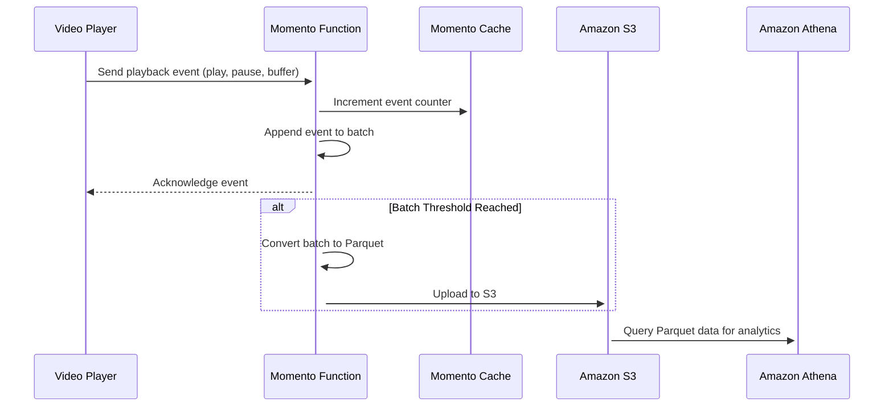

# Integrating Momento Functions with Amazon S3
*Momento Functions* can write data to [Amazon S3](https://aws.amazon.com/s3/) for durable storage and real-time analytics. By storing function output in [Parquet format](https://parquet.apache.org/docs/overview/), streaming platforms, IoT applications, and monitoring systems can efficiently analyze trends and performance over time.

## How it works
Functions must be configured with an [IAM role](/functions/authentication/aws-role-delegation) that grants permission to write objects to an Amazon S3 bucket.

### Example workflow
1. A function receives event data from a video player (e.g., play, pause, buffering).
2. The function increments event counters in Momento Cache to track real-time metrics.
3. The event data is added to an in-memory batch processor.
4. When the batch reaches the threshold, it is converted to Parquet and written to Amazon S3.
5. Amazon Athena (or another analytics service) can later query the stored Parquet files to analyze trends.



## Writing to Amazon S3 from a function
Once the IAM role is configured, a function can process incoming data, apply transformations, and write results to Amazon S3. By leveraging Parquet format, functions can efficiently store structured data, enabling downstream analytics, archival, and integration with tools like Amazon Athena, machine learning pipelines, or business intelligence dashboards.

### Example: Video playback analytics
This example demonstrates how a function increments counters in Momento Cache and batches event data for storage in Amazon S3.

```rust
use momento::{CacheClient, Response};
use serde::{Deserialize};
use std::sync::Arc;
use aws_sdk_s3::Client as S3Client;
use aws_smithy_types::byte_stream::ByteStream;
use chrono::{Utc, Datelike, Timelike};
use parquet::arrow::ArrowWriter;
use parquet::basic::Compression;
use parquet::file::properties::WriterProperties;
use uuid::Uuid;
use tokio::sync::Mutex;

use crate::context::AppContext;

const BATCH_SIZE: usize = 100; // Process the batch when it reaches 100 events
const CACHE_NAMESPACE: &str = "video-metrics";

#[derive(Deserialize)]
struct PlaybackEvent {
    user_id: String,
    event_type: String,
    video_id: String,
    timestamp: String,
}

lazy_static::lazy_static! {
    static ref EVENT_BATCH: Mutex<Vec<PlaybackEvent>> = Mutex::new(Vec::new());
}

pub async fn handler(
    request: momento::Request<PlaybackEvent>,
    context: Arc<AppContext>,
) -> Response<String> {
    let event = request.body();

    // Increment playback event counters in Momento Cache
    let counter_key = format!("event_count:{}", event.event_type);
    let _ = context.cache_client.increment(CACHE_NAMESPACE, counter_key, 1).await;

    // Add event to batch
    let mut batch = EVENT_BATCH.lock().await;
    batch.push(event.clone());

    if batch.len() >= BATCH_SIZE {
        let compressed_parquet = convert_to_parquet(&batch);
        let upload_key = format!(
            "{}/{:02}/{:02}/{:02}/batch_{}.parquet",
            Utc::now().year(),
            Utc::now().month(),
            Utc::now().day(),
            Utc::now().hour(),
            Uuid::new_v4()
        );

        let success = upload_to_s3(upload_key, compressed_parquet, context.s3_client.clone()).await;

        if success {
            batch.clear();
            Response::json("Batch processed and uploaded to S3")
        } else {
            Response::json("Failed to upload batch to S3")
        }
    } else {
        Response::json("Event recorded, waiting for batch to fill")
    }
}

fn convert_to_parquet(events: &[PlaybackEvent]) -> Vec<u8> {
    let mut parquet_buffer = Vec::new();
    let props = WriterProperties::builder()
        .set_compression(Compression::ZSTD)
        .build();
    let mut writer = ArrowWriter::try_new(&mut parquet_buffer, schema, Some(props)).unwrap();

    writer.write(&batch).expect("Failed to write batch");
    writer.close().expect("Failed to close writer");

    parquet_buffer
}

async fn upload_to_s3(
    key: String,
    data: Vec<u8>,
    s3_client: Arc<S3Client>,
) -> bool {
    match s3_client
        .put_object()
        .bucket("your-bucket-name")
        .key(key)
        .body(ByteStream::from(data))
        .send()
        .await
    {
        Ok(_) => true,
        Err(e) => {
            log::error!("Failed to upload Parquet file to S3: {}", e);
            false
        }
    }
}
```

## Use Cases
Momento Functions with Amazon S3 enable real-time analytics pipelines across various industries:

**Video playback analytics with real-time counters**
Track playback, pause, and buffering events in real time while storing detailed playback logs in S3 for later analysis.

**IoT device telemetry tracking**
Aggregate IoT sensor readings, increment live statistics in Momento Cache, and batch data into S3 for machine learning models.

**Log aggregation with event counting**
Combine real-time log counters in Momento Cache with structured logs in S3 for monitoring performance and security.

**Operational metrics for business intelligence**
Collect key business events, store them in S3, and enable ad-hoc queries with Amazon Athena for insights.

## Security Considerations
When integrating with Amazon S3, it is important to ensure that *IAM roles are correctly scoped* to grant only the necessary permissions, preventing over-permissioning and unintended access. Functions should be designed to validate and sanitize data before writing to S3 to avoid storing malformed or untrusted data. By enforcing strict access controls and input validation, you can maintain a secure and reliable data pipeline.
