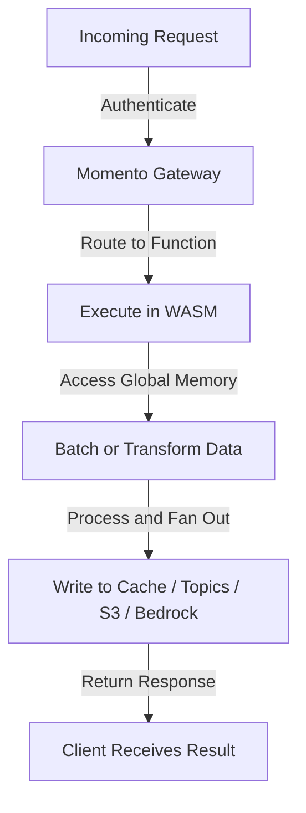

# How Momento Functions work

*Momento Functions* provide a high-throughput compute layer designed for massive-scale real-time event processing. Functions execute in a WebAssembly (WASM) environment and run within the *Momento Gateway*, which optimizes performance by handling millions of concurrent function invocations with no concurrency limits.

## Function lifecycle

A function follows a structured lifecycle from invocation to execution to result handling.

### 1. Invocation
A function is invoked by sending an HTTPS request to a Momento-generated endpoint specific to the function. The request must include a valid [API key or session token](/functions/authentication/authentication-methods) to pass authentication and access control checks. If authentication fails, the gateway will reject the request with a `401 Unauthorized` response.

Each function invocation includes a structured JSON payload that carries the data to be processed. Functions dynamically process batched data within the execution environment, allowing them to operate on multiple related events at once without requiring clients to batch messages manually.

When a function is invoked, the request is processed within the Momento execution environment, which optimizes for ultra-fast performance. Unlike traditional compute models, all function instances share global memory, allowing efficient state management and reducing redundant computations. This results in faster execution and lower costs, especially in high-frequency workloads.

### 2. Execution
Once authenticated, the request is forwarded to a WebAssembly (WASM) execution environment. The function is executed with an extreme performance target of *5 milliseconds per invocation*.

During execution, the function:
- Processes and transforms data based on application logic.
- Performs batch operations on dynamically accessible data from multiple invocations.
- Explodes a single event into multiple downstream operations.

Functions are optimized for high-throughput workloads, enabling efficient data processing, aggregation, and transformation within their execution lifecycle.

### 3. Accessing external services
Once a function executes, it has access to various services within the WASM execution environment, allowing it to interact with [Momento Cache](/cache), [Momento Topics](/topics), [Amazon S3](/functions/integrations/amazon-s3), and [Amazon Bedrock](/functions/integrations/amazon-bedrock). Functions can choose to write to or read from these services based on their logic.

If a function needs to cache data for low-latency lookups, it can interact with Momento Cache. For event-driven workflows, it can publish structured messages to Momento Topics. When writing large volumes of processed data, it can store results in Amazon S3 in Parquet format. Users can also send queries to Amazon Bedrock and retrieve LLM-generated responses.

:::note AWS Trust Relationship Setup
To enable a function to interact with Amazon S3 or Amazon Bedrock, users must configure a trust relationship in their AWS account. For setup instructions, see [Configuring AWS Trust Relationships](/functions/authentication/aws-role-delegation).
:::

## Function behavior and performance
*Momento Functions* are designed for high-throughput, event-driven workloads that require both reliability and scalability. While functions execute independently, their performance characteristics and error-handling mechanisms ensure smooth operation at massive scale.

### Handling failures and retries
If a function fails during execution, the response will return a `500 Internal Server Error` status code, indicating an unhandled error. Clients are responsible for implementing their own retry logic based on their application's needs.

If authentication is invalid or missing, the gateway will reject the request with a `401 Unauthorized` error. If the request payload exceeds defined [limits](/functions/limits), a `4XX` status code will be returned, depending on the limit that was exceeded.

Calls made from a function to Momento services such as [Momento Cache](/cache) or [Momento Topics](/topics) will automatically retry *up to 3 times* if they fail due to transient errors. However, if the retries are exhausted or the failure is non-recoverable, the function will proceed with execution as normal. The *function itself will not retry on its own*, meaning any failure at the function level must be handled externally by the client.

### Scaling and performance
*Momento Functions* scale horizontally without concurrency limits, enabling them to handle both low-traffic workloads and millions of invocations per second with equal efficiency. The architecture is designed to deliver consistent performance, even under extreme traffic spikes.
