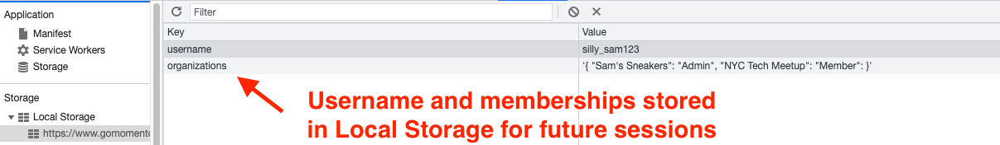
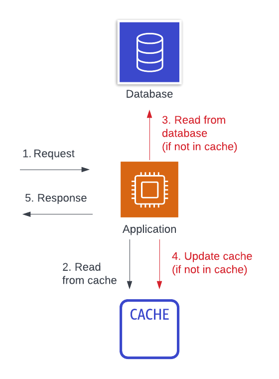
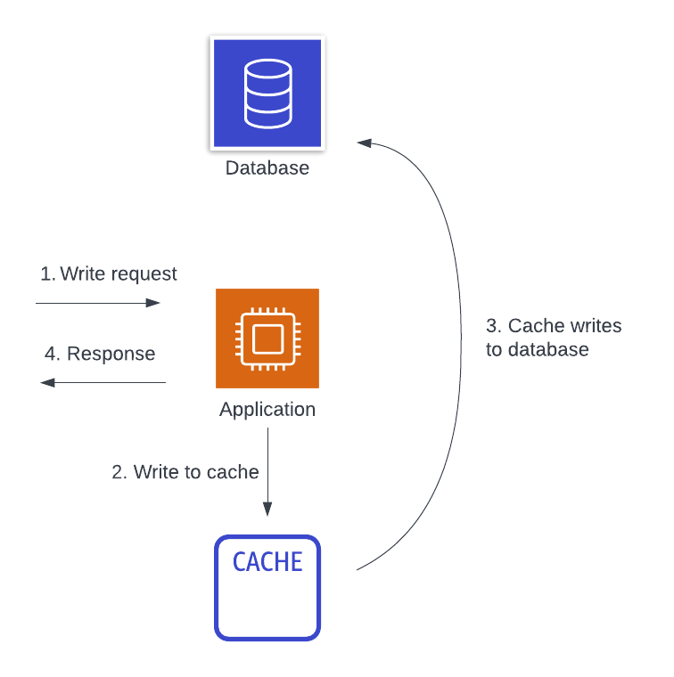

# Common caching strategies

Now that we know the key choices you need to make when implementing a caching strategy, let's review some popular caching patterns. For each pattern, we will describe the pattern, the choices the pattern makes on the three questions above, and when you may want to use that pattern.

## Local browser caching

The first, and perhaps simplest, caching strategy is local browser caching. If you are building a web-based application accessed from a browser, you can use [local storage](https://developer.mozilla.org/en-US/docs/Web/API/Window/localStorage) to store key-value data in the user's browser. For example, once a user authenticates to your service, you may store some information about the user's ID and profile used to access the service to speed display of your application upon subsequent viewings.

Local browser caching is **local**, **aside** caching and is likely written at read-time.

The benefits of local browser caching are its simplicity, as the local storage API is included in modern web browsers. Additionally, you don't need to worry about provisioning a cache in advance or running out of space, as you're effectively renting out space on your user's machine to cache this data.

The downsides of local browser caching is that it's only useful in specific circumstances. If a user reuses a browser, you can speed up certain operations easily. However, the cached data does not apply to the user when using a different device or even using a different browser instance on the device. Further, there's no mechanism for your backend data source to proactively invalidate items in the local storage cache if the underlying data has changed.

## Local backend caching

A second caching strategy is another local strategy. With local backend caching, your backend server instances may cache network responses or intermediate data from other systems. This data is often cached in-memory within your application process, such as with key-value maps in your programming language. When your backend instance needs to access that data, it will first check the in-memory object, then fall back to the primary data source if the cached value is not present.

Like local browser caching, this is a **local**, **aside** caching strategy that is likely written at read-time.

The benefits of this strategy are in its ease of use and simplicity. If you have data that is frequently accessed and relatively long-lived, you can quickly cache it on individual server instances without standing up and operating additional infrastructure. This can work well for configuration data or other slow-moving data.

In a way, this is similar to the way we [reuse (or "cache") our Momento SimpleClient within AWS Lambda to enable connection reuse](./../guides/caching-with-aws-lambda#connection-reuse)!.

The downside of this caching strategy is that it is less effective than remote caching methods. Each backend instance will have its own independent cache. If you have a broad set of data to cache, and you only cache it once it has been requested once on that instance, your cache hit rate can be quite low. Further, the cache hit rate gets even lower as your cluster size (and, likely, your overall load) increases! This is particularly troublesome when caching with hyper-ephemeral compute like AWS Lambda where your instances can be created and destroyed regularly. Finally, like with local browser caching, it can be difficult to invalidate expired data on the backend instances if the underlying data changes.

## Read-aside caching

The third, and most common, caching strategy is read-aside caching (commonly called "lazy loading"). With read-aside caching, your application will first try to request your needed data from a cache. If the data is there, it will return to the caller. If not, it will request the data from the primary data source. Then, it will store the data in the cache for the next attempt and return the data to the caller.

This is a **remote, read-based, aside **caching strategy.

The benefits of a read-aside caching strategy are in the improved cache hit rate and in the general applicability to most problems. For most access patterns, a piece of data that is accessed once is more likely to be accessed again soon after. By caching a piece of data in a centralized location after it has been read, we can improve the cache hit rate across our fleet of servers. Further, the read-aside cache strategy applies to nearly any situation. You can cache at any point in your application that makes sense -- a network response, after some intermediate calculation, or full, aggregated responses to an HTTP client.

Moving from local to remote caching will increase our hit rate, but it will also increase our operations burden and application complexity. We have an additional piece of infrastructure to manage and must consider its effect on overall system availability. You may think availability won't be affected because it falls back to a primary data source, but many outages are due to an initial cache failure leading to unsustainable load on a primary data source.

Additionally, the read-aside cache does pay a latency cost for the initial read of a piece of data. If your application reads are spread across records in your application, you might have a nearly full cache along with a low cache hit rate overall.

## Write-aside caching

The next caching strategy is similar to the previous. With write-aside caching, we are using a centralized, aside cache like with read-aside caching. However, rather than lazily loading items into our cache after accessing it for the first time, we are proactively pushing data to our cache when we write it.

This is a **remote, write-based, aside **caching strategy.

Many of the benefits of the write-aside caching strategy are similar to the read-aside caching strategy. You should have a higher cache hit rate with a centralized cache. Further, your cache hit rate should be even higher as you won't have the initial miss for each entry. This can reduce latency for data that you know will be accessed soon after it is written. Finally, when implemented correctly, you can reduce the chance of stale data as all data updates are immediately reflected into the cache.

The downsides of the write-aside strategy are in its added complexity. Read-aside caching is straight-forward in how it is implemented within a single data access path. With write-aside caching, you need your read and write paths to work together to understand the cache key and value format. Further, you need a deeper understanding of both your read and write access patterns. This can require careful auditing and constant vigilance to prevent stale data across patterns.

## Read-through and write-through caching

The final two strategies are read-through and write-through caching. These two strategies are unique in that all data access goes through the cache directly. Your application will make a request to the cache to fetch the requested data. If the data is available locally, the cache will return it. Otherwise, the _cache itself_ will do the work to fetch the data from the primary data source, cache the data, and return it to you.

For example, the image below shows the flow for a write-through cache. First, a write request comes to our application. The application writes the data directly to the cache, and the cache is responsible for persisting it back to the main database. Once the cache returns to the application indicating that the write is persisted, then the application returns a response.

This is a **remote, inline** caching strategy that can be used on either the read side or the write side.

A [content delivery network](https://en.wikipedia.org/wiki/Content_delivery_network) (CDN) is a type of read-through cache, as you can see in the image below.

A client may make an HTTP request for a piece of content, and the CDN will serve it from an edge location if available or make a trip back to the origin if not. If the CDN retrieves it from the origin, then it will store it on the edge for subsequent requests. There are also a few other HTTP-based read-through caches, such as [Varnish](https://varnish-cache.org/) or even [Nginx](https://www.nginx.com/).

Database-based inline caches are more rare, but they do exist. [DynamoDB Accelerator](https://aws.amazon.com/dynamodb/dax/) (DAX) is a read- and write-through cache for DynamoDB. You can perform the same DynamoDB operations against DAX as against your DynamoDB table, and your DAX instance will forward reads and writes to the underlying DynamoDB table as needed.

The benefits of an inline cache are in their simplicity from a client perspective. You don't need to manage cache keys or implement multi-step logic to handle cache misses. The inline cache handles this for you. Additionally, because it is a remote cache, it gets the benefits of a higher cache hit rate that we saw from aside caches.

Inline caches have downsides as well. First, inline caches for your data source can be hard to find or non-existent. The creator of an inline cache needs to implement the logic to handle fallback to the underlying data source. Depending on the implementation, there can be discrepancies in how your application works with and without the inline cache. Further, using an inline cache adds a critical piece of infrastructure to your application and can affect availability even more than an aside cache.​​