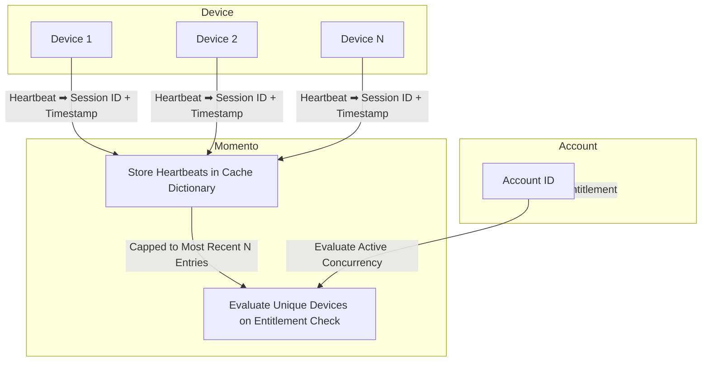

import Tabs from '@theme/Tabs';
import TabItem from '@theme/TabItem';

# Tracking concurrent devices for an account

Tracking concurrent devices or streams per account is essential for applications where managing access, ensuring security, and optimizing resources are top priorities. In subscription-based services, enforcing device or stream limits restrict simultaneous access to content to a specified number of devices. **Concurrency tracking** also supports account security by preventing unauthorized sharing, safeguarding the service from potential misuse. This also enables resource optimization in high-traffic applications, especially within media and entertainment, by managing resources dynamically based on real-time demand.

The pattern outlined below demonstrates how Momento provides **real-time session monitoring** without the need for complex infrastructure.

## Overview



Monitoring concurrency with Momento relies on [heartbeats](/media-storage/enhancements/heartbeats) to be emitted from connected players. A server component manages [cache dictionaries](/cache/develop/basics/datatypes#dictionaries) in Momento that track the heartbeats from unique players over a given interval. During an [entitlement check](/media-storage/entitlements/about), the last *complete* interval dictionary is fetched and the concurrency count is determined.

The major components in concurrency tracking are:

* **Device** - Each device or stream sends a heartbeat via [Momento Topics](/topics), which includes a unique session ID.
* **Momento**
  * **Cache** - Stores recent heartbeats for each account in interval based cache dictionaries.
  * **Auth** - Creates [session tokens](/cache/develop/authentication/tokens) for players, encoding the account id directly in the token.
* **Account** - Represents the user account in your system.

## Building a concurrency tracker

Four components are needed in this pattern

* Token vending machine
* Device heartbeat
* Heartbeat handler
* Concurrency checker

### Token vending machine

A token vending machine is a pattern that dispenses short-lived session tokens with limited permissions. This is a server-side component, usually an API endpoint, that dynamically generates the token. Below is a snippet of code used to create a session token. This code should live inside of your API endpoint handler.

<Tabs>
<TabItem value="node" label="Node.js">

```javascript
const scope = { permissions: [
  {
    role: 'publishonly',
    cache: 'video',
    topic: 'heartbeat'
  }
]};

const response = await authClient.generateDisposableToken(scope, ExpiresIn.minutes(30), { tokenId: accountId });
if(response.type === GenerateDisposableTokenResponse.Success){
  return { token: response.authToken };
}
```
</TabItem>
<TabItem value="go" label="Go">

```go
resp, err := authClient.GenerateDisposableToken(ctx, &momento.GenerateDisposableTokenRequest{
		ExpiresIn: utils.ExpiresInMinutes(30),
		Scope: momento.TopicPublishOnly(
			momento.CacheName{Name: "video"},
			momento.TopicName{Name: "heartbeat"},
		),
		Props: momento.DisposableTokenProps{
			TokenId: &req.PlayerID,
		},
	})

	if err != nil {
		http.Error(w, "Failed to generate token", http.StatusInternalServerError)
		return
	}

  switch r := resp.(type) {
	case *auth_resp.GenerateDisposableTokenSuccess:
		return r.ApiKey
	default:
		http.Error(w, "Failed to generate token", http.StatusInternalServerError)
	}
```

</TabItem>
<TabItem value="dotnet" label=".NET">

```csharp
var response = await _authClient.GenerateDispableTokenAsync(
  DisposableTokenScopes.TopicPublishOnly("video", "heartbeat"),
  ExpiresIn.Minutes(30)
);

return response.AuthToken;
```

</TabItem>
</Tabs>

In the snippet above, we set explicit permissions to allow the user to *publish* messages to the `heartbeat` topic. This is the way the player heartbeat will communicate with our handler. The token is configured to live for 30 minutes and has the user's `accountId` embedded in the token. The embedded account id will show up as an argument in our heartbeat subscription on the server, *preventing messages from being spoofed* and adding a layer of security to our solution.

:::info
In a production scenario, this code might live in your existing authZ mechanism and return the generated token as a claim. Assumptions are made here that prior to the code snippet above, the user has been authenticated and you have access to their account id and have securely identified the content their are attempting to view.
:::

### Device heartbeat

With the token vending machine in place, we can use it on the device to publish heartbeat on a regular interval. The heartbeat can contain any information about the media, player, or device based on your use case. For this simple walkthrough, we will provide the minimum amount of information and include only the device id.

<Tabs>
<TabItem value="sdk" label="Momento Web SDK (React)">

```jsx
import React, { useEffect, useState, useMemo } from 'react';
import ReactDOM from 'react-dom/client';
import { TopicClient, CredentialProvider } from '@gomomento/sdk-web';

const HEARTBEAT_INTERVAL_MS = 5000;

function getMediaIdFromQuery() {
  const params = new URLSearchParams(window.location.search);
  return params.get('id');
}

function Device() {
  const [topicClient, setTopicClient] = useState(null);

  const mediaId = useMemo(() => getMediaIdFromQuery(), []);
  const deviceId = useMemo(() => {
    const savedDeviceId = localStorage.getItem('deviceId');
    if (savedDeviceId) return savedDeviceId;

    const newDeviceId = crypto.randomUUID();
    localStorage.setItem('deviceId', newDeviceId);
    return newDeviceId;
  }, []);

  const message = useMemo(() => JSON.stringify({ deviceId, mediaId }), [deviceId, mediaId]);

  useEffect(() => {
    async function initTopicClient() {
      const response = await fetch('http://localhost:3000/tokens', {
        method: 'POST',
        headers: {
          'Content-Type': 'application/json',
        },
        body: JSON.stringify({ accountId: 'account-id' }),
      });
      if (response.ok) {
        const { token } = await response.json();
        const topicClient = new TopicClient({
          credentialProvider: CredentialProvider.fromString(token),
        });
        setTopicClient(topicClient);
      }
    }

    initTopicClient();
  }, [mediaId]);

  useEffect(() => {
    if (topicClient) {
      const intervalId = setInterval(() => {
        topicClient.publish('video', 'heartbeat', message);
      }, HEARTBEAT_INTERVAL_MS);

      return () => clearInterval(intervalId);
    }
  }, [topicClient, mediaId, message]);

  return (
    <div>
      <h2>Device {deviceId}: {topicClient ? 'Connected' : 'Not Connected'}</h2>
    </div>
  );
}

const root = ReactDOM.createRoot(document.getElementById('root'));
root.render(<Device />);

```

</TabItem>
<TabItem value="http" label="HTTP only">

```html
<!DOCTYPE html>
<html lang="en">

<body>
  <div id="root">
    <h2>Device <span id="deviceId"></span>: <span id="status">Not Connected</span></h2>
  </div>

  <script>
    const HEARTBEAT_INTERVAL_MS = 5000;
    const mediaId = getMediaIdFromQuery();
    const deviceId = getDeviceId();
    const message = JSON.stringify({ deviceId, mediaId });
    let token;

    function getMediaIdFromQuery() {
      const params = new URLSearchParams(window.location.search);
      return params.get('id');
    }

    function getDeviceId() {
      let deviceId = localStorage.getItem('deviceId');
      if (!deviceId) {
        deviceId = crypto.randomUUID();
        localStorage.setItem('deviceId', deviceId);
      }

      document.getElementById('deviceId').innerText = deviceId;
      return deviceId;
    }

    async function sendHeartbeat() {
      await fetch(`<MOMENTO_REGION_ENDPOINT>/topics/video/heartbeat`, {
        method: 'POST',
        headers: {
          'Content-Type': 'application/json',
          'Authorization': token
        },
        body: message,
      });
    }

    async function getToken() {
      const response = await fetch('http://localhost:3000/tokens', {
        method: 'POST',
        headers: { 'Content-Type': 'application/json' },
        body: JSON.stringify({ accountId: 'account-id' }),
      });

      if (response.ok) {
        const { token } = await response.json();
        return token;
      }
    }

    function startHeartbeat() {
      setInterval(() => {
        sendHeartbeat();
      }, HEARTBEAT_INTERVAL_MS);
    }

    async function init() {
      const statusElement = document.getElementById('status');
      token = await getToken();
      if (token) {
        statusElement.innerText = 'Connected';
        startHeartbeat();
      } else {
        statusElement.innerText = 'Failed to Connect';
      }
    }

    init();
  </script>
</body>
</html>

```

</TabItem>
</Tabs>

In the above examples, the player html only includes the heartbeat logic. It calls the token vending machine from step one that we put behind an API endpoint running locally to fetch a token. Once the player has the token, it begins publishing the device id and media id to the `heartbeat` topic. The heartbeat is sent every 5 seconds so the heartbeat handler can track active instances.

Two things to note in the code for the device heartbeat:

1. The account id being supplied to the token vending machine is hardcoded, in practice this would come from your AuthN mechanism.
2. When calling the Momento HTTP API, the base url is [region based](/platform/regions). Substitute the placeholder with the correct region endpoint for your use case. If you use the Momento SDK, region handling is managed for you.

*For a complete example of a token vending machine, [check out this tutorial](/media-storage/enhancements/live-reactions#step-1-building-a-token-vending-machine).*

### Heartbeat handler

Devices for a specific account will be tracked in a series of cache dictionaries. A unique cache dictionary will be used to track device heartbeats over a given time interval. The time interval can vary based on your business requirements. Our example will be evaluating concurrency once a minute.

The naming convention for the interval-based dictionaries is `{accountId}-${intervalTime}`. To calculate the interval time, get the time in ticks of a given minute and round down.

<Tabs>
<TabItem value="node" label="Node.js">

```javascript
function getIntervalMarker(minutesBack = 0) {
  const now = new Date();
  now.setTime(now.getTime() - minutesBack * 60000);
  now.setSeconds(0, 0);
  return now.getTime();
}
```

</TabItem>
<TabItem value="go" label="Go">

```go
import (
	"fmt"
	"time"
)

func getIntervalMarker(minutesBack int) int64 {
	now := time.Now().Add(-time.Duration(minutesBack) * time.Minute)
	rounded := time.Date(now.Year(), now.Month(), now.Day(), now.Hour(), now.Minute(), 0, 0, now.Location())
	return rounded.UnixNano() / int64(time.Millisecond)
}
```

</TabItem>
<TabItem value="dotnet" label=".NET">

```csharp
static long GetIntervalMarker(int minutesBack = 0)
{
  DateTime now = DateTime.UtcNow.AddMinutes(-minutesBack);
  now = new DateTime(now.Year, now.Month, now.Day, now.Hour, now.Minute, 0, DateTimeKind.Utc);
  return new DateTimeOffset(now).ToUnixTimeMilliseconds();
}
```

</TabItem>
</Tabs>

To create the cache key that tracks the device heartbeat count, you append the value from the function above to the end of a user's account id. Creating keys this way means you have a dedicated cache item per interval. Coupled with an appropriate TTL, the cache item will clean itself up automatically, simplifying the code needed for the pattern.

<Tabs>
<TabItem value="node" label="Node.js">

```javascript
// Get the account id through your business logic
const accountId = getAccountId(req);
const { deviceId } = req.body;
const key = `${accountId}-${getIntervalMarker()}`;

await cacheClient.dictionaryIncrement('video', key, deviceId, 1);
```

</TabItem>
<TabItem value="go" label="Go">

```go
accountId := getAccountId(req)
deviceId := req.DeviceID

key := fmt.Sprintf("%s-%d", accountId, getIntervalMarker())
_, err := cacheClient.DictionaryIncrement(ctx, &momento.DictionaryIncrementRequest{
  CacheName:      momento.String("video"),
  DictionaryName: key,
  Field:          deviceId,
  Amount:         1
})
if err != nil {
  fmt.Println("Error incrementing cache:", err)
}
```

</TabItem>
<TabItem value="dotnet" label=".NET">

```csharp
  var accountId = GetAccountId(req);
  var deviceId = req.Body.DeviceId;
  var key = $"{accountId}-{getIntervalMarker()}";

  await cacheClient.DictionaryIncrementAsync("video", key, deviceId, 1);
```
</TabItem>
</Tabs>

As heartbeats come in, the device id is stored as a value in the dictionary and a count is incremented. A [time to live (TTL)](/cache/learn/how-it-works/expire-data-with-ttl) is set on the dictionary for twice the interval length, so the data automatically cleans itself up when it is no longer needed.

### Concurrency checker

Lastly, we have the concurrency checker. Often rolled in as part of an [entitlement check](/media-storage/entitlements/about), this is the logic that reads the heartbeat dictionary and determines if an account is over their allowed limit. To check concurrency, we fetch the dictionary length from the *previous interval* and count the number of entries.

<Tabs>
<TabItem value="node" label="Node.js">

```javascript
async function getConcurrentDeviceCount(accountId) {
  const interval = getIntervalMarker(1);
  const intervalKey = `${accountId}-${interval}`;
  let deviceCount = 0;
  const response = await cacheClient.dictionaryLength('video', intervalKey);
  if(response.type === CacheDictionaryLengthResponse.Hit){
    deviceCount = response.value();
  }
  return deviceCount;
}
```

</TabItem>
<TabItem value="go" label="Go">

```go
func getConcurrentDeviceCount(accountId string) int {
  interval := getIntervalMarker(1)
	intervalKey := fmt.Sprintf("%s-%d", accountId, interval)
	deviceCount := 0

	resp, err := client.DictionaryLength(ctx, &momento.DictionaryLengthRequest{
		CacheName:      momento.String("video"),
		DictionaryName: intervalKey,
	})
	if err != nil {
		panic(err)
	}
	switch r := resp.(type) {
	case *responses.DictionaryLengthHit:
		deviceCount = int(r.Length())
	}
	return deviceCount
}
```

</TabItem>
<TabItem value="dotnet" label=".NET">

```csharp
static async Task<int> GetConcurrentDeviceCount(CacheClient cacheClient, string accountId)
{
  long interval = GetIntervalMarker(1);
  string intervalKey = $"{accountId}-{interval}";
  int deviceCount = 0;

  CacheDictionaryLengthResponse response = await cacheClient.DictionaryLengthAsync("video", intervalKey);
  if (response is CacheDictionaryLengthResponse.Hit)
  {
    deviceCount = response.Length;
  }

  return deviceCount;
}
```

</TabItem>
</Tabs>

This function uses the `getIntervalMarker` method we created in the previous step to get the time of our last interval, then calls Momento Cache to see how many entries are in the dictionary. Remember, each device that reported a heartbeat counts as an entry in the dictionary, so the length directly maps to the number of concurrent players.

The value is returned to the caller and it's up to standard business logic to take over from there.

:::tip
For a complete example of this pattern in action, along with other practical patterns for media streaming, check out our [demo on GitHub](https://github.com/momentohq/demo-video-streaming)!
:::
