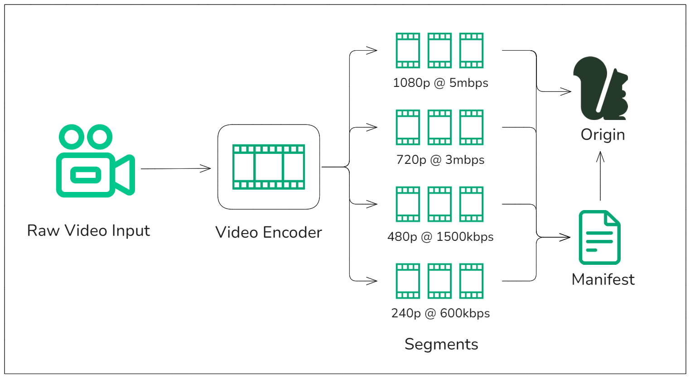

# What are segments?

Segments are small chunks of media used in the delivery of video and audio content in streaming workflows. They divide media files into manageable pieces, ideally two seconds in duration, which are then delivered sequentially to media players. By breaking media into segments, streaming platforms can provide [adaptive bitrate streaming](/media-storage/performance/adaptive-bitrates/how-it-works) to ensure continuous playback even under varying network conditions.

## Role of segments in media streaming

Segments allow media players to dynamically adjust video or audio quality depending on the available bandwidth, making streaming more resilient to fluctuating network conditions. By fetching different quality levels of the same content, the player can deliver the best possible experience without interruptions or buffering. This is particularly important for live streaming or high-traffic events, where network performance can be inconsistent.

For adaptive bitrate streaming protocols like [HLS (HTTP Live Streaming)](/media-storage/performance/adaptive-bitrates/hls) and [DASH (Dynamic Adaptive Streaming over HTTP)](/media-storage/performance/adaptive-bitrates/dash), segments are the foundation that allows for smooth transitions between quality levels. Media files are encoded at multiple bitrates and resolutions, and the segments for each version are stored separately. The media player selects the most suitable segment based on network conditions, making the experience as seamless as possible for the viewer.

## How segments work in a streaming workflow

* **Raw video input** - Video and audio are captured from a recording device and sent to a video encoder for processing
* **Video encoder** - Raw video is divided into small *segments* and transcoded into multiple versions of varying bitrates and resolutions
* **Manifest** - A playlist (manifest) is created that references all the segments at the various bitrates and resolutions that guides players on which segment to download next based on network conditions and desired resultion and bitrate
* **Origin** - Stores the segments and manifest for retrieval by CDNs

## Momento Media Storage and segments

Momento Media Storage stores segments and delivers them with lightning-fast performance and low error rates. Our platform is optimized for both [live streaming](/media-storage/streaming/live-streaming/how-it-works) and [video-on-demand (VOD)](/media-storage/streaming/video-on-demand/media-storage) use cases, ensuring that media segments are available for fast retrieval and distribution to CDNs. By leveraging our ultra-low latency storage, Momento Media Storage supports seamless playback for viewers across devices and geographies.

With Momento Media Storage, segments are stored and delivered quickly, reducing the likelihood of interruptions and minimizing buffering. Its ability to handle high-traffic events without sacrificing performance ensures that even under heavy demand, segments are delivered reliably and without error, contributing to a smooth, error-free streaming experience.
