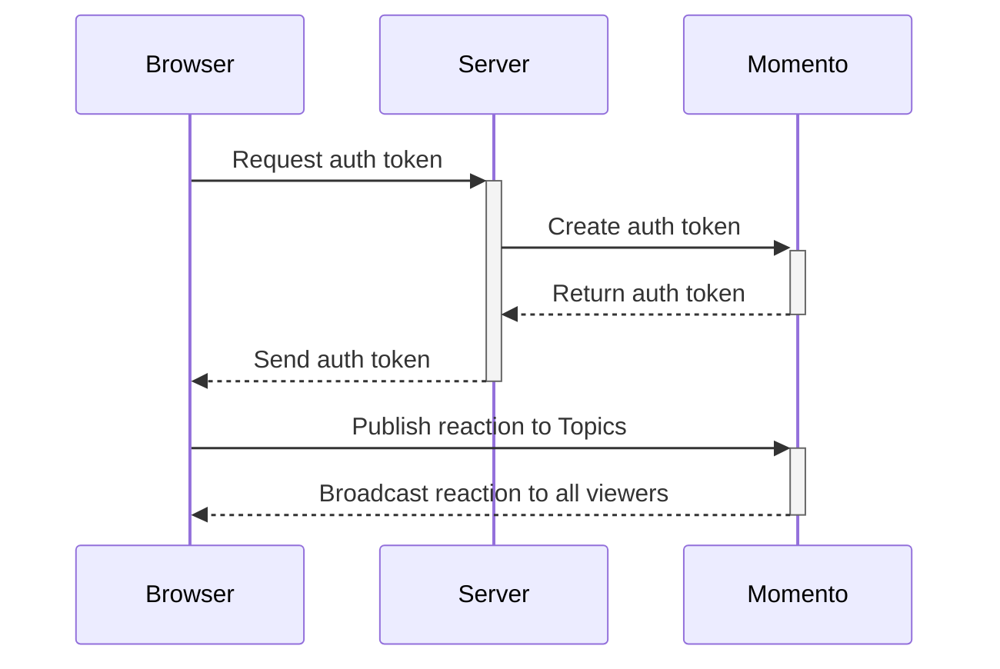

import Tabs from '@theme/Tabs';
import TabItem from '@theme/TabItem';

# Adding real-time emoji reactions to a video stream

Interactivity plays a significant role in viewer experience. Sending reactions and sharing emotions with other viewers adds a sense of community and engagement you can't find through media streaming alone. In this tutorial, you’ll set up a real-time emoji overlay on a video player. With **Momento Topics**, emoji reactions appear instantly as users interact, allowing for a lively and engaging viewing experience.

:::info
You can skip straight to a complete [example in GitHub](https://github.com/momentohq/demo-video-streaming) or follow along the tutorial below to build a simple implementation yourself.
:::

## How it works



First, the browser will request an auth token from a server component called a *token vending machine*, which is responsible for creating and distributing short-lived, limited scope [session tokens](/cache/develop/authentication/tokens). This token will be active for a short period of time and grants access only to the resources needed for sending and receiving reactions.

After the token is received, the player will publish a message to [Momento Topics](/topics) indicating which emoji was pressed. Topics will broadcast the emoji to all video players that subscribed for reactions.

The event handler in the browser invoked by Momento Topics then renders the emoji on screen, providing real-time reactions to all your users.

## Prerequisites

* A [Momento API key](/cache/develop/authentication/api-keys)

## Step 1: Building a token vending machine

The video player needs access to Momento Topics to publish and receive emojis. To grant access, you must generate a session token and return it to the caller. We do this by creating a simple web server with a `POST /tokens` endpoint.

<Tabs>
<TabItem value="node" label="Node.js">

```javascript
import express from 'express';
import { AuthClient, ExpiresIn } from '@gomomento/sdk'

const authClient = new AuthClient();
const app = express();
app.use(express.json());

app.post('/tokens', async (req, res) => {
  const { playerId, streamId} = req.body;
  const scope = {
    permissions: [{
      role: 'publishsubscribe',
      cache: 'video',
      topic: streamId
    }]
  };

  const tokenResponse = await authClient.generateDisposableToken(scope, ExpiresIn.minutes(30), { tokenId: playerId });
  res.status(201).json({ token: tokenResponse.authToken });
});

app.listen(3000, () => {
  console.log('Server is running on port 3000');
});
```

</TabItem>
<TabItem value="go" label="Go">

```go
package main

import (
	"context"
	"encoding/json"
	"log"
	"net/http"
	"time"

	"github.com/gorilla/mux"
	"github.com/momentohq/client-sdk-go/auth"
	"github.com/momentohq/client-sdk-go/config"
	"github.com/momentohq/client-sdk-go/momento"
	auth_resp "github.com/momentohq/client-sdk-go/responses/auth"
	"github.com/momentohq/client-sdk-go/utils"
)

var (
	ctx                context.Context
	authClient         momento.AuthClient
)

type TokenRequest struct {
	PlayerID string `json:"playerId"`
	StreamID string `json:"streamId"`
}

type TokenResponse struct {
	Token string `json:"token"`
}

func generateTokenHandler(w http.ResponseWriter, r *http.Request) {
	var req TokenRequest
	err := json.NewDecoder(r.Body).Decode(&req)
	if err != nil {
		http.Error(w, "Invalid request payload", http.StatusBadRequest)
		return
	}

	credentialProvider, err := auth.NewEnvMomentoTokenProvider("MOMENTO_API_KEY")
	if err != nil {
		panic(err)
	}

	authClient, err = momento.NewAuthClient(config.AuthDefault(), credentialProvider)
	if err != nil {
		panic(err)
	}

	resp, err := authClient.GenerateDisposableToken(ctx, &momento.GenerateDisposableTokenRequest{
		ExpiresIn: utils.ExpiresInMinutes(30),
		Scope: momento.TopicSubscribeOnly(
			momento.CacheName{Name: "video"},
			momento.TopicName{Name: req.StreamID},
		),
		Props: momento.DisposableTokenProps{
			TokenId: &req.PlayerID,
		},
	})

	if err != nil {
		http.Error(w, "Failed to generate token", http.StatusInternalServerError)
		return
	}

	switch r := resp.(type) {
	case *auth_resp.GenerateDisposableTokenSuccess:
		res := TokenResponse{Token: r.ApiKey}
		w.Header().Set("Content-Type", "application/json")
		w.WriteHeader(http.StatusCreated)
		json.NewEncoder(w).Encode(res)
	default:
		http.Error(w, "Failed to generate token", http.StatusInternalServerError)
	}
}

func main() {
	ctx = context.Background()

	r := mux.NewRouter()
	r.HandleFunc("/tokens", generateTokenHandler).Methods("POST")

	srv := &http.Server{
		Handler:      r,
		Addr:         ":8080",
		WriteTimeout: 15 * time.Second,
		ReadTimeout:  15 * time.Second,
	}

	log.Println("Server is running on port 8080")
	log.Fatal(srv.ListenAndServe())
}

```

</TabItem>
<TabItem value="dotnet" label=".NET">

```csharp
using Microsoft.AspNetCore.Mvc;
using Microsoft.Extensions.Configuration;
using Momento.Sdk;
using Momento.Sdk.Auth;
using Momento.Sdk.Config;
using Momento.Sdk.Auth.AccessControl;
using Momento.Sdk.Responses;
using System;
using System.Threading.Tasks;

[ApiController]
[Route("api/[controller]")]
public class TokenController : ControllerBase
{
  private readonly Momento.AuthClient _authClient;

  public TokenController(IConfiguration configuration)
  {
    _authClient = configuration.AuthClient;
  }

  [HttpPost]
  [Route("tokens")]
  public async Task<IActionResult> GenerateToken([FromBody] TokenRequest request)
  {
    try
    {
      var response = await _authClient.GenerateDispableTokenAsync(
        DisposableTokenScopes.TopicPublishSubscribe("video", request.StreamId),
        ExpiresIn.Minutes(30)
      )

      return Created("", new TokenResponse { Token = response.AuthToken });
    }
    catch (Exception ex)
    {
      Console.WriteLine($"Error generating token: {ex.Message}");
      return StatusCode(500, "Failed to generate token");
    }
  }
}

```

</TabItem>
</Tabs>


The endpoint you created here accepts a request body containing `playerId` and `streamId` properties. The `streamId` is a unique identifier for the video stream being watched. This is used to *limit the scope of the reactions to the requested video*. The `playerId` is the identifier of the caller. Momento best practices say to *always include the identifier of the caller in your session tokens* so you can uniquely identify the actor on your account. We are creating the token with the `playerId` embedded directly in it, which will carry through to every message published by the user.

:::tip
For the Momento AuthClient to initialize properly, you must have your Momento API key configured in a `MOMENTO_API_KEY` environment variable or pass it directly to the constructor in the `credentialProvider` property.
:::

The permissions granted in the token allow the caller to both *publish* and *subscribe* to a topic dedicated to the video stream the caller is watching. This topic lives in a [cache](/cache) named `video`.

Upon success, this endpoint will return a `201 Created` status code along with the generated token that expires in 30 minutes.

## Step 2: Creating the video player and emoji overlay

The emojis sent to each other by viewers are not actually part of the embedded video player itself. In reality, the emojis are overlayed in a `div` surrounding the video player. Emojis are placed with *absolute* positioning and animated with keyframes in CSS.

```html
<!DOCTYPE html>
<html lang="en">
<head>
  <meta charset="UTF-8">
  <title>Live emoji reactions with Momento</title>
  <style>
    .video-container {
      position: relative;
    }
    .reaction-buttons {
      position: absolute;
      display: flex;
      top: 1rem;
      right: 1rem;
      gap: 0.5rem;
    }
    .reaction {
      padding: 0.5rem;
      background-color: black;
      opacity: 0.5;
      border-radius: 1.5rem;
    }
    .animated-emoji {
      position: absolute;
      bottom: 0;
      font-size: 30px;
      animation: floatUpAndOut 2s linear forwards;
      pointer-events: none;
    }

    @keyframes floatUpAndOut {
      0% { bottom: 0%; opacity: 1; transform: translateX(0) rotate(0deg); }
      100% { bottom: 100%; opacity: 0; transform: translateX(20px) rotate(15deg); }
    }
  </style>
</head>
<body>
  <!-- Video Player Container -->
  <div id="videoPlayerContainer" class="video-container">
    <video id="videoPlayer" controls autoplay muted></video>

    <!-- Reaction Buttons -->
    <div id="emojiReactions" class="reaction-buttons">
      <button onclick="sendReaction('heart')" class="reaction">❤️</button>
      <button onclick="sendReaction('100')" class="reaction">💯</button>
      <button onclick="sendReaction('thumbsup')" class="reaction">👍</button>
      <button onclick="sendReaction('mindblown')" class="reaction">🤯</button>
    </div>
  </div>
</body>
</html>
```

In this HTML, each emoji button triggers a `sendReaction` function, which will send an emoji reaction when clicked. The `videoPlayerContainer` contains both the video player and emoji overlay. The reaction buttons will display on the top right corner of the video player. You can see we have options of ❤️, 💯, 👍, and 🤯 to send.

This is the foundation of our video player. Now we have to make it work!

## Step 3: Publishing messages with Momento Topics

In either a `<script>` tag or external `script.js` file, we must add some logic to call our token vending machine and publish a message when an emoji button is pressed. For simplicity, we'll assume this is running locally and use `localhost` as the base url for the token vending machine.

```javascript
let authToken;
let id = crypto.randomUUID();
const url = new URL(window.location.href);
const streamId = url.searchParams.get('videoId');

const response = await fetch('http://localhost/tokens', {
  method: 'POST',
  body: JSON.stringify({
    playerId: id,
    streamId: streamId
  })
});

const data = await response.json();
authToken = data.token;

function sendReaction(reaction) {
  fetch(`<MOMENTO_REGION_ENDOINT>/topics/video/${streamId}`, {
    method: 'POST',
    headers: {
      'Content-Type': 'application/json',
      'Authorization': authToken
    },
    body: reaction
  });
}
```

This code generates a unique `playerId` for the viewer, gets the requested video id from the `videoId` query string parameter, and gets an auth token from our token vending machine. It then saves the token globally so we have it in scope for calls made to Momento.

We also define the `sendReaction` function, which simply wraps a call to the [Momento HTTP API](/topics/api-reference/http-api) using our globally-scoped auth token variable. The url to the Momento API is [region-based](/platform/regions) and varies based on geo-location. You can see in the url, we are doing a POST to Momento Topics, specifically to the `video` cache and sending a message to the `streamId` topic. This allows us to scope interactions specifically to the video being watched by the player.

:::tip
When adding reactions to videos, it's considered best practice to scope interactions to a specific piece of media. If you broadcast to a generic `reactions` topic, then *all reactions* across *all videos* would display across the screen.
:::

## Step 4: Rendering emojis on screen

Now that we're publishing messages that share emojis with other viewers, we need to render them on screen. To get a dynamic effect, each emoji will be placed at a random point horizontally across the video player and will slowly animate from the bottom to the top gradually fading out. Remember, we've already configured the fade up and out animation in our `floatUpAndOut` keyframe CSS class in *step 2*.

```javascript
function displayEmoji(emoji) {
  const emoji = document.createElement('div');
  emoji.textContent = emoji;
  emoji.className = 'animated-emoji';

  // Random horizontal position within the video player
  const containerWidth = document.getElementById('videoPlayerContainer').offsetWidth;
  emoji.style.left = `${Math.random() * (containerWidth - 30)}px`;

  document.getElementById('videoPlayerContainer').appendChild(emoji);

  setTimeout(() => { emoji.remove(); }, 2000);
}

async function longPoll(signal) {
  try {
    const response = await fetch('<MOMENTO_REGION_ENDOINT>/topics/video/${streamId}', {
    headers: {
      'Authorization': '{{{momento.token}}}',
    }
    });

    if (response.ok) {
      const data = await response.json();
      if (data && data.items && data.items.length > 0) {
        const emojiMap = {
          'heart': '❤️',
          '100': '💯',
          'thumbsup': '👍',
          'mindblown': '🤯'
        };
        data.items.forEach(item => {
          if (item.item && item.item.value && item.item.value.text) {
            const emoji = emojiMap[item.item.value.text];
            if(emoji){
              displayEmoji(emoji);
            }
          }
        });
      }
    }
  } catch (error) {
    if (error.name !== 'AbortError') {
      console.error('Long polling error:', error);
    }
  } finally {
    if (!signal.aborted) {
      setTimeout(() => longPoll(signal), 0);
    }
  }
}

const pollingController = new AbortController();
longPoll(pollingController.signal);
```

In the code above, we define the function that adds the emoji `div` to the video player and applies the CSS class that contains the animation. When the animation is over (it takes two seconds as defined in the CSS), we remove the `div` from the page to clean everything up.

The other big piece you see above is **long polling**. We use the Momento HTTP API to *subscribe* for messages to the `streamId` topic. With long polling, the browser will make a request to Momento and it will only return once a message has been published. The browser then immediately makes the request again, waiting for another message to be published. While technically this is a *pull* instead of a *push* for messages, it does provide near real-time messages from Momento.

The response handler of the long polling will iterate over all received messages, validate the text received is a valid reaction (to prevent against malicious emojis), then proceed to call the `displayEmoji` function and start the animation across the video player.

## Step 5: Let the emojis fly!

Now that the code is written, it's time to test it out! The easiest way to test it all is to run everything locally. So let's tie up some of the loose ends here.

### Initialize and install dependencies

To make this code functional, you need to initialize a new project and install the dependencies. This can be done with the following commands:

```bash
npm init
npm install express @gomomento/sdk
```

The first command will walk you through a wizard to setup the project. The second command will install all the dependencies we used in the server-side code.

### Server-side code

The code from *step 1* should be in a file called `server.mjs`. You can configure a `.env` file with the `MOMENTO_API_KEY` environment variable set to your Momento API key. To start the server locally, you can run the following command:

```bash
node server.mjs
```

This will start the server and allow our web page to make a call.

### Client-side code

The html we created in *step 2* should be in a file called `client.html`. The JavaScript from *steps 3 and 4* can be put in a `<script>` tag inside of the `<body>` element in the html. From there, we can run the web page by executing the following command in a terminal:

```bash
npx serve client.html
```

This will start another server locally hosting the html. You can click on the link provided in the terminal to open the page in your browser. From here, everything is functional, so click on the emojis and start sending them across the video player!!

## Concepts learned

In this tutorial, you learned how to do a bunch of things in a short amount of time and an even shorter amount of code! Here's what you now know how to do:

* Use the Momento AuthClient to create a token vending machine
* Use Momento Topics to send messages *directly between browsers* with no server-side code
* How to implement **long polling** with the Momento HTTP API

These are foundational topics and core builder skills for programmers of any level. Whether you're building a side project at home or designing an enterprise-grade application, Momento scales with you automatically leaving you to worry about what's important - *solving your business problem*.

Happy coding!
