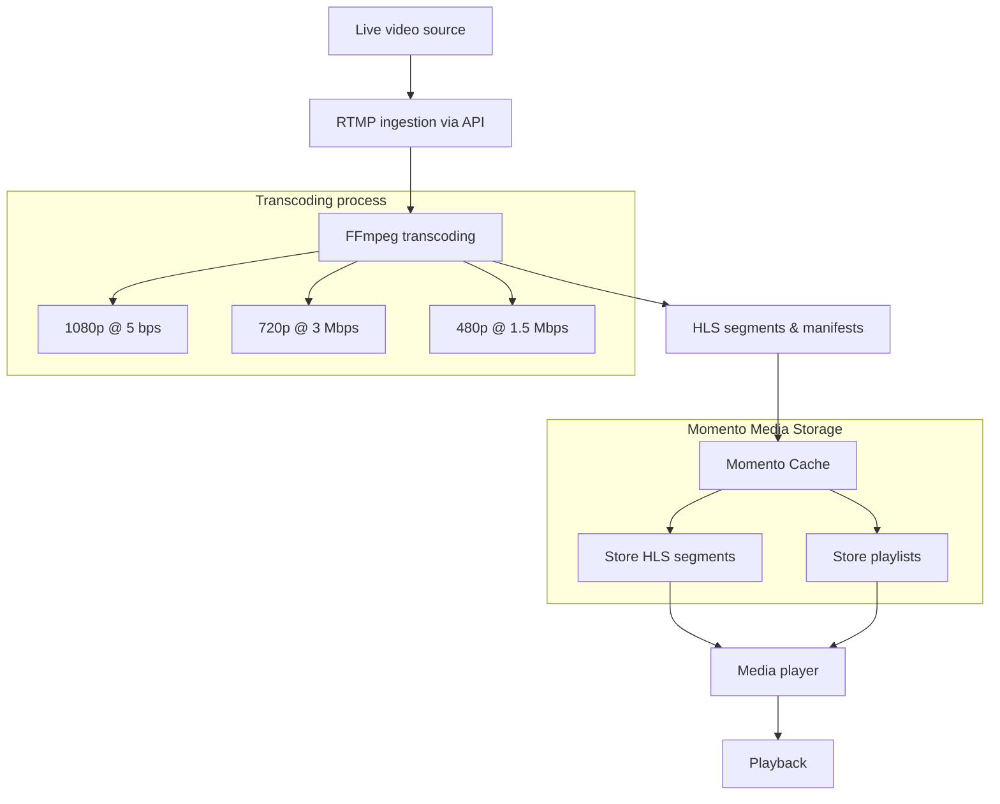

# Live streaming with RTMP, FFmpeg, and Momento Media Storage

In this tutorial, you will build a live stream ingestion workflow triggered by an HTTP POST request. The request will contain the [RTMP stream](https://en.wikipedia.org/wiki/Real-Time_Messaging_Protocol) url and stream name, which triggers **FFmpeg** to transcode the stream into multiple resolutions and upload the resulting [HLS segments](/media-storage/performance/adaptive-bitrates/hls) and manifest files to **Momento Media Storage** using the Momento SDK.

:::info
You can skip straight to the [code in GitHub](https://github.com/momentohq/demo-rtmp-streaming) or follow along the tutorial below.
:::

## Architecture

Below is a diagram of what you will be building in this tutorial.



## Step 1: Setting up the Express API

First, create an [Express app](https://expressjs.com/) that listens for POST requests at the `/livestreams` endpoint. The request body will contain the RTMP url and stream name, and the server will kick off an asynchronous workflow to process the stream.

### Install dependencies

Install the npm packages below and make sure [FFmpeg](http://www.ffmpeg.org/) is installed on your media server with the `FFMPEG_PATH` environment variable set to the location of the FFmpeg binary.

```bash
npm install express fluent-ffmpeg @gomomento/sdk
```

### Create your cache

The segments and manifest files will be stored in [Momento Cache](/cache). You must create a cache [in your account](https://console.gomomento.com) before running the code. The example we are building uses a cache named `livestreams`.

### Create the Express.js server

To define the **POST /livestreams** endpoint and kick off the async processing task, use the code below.

```javascript
import express from 'express';
import fs from 'fs';
import ffmpeg from 'fluent-ffmpeg';
import { CacheClient } from '@gomomento/sdk';

// Initialize Momento CacheClient
const momento = new CacheClient({ defaultTtlSeconds: 3600 });

const NAMESPACE = 'livestreams';
const app = express();
app.use(express.json());

// POST endpoint to trigger livestream processing
app.post('/livestreams', async (req, res) => {
  const { rtmpUrl, streamName } = req.body;

  if (!rtmpUrl || !streamName ) {
    return res.status(400).json({ error: 'RTMP url and stream name are required' });
  }

  const stream = streamName.replace(/[^a-zA-Z]/g, "").toLowerCase();
  res.status(202).json({ stream: `${stream}_playlist.m3u8` });
  startTranscodingWorkflow(rtmpUrl, stream);
});

app.listen(3000, () => {
  console.log('Server running on port 3000');
});
```

The code above initializes the Momento `CacheClient` and configures the Express app to run with the `/livestreams` endpoint with basic validation. We also set the default [time to live](/cache/learn/how-it-works/expire-data-with-ttl) for segments and manifest files for one hour. After an hour they will be automatically deleted.

The endpoint returns a `stream` property with the key of the master playlist.

## 2. Build the transcoding workflow

Now that the request is handled, we need to write the async workflow that ingests the RTMP stream and transcodes it to [different bitrates and resolutions](/media-storage/core-concepts/abr-ladder).

```javascript
function startTranscodingWorkflow(rtmpUrl, streamName) {
  ffmpeg(rtmpUrl)
    // 1080p Output
    .size('1920x1080')
    .videoBitrate('5000k')
    .output(`${streamName}/1080p/playlist.m3u8`)
    .outputOptions([
      '-c:v libx264',
      '-g 48',
      '-sc_threshold 0',
      '-f hls',
      '-hls_time 1',
      '-hls_list_size 0',
      `-hls_segment_filename ${streamName}/1080p/${streamName}_1080p_segment%03d.ts`
    ])
    // 720p Output
    .size('1280x720')
    .videoBitrate('3000k')
    .output(`${streamName}/720p/playlist.m3u8`)
    .outputOptions([
      '-c:v libx264',
      '-g 48',
      '-sc_threshold 0',
      '-f hls',
      '-hls_time 1',
      '-hls_list_size 0',
      `-hls_segment_filename ${streamName}/720p/${streamName}_720p_segment%03d.ts`
    ])
    // 480p Output
    .size('854x480')
    .videoBitrate('1500k')
    .output(`${streamName}/480p/playlist.m3u8`)
    .outputOptions([
      '-c:v libx264',
      '-g 48',
      '-sc_threshold 0',
      '-f hls',
      '-hls_time 1',
      '-hls_list_size 0',
      `-hls_segment_filename ${streamName}/480p/${streamName}_480p_segment%03d.ts`
    ])
    .on('end', () => {
      console.log('Transcoding complete');
    })
    .on('error', (err) => {
      console.error(`Error during transcoding: ${err.message}`);
    })
    .run();

  watchAndUploadSegments(streamName, ['1080p', '720p', '480p']);
  uploadMasterPlaylist(streamName);
}
```

This code uses the wrapper package `fluent-ffmpeg` to pass commands to the FFmpeg binary using the RTMP steam as input. We are building a command that transcodes the stream into *1080p at 5mbps*, *720p at 3mbps*, and *480p at 1.5mbps* bitrates and resolutions with one second segments. Each segment will be output to a directory for the specific resolution with the naming convention "(streamName)_(resolution)_segment(number).ts". This naming convention grants us unique key names for each segment and resolution. The output file names are added automatically to each manifest file by ffmpeg.

Next, we need to implement the watcher function that uploads segments to Momento Media Storage as they are created in real time.


## 3. Uploading data to Momento

Now that we are creating segments from the RTMP stream, we must upload them to Momento to make them available to CDNs. To do this, we add a watcher to the output folders and upload the files as they are added.

```javascript
function watchAndUploadSegments(streamName, directories) {
  for (const directory of directories) {
    const streamDirectory = `${streamName}/${directory}`;
    if (!fs.existsSync(streamDirectory)) {
      fs.mkdirSync(streamDirectory, { recursive: true });
    }

    fs.watch(streamDirectory, (eventType, fileName) => {
      if (fileName.endsWith('.ts') || fileName.endsWith('.m3u8')) {
        const location = `${streamDirectory}/${fileName}`;
        const key = `${streamName}_${directory}_${fileName}`;
        uploadToMomento(location, key);
      }
    });
  }
}

async function uploadToMomento(filepath, key) {
  try {
    const fileData = fs.readFileSync(filepath);
    await momento.set(NAMESPACE, key, fileData);
    console.log(`${key} uploaded`);
  } catch (error) {
    console.error(`Failed to upload ${key}:`, error);
  }
}

async function uploadMasterPlaylist(streamName) {
  const masterPlaylist = `#EXTM3U
  #EXT-X-STREAM-INF:BANDWIDTH=5000000,RESOLUTION=1920x1080
  ${streamName}_1080p_playlist.m3u8
  #EXT-X-STREAM-INF:BANDWIDTH=3000000,RESOLUTION=1280x720
  ${streamName}_720p_playlist.m3u8
  #EXT-X-STREAM-INF:BANDWIDTH=1500000,RESOLUTION=854x480
  ${streamName}_480p_playlist.m3u8
  `;

  await momento.set(NAMESPACE, `${streamName}_playlist.m3u8`, masterPlaylist);
}
```

These functions are watching the directories for file changes then uploading the files to Momento. FFmpeg will automatically update each manifest file as segments are created, which triggers our upload to overwrite it with the new version.

We are also hardcoding the *master playist*, pointing it at the three different resolutions we are creating. FFmpeg does not create it on its own, so we have to do it manually here.

With this in place, segments are actively being created and the resolution-specific manifest files are constantly being updated. That means we've successfully built our stream processor!

## 4. Try it out

To test this setup locally with an RTMP stream from [OBS (Open Broadcaster Software)](https://obsproject.com/), perform the following steps.

1. **Setup your media server**
    - Download Nginx with the [RTMP module](https://docs.nginx.com/nginx/admin-guide/dynamic-modules/rtmp/)
    - Set up your `conf > nginx.conf` file to include this rtmp snippet
    ```conf
    rtmp {
      server {
        listen 1935;

        application live {
            live on;
        }

        application hls {
            live on;
            hls on;
            hls_path temp/hls;
            hls_fragment 8s;
        }
     }
    }
    ```
    - Start Nginx

    *NOTE - The config file requires more than the rtmp section. The [Nginx docs](https://docs.nginx.com/nginx/admin-guide/basic-functionality/managing-configuration-files/) describe the full details.*
2. **Configure OBS to stream via RTMP**
    - Open **OBS** and go to **File > Settings > Stream**.
    - Select **Custom** as the service.
    - Enter `rtmp://localhost/live` in the **Server** field.
    - Enter `teststream` in the **Stream Key** field.
    - Apply the settings and start streaming.
3. **Run the Express server**
    - Ensure that [FFmpeg is installed](https://www.ffmpeg.org/) and the `FFMPEG_PATH` environment variable is set to the FFmpeg binary location.
    - Run the application with the following command:
    ```bash
    node app.js
    ```
4. **Call your endpoint**
   - Use a tool like Postman or curl to send a POST request to start processing the stream
     ```bash
     curl -X POST http://localhost:3000/livestreams \
     -H "Content-Type: application/json" \
     -d '{"rtmpUrl": "rtmp://localhost/live/teststream", "streamName": "My Momento Stream"}'
     ```

5. **Monitor transcoding and uploading**
    - The transcoding process will begin, with your app creating segments and uploading them to **Momento Media Storage** in real-time. The server will log the upload process and notify you when it's complete.
    - You can also view the generated segments on your file system as they are created in each resolution folder

5. **Playback**
    - Once the segments and manifest files are in **Momento Media Storage**, they can be accessed via an HLS-compatible player using the master playlist URL:
    ```
    https://<your-cdn-url>/<streamName>/playlist.m3u8
    ```
    - For local testing, you can use a player like [VLC](https://www.videolan.org/) or [Video.js](https://videojs.com/) in your browser.

:::info
The method we used in this demo was the [CDN route](/media-storage/streaming/decoding-video#using-a-cdn-with-header-forwarding) for accessing media files. This CDN takes requests and forwards a Momento auth token directly to Momento Media Storage. If you do not have a CDN configured to do this, the media player will be unable to fetch the manifest and segments.
:::

You are now ready to handle RTMP live streaming, transcoding, and storing segments in **Momento Media Storage**. You can adjust the stream quality, segments length, and other parameters based on your streaming needs. Happy coding!
