# Creating a live video origin with Momento Media Storage, AWS MediaLive, and Amazon CloudFront

Live video streaming requires a highly performant and scalable [origin server](/media-storage/core-concepts/origin) to handle the demands of a global audience. Traditional origin servers often struggle with latency, scalability, or complexity when integrated with modern cloud workflows. Momento Media Storage offers a simple, high-scale solution by providing a robust, low-latency, and cost-effective origin solution tailored for live video streaming.

In this tutorial, you will learn how to set up Momento Media Storage as the origin server for a live video stream encoded by [AWS Elemental MediaLive](https://aws.amazon.com/medialive/) and delivered via [Amazon CloudFront](https://aws.amazon.com/CloudFront/). By the end of this guide, you'll have a fully functional workflow capable of delivering live [HLS streams](/media-storage/performance/adaptive-bitrates/hls) optimized for performance and reliability.

Here's what we'll cover:

1. Creating a storage namespace in Momento Media Storage to act as the origin server.
2. Configuring AWS Elemental MediaLive to encode and push live content to Momento.
3. Setting up Amazon CloudFront to serve content to viewers with low latency.
4. Testing and troubleshooting the setup to ensure smooth playback.

In this tutorial, we will use the [Momento console](https://console.gomomento.com), but everything could be created and configured programmatically through [the Momento SDK](/platform/sdks).

**Prefer to learn through video?**

Watch this quick walkthrough of the tutorial to see the steps in action. This video compliments the guide below and is perfect if you're a visual learner or want a high-level overview or additional context before diving into the details.

<iframe width="560" height="315" src="https://www.youtube.com/embed/dwb8Qd7CDYw?si=ALK8BnC2Ugh5ty-S" title="YouTube video player" frameborder="0" allow="accelerometer; clipboard-write; encrypted-media; gyroscope; picture-in-picture; web-share" referrerpolicy="strict-origin-when-cross-origin" allowfullscreen></iframe>

## Preparation

Before creating any resources, please determine the basic characteristics of the live video channel.

**Channel bitrates**: The bitrate of a channel depends on the resolution, framerate, and encoding. The table below lists the example bitrates used in this guide.

**Segment duration**: Segment duration should fall between 1 and 2.5 seconds to minimize glass-to-glass latency. This guide uses 2.5 seconds.

**TTL (Time-to-Live)**: TTL determines how long stream data remains available for playback. This guide uses 3600 seconds (1 hour). Note that if your product includes features like DVR playback, you may need a much longer TTL measured in days.

:::tip

Momento Media Storage supports a maximum object size of 10MB. To estimate segment size, divide the bitrate in Kbps by 8, multiply by the segment duration in seconds, and add 10% to account for headers. For example, a 2 second segment at 1000 Kbps is roughly `1000 / 8 * 2 * 1.1 = 275 KB`.

:::

For the purposes of this tutorial, configure one live video channel for an [adaptive bitrate ladder](/media-storage/core-concepts/abr-ladder) with 3 encoding profiles and 2.5-second segments:

| resolution | framerate | bitrate | segment size |
|:-:|:-:|:-:|:-:|
| `720p` | `30` | `2,500 kbps` | `850 KiB`
| `480p` | `30` | `1,500 kbps` | `500 KiB`
| `240p` | `30` |   `750 kbps` | `250 KiB`


## 1. Create a storage namespace in your Momento account

Momento Media Storage is currently restricted to private preview access by key design partners. To create a storage namespace, please ensure that you have successfully logged in to the [Momento Console](https://console.gomomento.com/) once to initialize your account. Then, contact `support@momentohq.com` or your support representative with the following information to create a storage namespace:

- **account id**: Locate your account id in the dropdown in the upper right corner of the [console](https://console.gomomento.com/) (`a-xxxxxxxxxxxx`).
- **namespace id**: The desired id for the new storage namespace. This guide uses `live-origin`.
- **AWS region**: The AWS region for the new storage namespace. This guide uses `us-west-1`. Once AZ-alignment becomes available, you will also need to specify two AZs within the region.
- **hot storage capacity**: This determines how much stream data will be held in low-latency storage. Estimate required capacity by adding up the size of all segments and multiplying by the number of segments to keep in hot storage. For example, keeping 5 minutes of the example bitrate ladder in hot storage requires `(850+500+250)Kib * 300/2.5 ≈ 200 MiB`.

While Momento Media Storage is in private preview, the Storage *namespace* will be appear as a *cache* in the console. This guide will use *namespace* interchangeably with *cache*. As Momento Media Storage approaches general availability, updates to the console will make namespace creation a self-service process.

Next, generate the API key that the encoder will use to securely write segment and manifest files to the `live-origin` namespace. In the [API Key section](https://console.gomomento.com/api-keys) of Momento console, create a Fine-Grained Access Key that expires in 30 days with *readwrite* access to the `live-origin` namespace. Don't forget to click on "Add Permission" to grant the permissions before generating the API key.

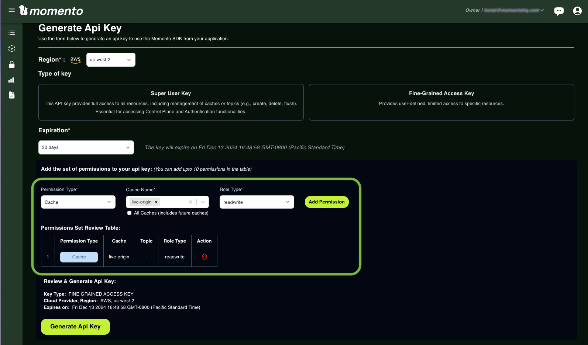

API key information will no longer be available after you navigate away from this page, so download the API key as a JSON file. The guide will refer to this API key as `encoder_api_key`.

Video players read the content pushed by encoders to Momento Media Storage via a **Content Delivery Network (CDN)**. As a security best practices, create a second API key with *readonly* access to the `live-origin` namespace. Use the same [API key page](https://console.gomomento.com/api-keys) as before to create this new API key. The guide will refer to this API key as `player_api_key`.

:::info[Checking in]

At the end of this step, you should have created two API keys: one that grants *readwrite* access and one that *readonly* access to the `live-origin` namespace. Keep these handy to use in the upcoming steps.

:::

## 2. Set up AWS MediaLive for live video encoding

AWS Elemental MediaLive is a live video encoding service from AWS that processes and delivers live streams at scale. MediaLive converts live video into streaming formats like [HLS](/media-storage/performance/adaptive-bitrates/hls). It is commonly used for live sports, major live events, and 24/7 channels.

MediaLive will act as the **encoder** in this live video workflow. The encoded video will be sent directly to Momento Media Storage, which functions as the origin server.

:::tip

For best performance, make sure the MediaLive service and the `live-origin` namespace are in the same AWS region or as close as possible. If you are new to MediaLive, refer to the [AWS documentation](https://docs.aws.amazon.com/medialive/latest/ug/container-planning-workflow.html) for detailed setup instructions.

:::

### Channel settings

First navigate to the [create channel](https://console.aws.amazon.com/medialive/home#/channels/new) page in AWS MediaLive. Give your channel a meaningful name, and if this is your first time using the service, follow the instructions to *Create role from template* to create an IAM role with the necessary permissions for encoding. After setup, select the `MediaLiveAccessRole` role.

We will not be using a channel template or changing any input specifications. However, we will be changing the **Channel class** to `SINGLE_PIPELINE`. Leave all other configuration fields alone, the default values are appropriate for our use case. Once configured, you should have something that resembles the screenshot below.

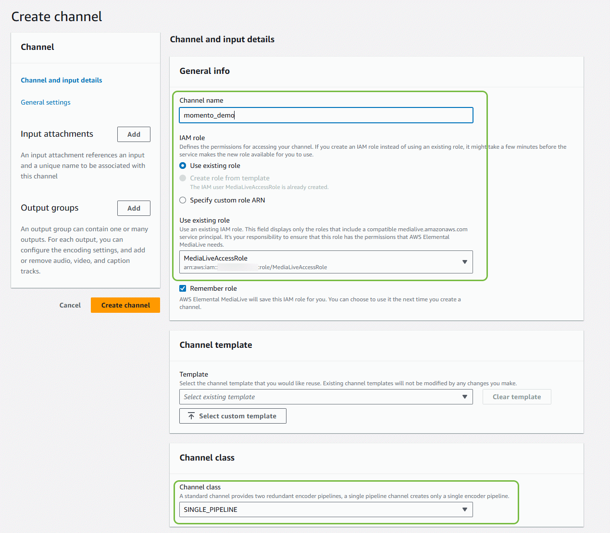

### Input attachments

Next, we must configure an input for our channel. The input is the media that will be streamed on our channel while it is active. You can either click the *Add* button next to the **Input attachments** label, or [navigate directly](https://console.aws.amazon.com/medialive/home#/inputs) to the input list.

If you already have an input you'd like to use, select it now. Otherwise, click on the *Create input* button to create a new one. For our example, we will be streaming a copy of *Big Buck Bunny* in MP4 format that is publicly available in an S3 bucket. So let's give it an appropriate name, input type of `MP4`, and select an **Input class** of `SINGLE_INPUT`.

Put the publicly accessible url to the MP4 in the **Input source A** field, and leave all other fields alone. It should resemble the following:

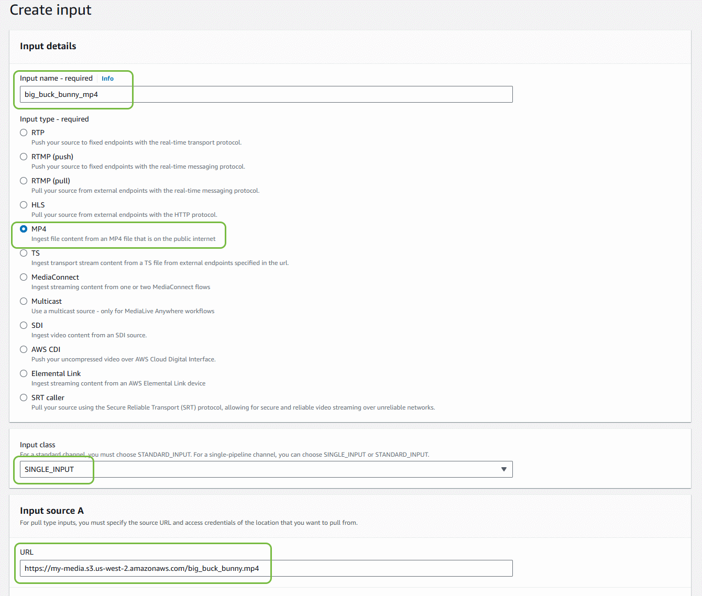

Once configured, hit the *Create input* button, navigate back to the channel configuration page, and select the input we just created.

### Output groups

Now time for the important part: configuring the outputs we would like the input converted to. As mentioned at the beginning of this tutorial, we will be generating three variants at different resolutions: *720p*, *480p*, and *240p*. To do this, we configure an output group for our channel.

Click on the *Add* button next to **Output groups** on the channel configuration page, select *HLS* as the output group type, and hit the *Confirm* button.

The destination URL is going to be writing directly to the [Momento HTTP API](https://docs.momentohq.com/cache/develop/api-reference/http-api) using the `encoder_api_key` we setup earlier. It should be in the following format:

```
https://<momento_rest_endpoint>/cache/<namespace_id>/playlist.m3u8?ttl_seconds=<ttl>&role=origin
```

The variable placeholders are:

* `momento_rest_endpoint` - Momento HTTP API region-specific endpoint ([see list](/platform/regions))
* `namespace_id` - ID of the namespace receiving uploaded segments
* `ttl` - number of seconds to retain the playlist and segments before deletion

*NOTE - notice the `role=origin` query parameter at the end. This is required for MediaLive to publish segments!*

As an example, your destination URL should look something like this:

```
https://api.cache.cell-4-us-west-2-1.prod.a.momentohq.com/cache/live-origin/playlist.m3u8?ttl_seconds=3600&role=origin
```

Next, expand the *Credentials* section. Set *Username* to `momento`. Select **Create parameter** under *Password* and follow the instructions to create a new parameter named `/medialive/momento_api_key` that contains the previously-created encoder API key.

Under *CDN Settings*, select **HLS Akamai**. We use **HLS Akamai** so that MediaLive will properly transmit credentials with each request. There's a small quirk with the service when using *HLS basic put* that omits the credentials.

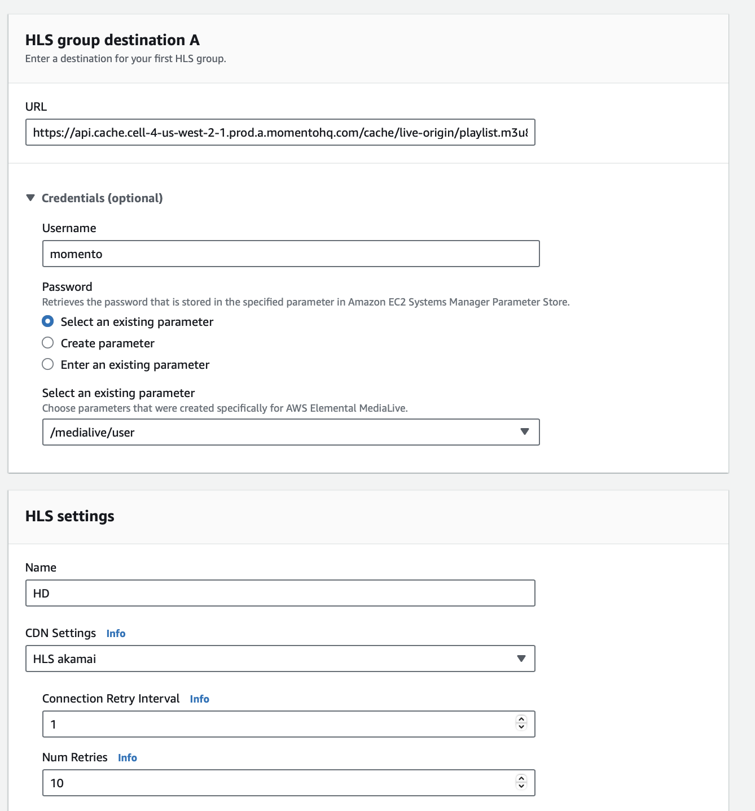

In the **Manifest and Segments** section, configure the following fields:

* **Output Selection** - MANIFESTS_AND_SEGMENTS
* **Mode** - LIVE
* **TS File Mode** - SEGMENTED_FILES
* **Segment Length** - 2

The remaining settings should match the configuration below:

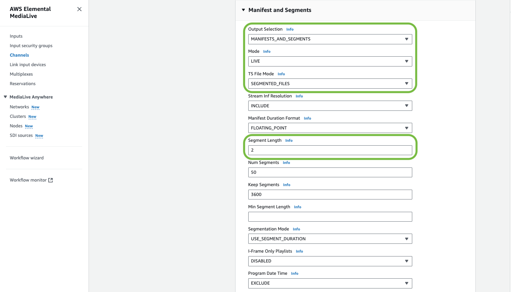

Finally, we configure how AWS Elemental MediaLive updates the variant playlists: the variant playlists are derived from the master manifest by appending a *Name modifier* at the end of the master playlist chosen name. For each variant playlist/output, add a descriptive modifier that tells us at a glance which playlist we are looking at. For example, each of the variant playlists in the example bitrate ladder will have `_480p30`, `_240p30`, and `_720p30` as the *Name Modifier*. Since we named the master manifest `playlist.m3u8`, the resulting variant manifests will be named respectively `playlist_480p30.m3u8`, `playlist_240p30.m3u8`, and `playlist_720p30.m3u8`. This naming convention will need to be specified in the CloudFront settings below.

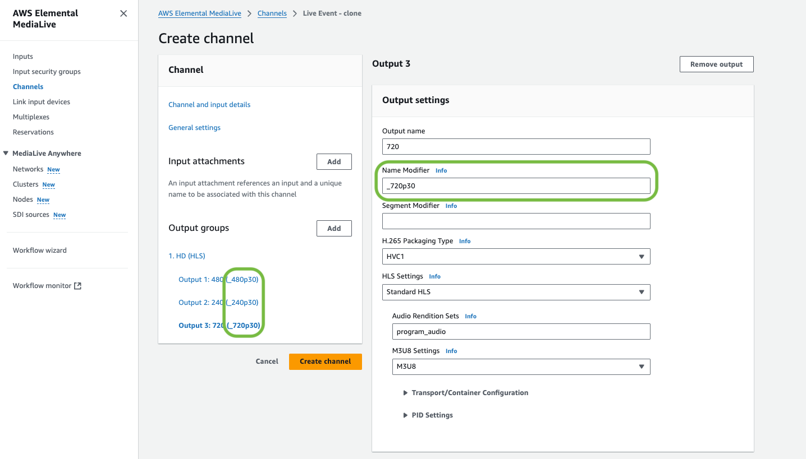

Once everything is configured, hit the *Create channel* button to create the encoder!

## 3. Optimize content delivery with Amazon CloudFront

Amazon CloudFront is a Content Delivery Network (CDN) that ensures the live video streams are delivered quickly and reliably to viewers worldwide. In this step, we'll configure CloudFront to work with Momento Media Storage - optimizing latency, managing costs, and securing access.

CloudFront will serve two key purposes in this workflow:

1. Reduce latency and costs by caching video segments across its Points of Presence (PoPs).
2. Secure access to the Momento origin by adding the appropriate authorization tokens to requests.

[Media segments](/media-storage/core-concepts/segments) are assets that change infrequently. They represent 1-5 seconds of video, audio, or metadata that will not change once it's been generated by the encoder. These media assets are usually best cached by a CDN service like Amazon CloudFront across multiple PoPs located close to the end viewers for both [live](/media-storage/streaming/live-streaming/how-it-works) and [VOD](/media-storage/streaming/video-on-demand/media-storage) video workflows.

While VOD workflows have HLS manifests that never change once they are created, HLS manifests in live video workflows are constantly recreated by the encoders to present the latest media segments, at the "live point". As a result, *live HLS manifests should not be cached by a CDN for longer than the size of a media segment*. So we will **not cache the manifests** and instead hand them over the Momento origin, which is designed to manage frequently changing objects.

:::tip

You can optimize retrieval of manifest files by specifying a short TTL in the appropriate CloudFront behavior.

:::

In the [Amazon CloudFront console](https://console.aws.amazon.com/cloudfront), create a CloudFront distribution that enables these rules through custom CloudFront behaviors.

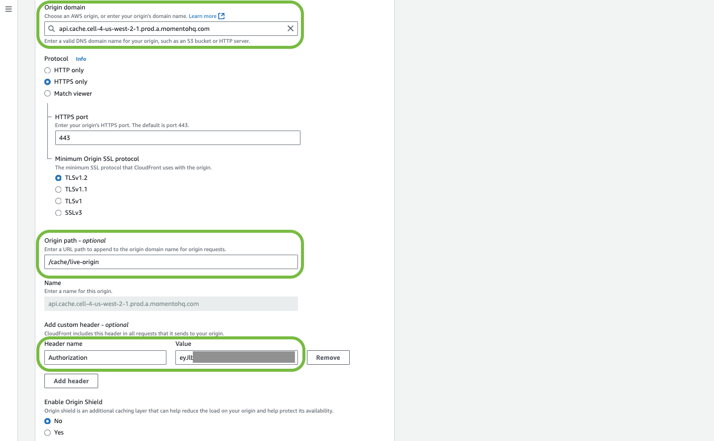

The *Origin domain* of the CloudFront distribution must be set as the `momento_rest_endpoint` url we used to configure the MediaLive channel, with the *Origin path* as `/cache/<namespace_id>`. Note the *Origin path* field **is required for this workflow**.

Since CloudFront is accessed by video players, which don't go through auth flows to obtain API keys or session tokens, we must set up the default policy to add an *Authorization* header with `player_api_key` for incoming requests. This enables CloudFront to automatically forward an API key to Momento, granting read-only access to the generated segments.

You do not need to enable the *Origin Shield* functionality of CloudFront, Momento takes care of it natively.

For the **Web Application Firewall (WAF)** settings, select *Do not enable security protections* for the demo.

Now we need to define the CloudFront behaviors for three types of objects read from the Momento origin server:

1. The default behavior
2. The behavior for media segments
3. The behavior for variant playlists

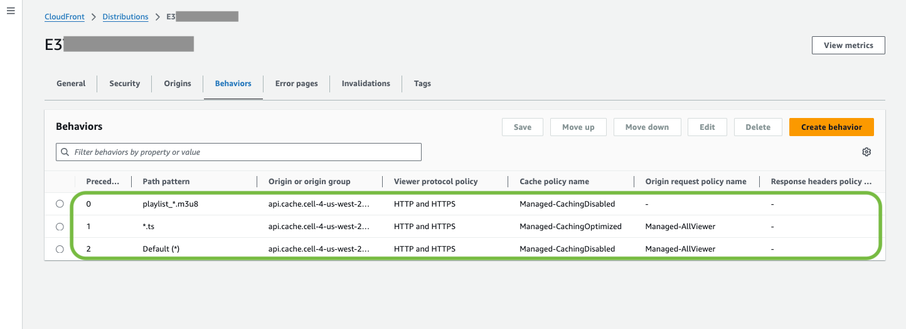

**Default behavior**: This "behavior" is for items that are not part of the video origin workflow. We assume these objects will be changed frequently, so we won't cache them in CloudFront, using the a "CachingDisabled" policy. Configure the policy as outlined below.

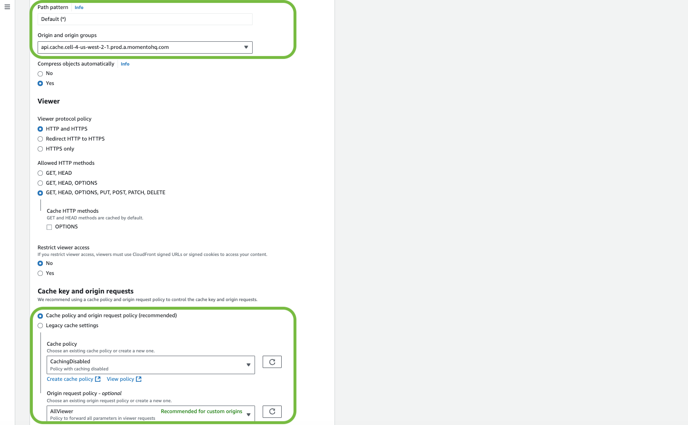

**Media segments behavior**: These files won't change after the encoder has sent them to the origin, so they are good candidates for being cached by CloudFront and its "CachingOptimized" policy. From the AWS MediaLive configuration, the segments that contain audio/video will always have the file extension `.ts` :

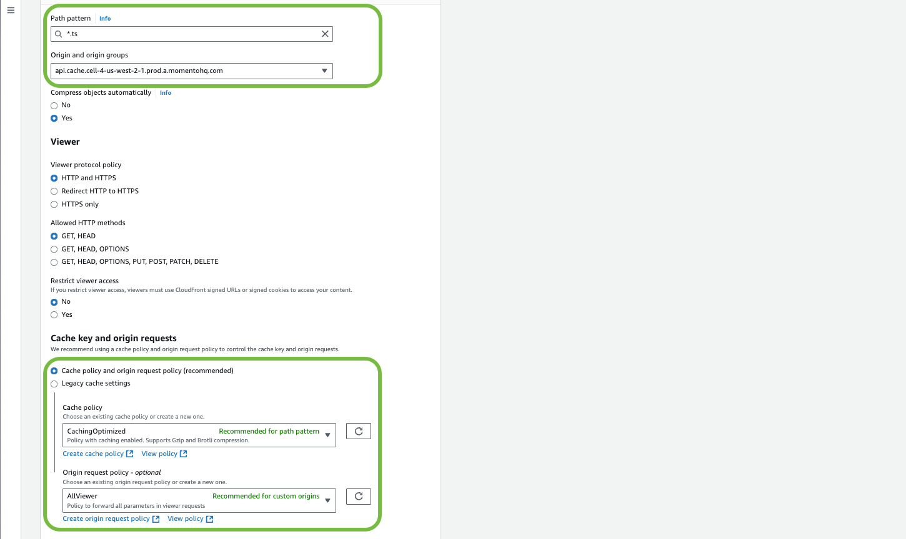

**Variant playlists behavior**: These `playlist_*.m3u8` files are refreshed every time a new media segment is available from AWS Elemental MediaLive. When MediaLive recreates the playlists, it automatically appends the `encoder_api_key` token query parameter in its URI. Since the default rules apply a different, conflicting value (`player_api_key`) in *Authorization* header when requesting these segments, we need to define a behavior where the *Authorization* header is dropped for these requests. To accomplish this, set the *Origin request policy* to None.

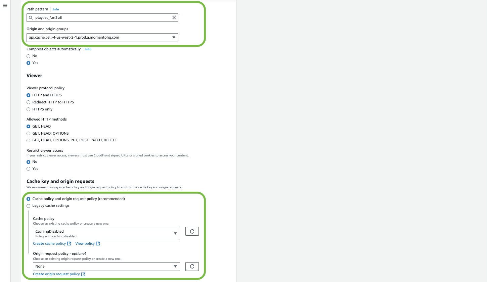

## 4. Starting the stream

Now that we have our CDN configured allowing video players to access the playlists and segments, let's see if it works! Navigate back to the [channel we created](https://console.aws.amazon.com/medialive/home#/channels) and hit the **Start** button. After a few moments, your channel will be broadcasting the video!

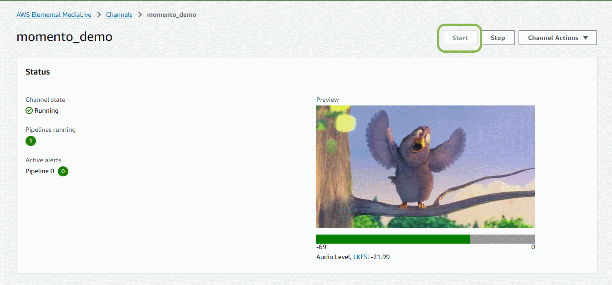

That's it, the stream is active and will be creating segments and uploading them to our `live-origin` cache. Now let's see it in action.

## 5. Watching the stream

If you already have a compatible media player like [VLC media player](https://www.videolan.org/) that accepts an HLS playlist, great! If you'd rather use an online player, you can navigate to [Livepush.io](https://livepush.io/hlsplayer/index.html) for testing purposes.

To get the url of our livestream, we need to get the distribution id of our CloudFront distribution. Navigate to the [CloudFront distribution page](https://console.aws.amazon.com/cloudfront/v4/home#/distributions) to find it. Once you have it, the url to our playlist is in the following format:

```
https://<cloudfront_id>.CloudFront.net/playlist.m3u8
```

You can put this url in the player to start watching your stream!

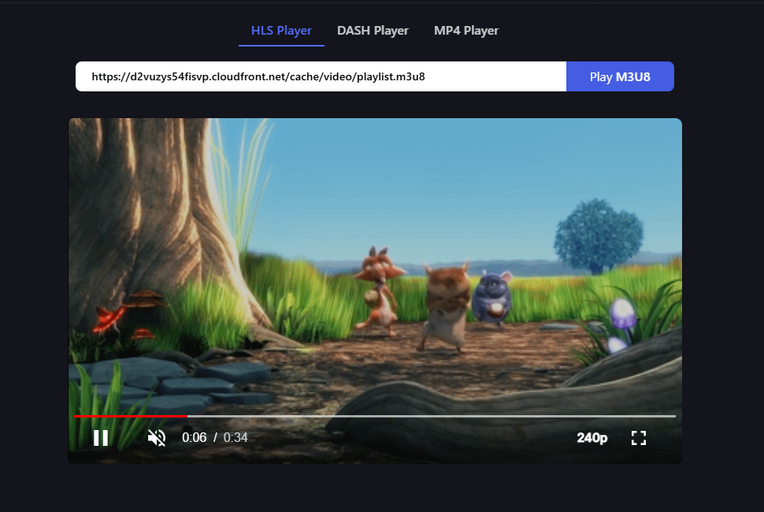

## 6. Troubleshooting

If things go wrong and the stream doesn't play, the best way to troubleshoot is to manually check each of the steps that is performed by the HLS video player.

### MediaLive and Momento

Verify the master manifest is accessible with `player_api_key` and returns the variant playlists correctly. Use the following `curl` command to test, or use the [Momento console](https://console.gomomento.com/caches/live-origin) to view data in the namespace.

```
$ curl "https://<momento_rest_endpoint>/cache/live-origin/playlist.m3u8?token=<player_api_key>"

#EXTM3U
#EXT-X-VERSION:3
#EXT-X-INDEPENDENT-SEGMENTS
#EXT-X-STREAM-INF:BANDWIDTH=2648800,AVERAGE-BANDWIDTH=1790800,CODECS="avc1.77.30,mp4a.40.2",RESOLUTION=640x480,FRAME-RATE=30.000
playlist_480p30.m3u8?ttl_seconds=3600
#EXT-X-STREAM-INF:BANDWIDTH=1394800,AVERAGE-BANDWIDTH=965800,CODECS="avc1.4d400d,mp4a.40.2",RESOLUTION=320x240,FRAME-RATE=30.000
playlist_240p30.m3u8?ttl_seconds=3600
#EXT-X-STREAM-INF:BANDWIDTH=4391200,AVERAGE-BANDWIDTH=2961200,CODECS="avc1.4d401f,mp4a.40.2",RESOLUTION=960x720,FRAME-RATE=30.000
playlist_720p30.m3u8?ttl_seconds=3600
```

Verify that each variant playlist is accessible, and if you can download the last media segment listed in the variant playlists (aka *the live point*). Below are the `curl` commands to view the 480p manifest and the live point.

```
$ curl "https://<momento_rest_endpoint>/cache/live-origin/playlist_480p30.m3u8?token=<player_api_key>"

#EXTM3U
#EXT-X-VERSION:3
#EXT-X-TARGETDURATION:2
#EXT-X-MEDIA-SEQUENCE:891
#EXTINF:2.00000,
playlist_480p30_00891.ts
#EXTINF:2.00000,
playlist_480p30_00892.ts
#EXTINF:2.00000,
[...]
#EXTINF:2.00000,
playlist_480p30_00939.ts
#EXTINF:2.00000,
playlist_480p30_00940.ts

$ curl -o test.ts  "https://<momento_rest_endpoint>/cache/live-origin/playlist_480p30_00940.ts?token=<player_api_key>"
```

When viewing the live point, verify a `test.ts` file is correctly downloaded and looks OK with your favorite test tool ([ffprobe](https://ffmpeg.org/ffprobe.html), [mediainfo](https://mediaarea.net/en/MediaInfo), etc...).

If any of these steps fails, usual suspects are:

* `encoder_api_key` or `player_api_key` might not have the right access level to the namespace.
* AWS Elemental MediaLive isn't configured correctly or isn't running.
  * Double check the URI provided in the *Destination URL* field at the HLS output group level, and don't forget to add the query parameters `&ttl_seconds=<ttl>&role=origin`

### CloudFront

If everything looks correct in MediaLive and Momento, verify the requests from CloudFront. The distribution rules already embed an authorization header, so you don't need to add `player_api_key` in the URIs. Verify that CloudFront inserts them properly.

The three commands below produce the same results as the requests sent from the player through CloudFront to Momento Media Storage. Remember that the media segments listed in each variant playlist constantly change, so replace `<id>` in the final command with a valid value from the fetched playlist:

```
$ curl "https://<cloudfront_id>.CloudFront.net/playlist.m3u8"

$ curl "https://<cloudfront_id>.CloudFront.net/playlist_480p30.m3u8"

$ curl -o test.ts "https://<cloudfront_id>.CloudFront.net/playlist_480p30_<id>.ts"
```

If any of these steps fails, usual suspects are:

* The *Authorization* header has not been correctly set to the `player_api_key` when the CloudFront distribution was created.
* A CloudFront behavior might be incorrectly set. Double check the file patterns and the associated caching policies.

## That's it!

Congratulations! You've successfully set up a live video streaming workflow using Momento Media Storage, AWS MediaLive, and Amazon CloudFront. This modern, scalable solution ensures low latency, reliability, and optimal performance for delivering live HLS streams.

**Here's what you've learned:**

* Configured Momento Media Storage as a highly performant and cost-effective origin server.
* Set up AWS MediaLive to encode and push adaptive bitrate streams directly to Momento.
* Optimized content delivery using CloudFront to reduce latency, manage costs, and secure playback access.
* Tested and troubleshot the setup to ensure seamless streaming from origin to viewers.

**Next Steps**

Now that your live streaming workflow is up and running, consider exploring additional features and optimizations:

* Learn about [adding entitlements](/media-storage/entitlements/about) to your workflow.
* Discover [how to use ffmpeg and an RTMP stream](/media-storage/streaming/capture/rtmp) to stream to Momento.
* Add [real-time reactions](/media-storage/enhancements/live-reactions) to your streams.

We can't wait to see what you build. Happy coding!
