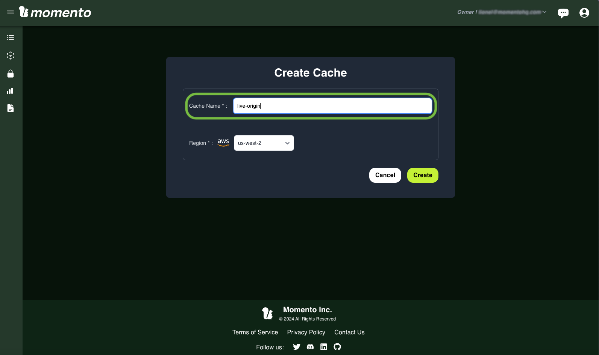
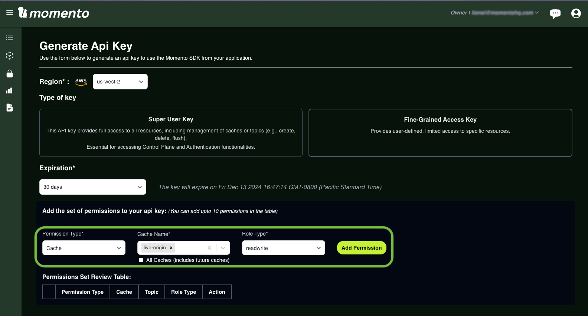
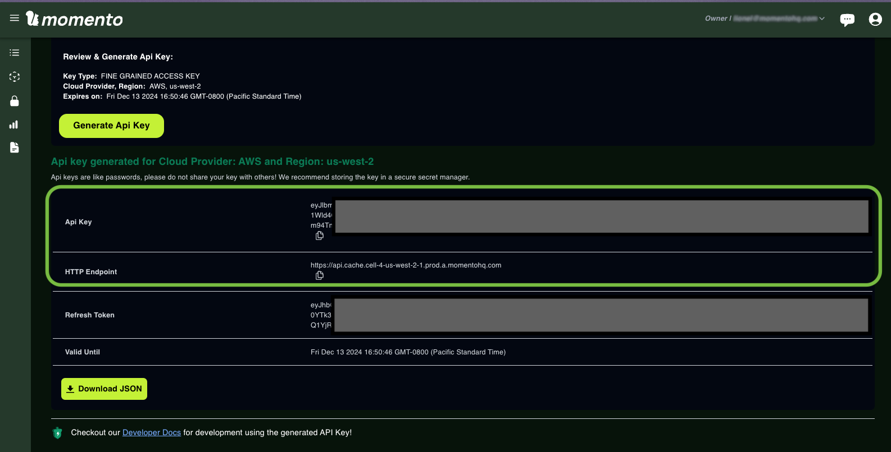
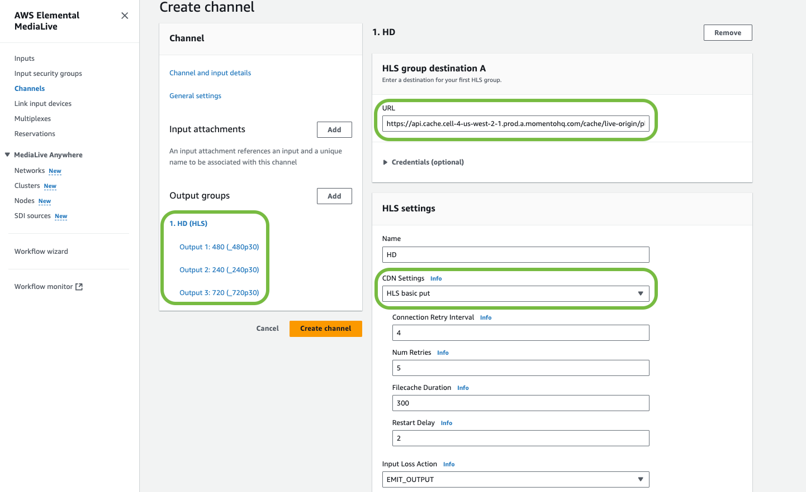

# Create a Momento Media Storage live video origin server.

With Momento Media Storage, a video origin server is defined as a cache. So, let's create a new Momento Media Storage cache called live-origin. For the purpose of this tutorial, we'll use the Momento console, but this could be created programmatically through the SDK. The AWS region we choose should be the closest available to the live encoder or encoding service you will be using.



Next, we generate the API keys to access the live-origin cache. From the Momento console, let's define a "Fine-Grained Access key" that expires in 30 days, with read-write access to our newly created live-origin cache. Don't forget to click on "Add Permission" to enable the attributes you want to grant to the API key.


 
Once this is done, click on "Generate API key", to get the details for the new key:


This API key information can be downloaded as the file momento_key_info.json. It is needed to securely upload your video segments and manifests to your Momento origin server. From now on, we will reference this API key as `encoder_api_key`.



Video players will need to read the content pushed by the encoders to Momento Media Storage, through a Content Delivery Network (CDN). For security best practices we will create a read-only API key with access to the live-origin cache. Use the same Generate API Key page as before to add this new read-only API key to your live-origin cache. For the rest of this document, we will be referencing this API key as the `player_api_key`.
   
# Create an AWS Elemental MediaLive channel
 
Best practice is to place the encoding service and Momento Media Storage cache in the same AWS region, or as close as possible. Next create a new AWS Elemental MediaLive Channel. If you are not sure how to do this, see [AWS documentation](https://docs.aws.amazon.com/medialive/latest/ug/container-planning-workflow.html).

We will use a MediaLive channel with a single encoding pipeline, sending to one destination (the Momento live origin). A couple of pitfalls to avoid when creating an AWS Elemental MediaLive channel pushing HLS content to Momento:

- Design your media segments to be less than 10MB in size which is the current limit of Momento. A quick estimate for the size of the media segments is to multiply the chosen bitrate by the segment size, and account for a small overhead of 10% to account for video headers and variability if you choose VBR as the “rate control mode” in AWS Elemental MediaLive. For example, if you choose an encoding profile at 3,000kbps, and media segments of 2 seconds, the resulting media segments will have a size of (3 * 2 * 1.10) = 6.6MB, which is compatible with Momento. 
- We recommend using media segments between 1 or 2.5 seconds to minimize camera to screen latency. Unlike other origin servers, Momento has been designed with access concurrency in mind, so your workflow will not be bottlenecked by origin performance.
- The Momento Media Storage cache requires defining the TTL for every object it manages. In this tutorial, the assumption is that the workflow we put in place is a live event. We define a TTL of 3600 seconds, or one hour, as it’s more than enough for this scenario. However, if you want to enable live-to-VOD workflows as catch-up or replay, you might want to change that retention period.

For our example, we will use an AWS Elemental MediaLive channel with an Adaptive Bitrate ladder of 3 encoding profiles (720p at 2,500 kbps, 480p at 1,500 kbps and 240p at 750kbps) and output in a HLS output group with the destination URL written as:

```
https://<momento_rest_endpoint>/cache/<cache_name>/playlist.m3u8?token=<encoder_api_key>&ttl_seconds=<ttl>&role=origin
```

Applied to this tutorial, the resulting destination URL would be:

```
https://api.cache.cell-4-us-west-2-1.prod.a.momentohq.com/cache/live-origin/playlist.m3u8?token=ey[...]J9&ttl_seconds=3600&role=origin
```

The `&role=origin` query parameter is needed as part of the MediaLive destination URL, and should be added after the `tts_seconds` query parameter.



Make sure the CDN Settings have the method as HLS basic put and the retry policy is compatible with the Momento Media Storage cache retention period.

Double check that AWS Elemental Media Live generates manifests_and_segments in its output selection, in live mode with a segment length and bitrate that keeps the segments under the 10MB limit, and is compatible with the GOP structure of your encoding ladder. In this tutorial, we are using a default encoding GOP structure of 2 seconds and the same value for the HLS segment length in the Manifest and segments settings.


Finally, we will look at the way AWS Elemental MediaLive updates the variant playlist: the variant playlists are derived from the master manifest by appending a Name modifier at the end of the master playlist chosen name. 


In our example, we named the master manifest playlist.m3u8, in the “HLS group destination A” field and we added name modifiers to each variant playlist `_480p30`, `_240p30`, and `_720p30`, which means that the resulting variant manifest will be named respectively `playlist_480p30.m3u8`, `playlist_240p30.m3u8`, and `playlist_720p30.m3u8`. This naming convention will need to be specified in the CloudFront settings below.

# Create an Amazon Cloudfront distribution

Amazon Cloudfront is a Content Delivery Network, that serves two purposes here:
1. Ensure a control of latency and delivery costs when you scale your your live video service, for assets that change infrequently;
1. Add the required authorization token at the right stage, when accessing the Momento origin service.

Media segments are assets that change infrequently. They represent between one second to a few seconds of video, audio or metadata that will not change once it’s been generated by the encoder. These media assets are usually best cached by a CDN service like Amazon Cloudfront across multiple points of presence located close to the end viewers for both for live and VOD video workflows.

While VOD workflows have HLS manifests that never change once they are created, in live video workflows the HLS manifests are constantly recreated by the encoders to present the latest media segments, at the “live point”. As a result, live HLS manifests should not be cached by a CDN for longer than the size of a media segment. For the sake of this demo, we will not cache the manifests and hand them over the Momento origin, which is designed to manage frequently changing objects, but this could be optimized with a short caching TTL.

Let’s go to the Amazon console, and create a Cloudfront distribution that enables these rules through custom Cloudfront behaviors.


The Origin domain of the Cloudfront distribution must be set as the `momento_rest_endpoint` URL, with the Origin path as `/cache/<cache_name>` (this is required, not optional for this workflow). Cloudfront will be accessed by the video players to play back the live video, and we set up the default policy to add an Authorization header with our `player_api_key` for the requests coming from the player side. No need to enable the Origin Shield functionality of Cloudfront, Momento will take care of it natively.

Now, we need to define the Cloudfront behaviors for three types of objects read from the Momento origin server:
1. The default behavior
2. The behavior for media segments
3. The behavior for variant playlists


**Default behavior**: This “behavior” will be for items that are not part of the video origin workflow. We will assume these objects will be changed frequently, so we won’t cache them in Cloudfront, using the CachingDisabled policy:


**Media segments behavior**: These files won’t change after the encoder has sent them to the origin, so they are good candidates for being cached by Cloudfront and its CachingOptimized policy. From our AWS ElementalLive configuration, the segments that contain audio/video will always have the file extension .ts :


**Variant playlists behavior**: These playlist_*.m3u8 files are refreshed every time a new media segment is available from AWS Elemental MediaLive (every 2 seconds in our example). When MediaLive recreates the variant playlists, it automatically appends the `encoder_api_key` token query parameter in its URI. As our default rules apply a different `player_api_key` in an authorization header when requesting these segments, they are conflicting and we need to define a behavior where the authorization header is dropped for these requests. To accomplish this, set the Origin request policy to None, for the sake of simplicity of this test. In production, you should define a caching policy with a TTL shorter than the size of the media segments (i.e. 2 seconds or less, in our example).


# Playback and troubleshooting

We are now all set, when the Cloudfront distribution is created and ready to be used, you should be able to point your favorite HLS player (in VLC open a network stream and paste the .m3u8 path) `https://<your_cloudfront_id>.cloudfront.net/playlist.m3u8` and play back the live stream encoded by AWS Elemental Medialive.

What if things go wrong, and the stream doesn’t play? The best way to troubleshoot the stream is to manually check each of the steps that is performed by the HLS video player.

At the Momento and encoder level:

Verify that the master manifest is accessible with your `player_api_key`, and returns the variant playlists correctly:

```
$ curl "https://<momento_rest_endpoint>/cache/live-origin/playlist.m3u8?token=<player_api_key>"

#EXTM3U
#EXT-X-VERSION:3
#EXT-X-INDEPENDENT-SEGMENTS
#EXT-X-STREAM-INF:BANDWIDTH=2648800,AVERAGE-BANDWIDTH=1790800,CODECS="avc1.77.30,mp4a.40.2",RESOLUTION=640x480,FRAME-RATE=30.000
playlist_480p30.m3u8?token=<encoder_api_key>&ttl_seconds=3600&role=origin
#EXT-X-STREAM-INF:BANDWIDTH=1394800,AVERAGE-BANDWIDTH=965800,CODECS="avc1.4d400d,mp4a.40.2",RESOLUTION=320x240,FRAME-RATE=30.000
playlist_240p30.m3u8?token=<encoder_api_key>&ttl_seconds=3600&role=origin
#EXT-X-STREAM-INF:BANDWIDTH=4391200,AVERAGE-BANDWIDTH=2961200,CODECS="avc1.4d401f,mp4a.40.2",RESOLUTION=960x720,FRAME-RATE=30.000
playlist_720p30.m3u8?token=<encoder_api_key>&ttl_seconds=3600&role=origin
```

Verify that each variant playlist is accessible, and if you can download the last media segment listed in the variant playlist (the live point):

```
$ curl "https://<momento_rest_endpoint>/cache/live-origin/playlist_480p30.m3u8?token=<player_api_key>"

#EXTM3U
#EXT-X-VERSION:3
#EXT-X-TARGETDURATION:2
#EXT-X-MEDIA-SEQUENCE:891
#EXTINF:2.00000,
playlist_480p30_00891.ts
#EXTINF:2.00000,
playlist_480p30_00892.ts
#EXTINF:2.00000,
[...]
#EXTINF:2.00000,
playlist_480p30_00939.ts
#EXTINF:2.00000,
playlist_480p30_00940.ts

$ curl -o test.ts  "https://<momento_rest_endpoint>/cache/live-origin/playlist_480p30_00940.ts?token=<player_api_key>"
```

Verify that a test.ts file is correctly downloaded and looks OK with your favorite test tool (ffprobe, mediainfo, avmediainfo...)

If any of these steps fails, usual suspects are:
Your Momento `encoder_api_key` or `player_api_key` might not have the right access level to the cache;
AWS Elemental MediaLive isn’t configured correctly or isn’t running: double check the URI provided in the destination URL field at the HLS output group level, and don’t forget to add the query parameters `&ttl_seconds=<ttl>&role=origin`


At the Cloudfront level:

If everything looks correct at the Momento level, we will verify the requests from Cloudfront. Because of the distribution rules we have defined, we don’t need to add the `player_api_key`` in the URIs, and we need to verify that Cloudfront inserts them properly.

The three commands below should give you the same results as the commands run right at the Momento Media Storage cache level (with the media segments in the variant playlists refreshed at the time you enter the command line `playlist_480p30_xxxx.ts`):

```
$ curl "https://<your_cloudfront_id>.cloudfront.net/playlist.m3u8"

$ curl "https://<your_cloudfront_id>.cloudfront.net/playlist_480p30.m3u8"

$ curl -o test.ts "https://<your_cloudfront_id>.cloudfront.net/playlist_480p30_01488.ts"
```

If any of these steps fails, usual suspects are:
- The Authorization header has not been correctly set to the `player_api_key` when the Cloudfront distribution was created.
- A Cloudfront behavior might be incorrectly set: double check the file patterns and the associated caching policies.
