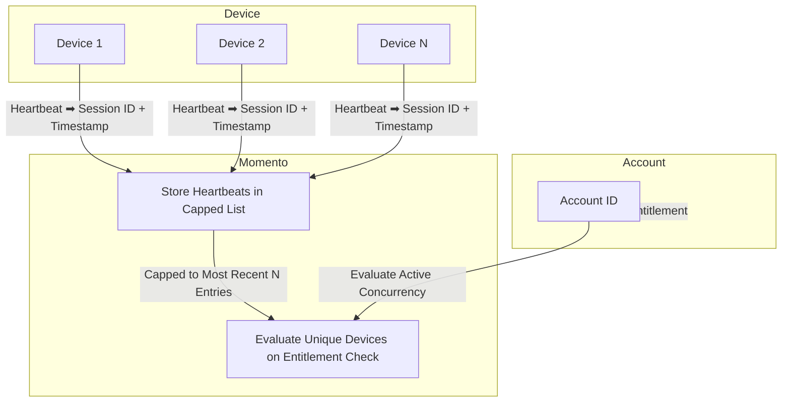

import Tabs from '@theme/Tabs';
import TabItem from '@theme/TabItem';

# Tracking concurrent devices for an account

Tracking concurrent devices or streams per account is essential for applications where managing access, ensuring security, and optimizing resources are top priorities. In subscription-based services, enforcing device or stream limits restrict simultaneous access to content to a specified number of devices. **Concurrency tracking** also supports account security by preventing unauthorized sharing, safeguarding the service from potential misuse. This also enables resource optimization in high-traffic applications, especially within media and entertainment, by managing resources dynamically based on real-time demand.

The pattern outlined below demonstrates how Momento provides **real-time session monitoring** without the need for complex infrastructure.

## Overview



Monitoring concurrency with Momento relies on [heartbeats](/mediastore/enhancements/heartbeats) to be emitted from connected players. A server component manages a [cache list](/cache/develop/basics/datatypes#lists) in Momento that tracks the most recent N heartbeats (N is based on your business requirements). During an [entitlement check](/mediastore/entitlements/about), the list is fetched, player ids are deduplicated, and the concurrency count is determined.

The major components in concurrency tracking are:

* **Device** - Each device or stream sends a heartbeat via [Momento Topics](/topics), which includes a unique session ID.
* **Momento**
  * **Cache** - Stores recent heartbeats for each account in a dedicated cache list, discarding old entries when the list exceeds a certain length.
  * **Auth** - Creates [session tokens](/cache/develop/authentication/tokens) for players, encoding the account id directly in the token.
* **Account** - Represents the user account in your system.

## Building a concurrency tracker

Four components are needed in this pattern

* Token vending machine
* Device heartbeat
* Heartbeat handler
* Concurrency checker

### Token vending machine

A token vending machine is a pattern that dispenses short-lived session tokens with limited permissions. This is a server-side component, usually an API endpoint, that dynamically generates the token. Below is a snippet of code used to create a session token. This code should live inside of your API endpoint handler.
<Tabs>
<TabItem value="node" label="Node.js">

```javascript
const scope = { permissions: [
  {
    role: 'publishonly',
    cache: 'video',
    topic: mediaId
  }
]};

const response = await authClient.generateDisposableToken(scope, ExpiresIn.minutes(30), { tokenId: accountId });
if(response.type === GenerateDisposableTokenResponse.Success){
  return { token: response.authToken };
}
```
</TabItem>
<TabItem value="go" label="Go">
</TabItem>
<TabItem value="dotnet" label=".NET">
</TabItem>
</Tabs>

In the snippet above, we set explicit permissions to allow the user to *publish* messages to the `mediaId` topic. This is the way the player heartbeat will communicate with our handler. The token is configured to live for 30 minutes and has the user's `accountId` embedded in the token. The embedded account id will show up as an argument in our heartbeat subscription on the server, *preventing messages from being spoofed* and adding a layer of security to our solution.

:::info
In a production scenario, this code might live in your existing authZ mechanism and return the generated token as a claim. Assumptions are made here that prior to the code snippet above, the user has been authenticated and you have access to their account id and have securely identified the content their are attempting to view.
:::
