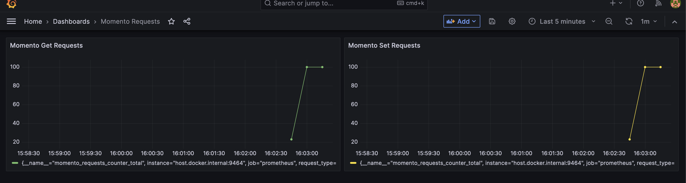

import { SdkExampleCodeBlock } from "@site/src/components/SdkExampleCodeBlock";
import { SdkExampleCodeBlockImpl } from "@site/src/components/SdkExampleCodeBlockImpl";

# Observability with Momento in Node.js

## Logging

Our goal for all of the Momento SDKs is to make sure that developers can direct Momento log output to the same destination that they are using for the rest of their application logs; therefore, we aim to be compatible with all of the popular logging frameworks for a given programming language.

There are many different logging libraries available for node.js. Some popular ones include:

- [Pino](https://github.com/pinojs/pino)
- [Winston](https://github.com/winstonjs/winston)
- [Bunyan](https://github.com/trentm/node-bunyan)
- [Morgan](https://github.com/expressjs/morgan)

To ensure that Momento is compatible with all of these libraries (and more!), we provide a light-weight logging facade that you can use to wrap your favorite logging client. To use it, you simply need to implement the `MomentoLoggerFactory` and `MomentoLogger` interfaces:

<SdkExampleCodeBlock language={'javascript'} file={'packages/core/src/config/logging/momento-logger.ts'} />

Your implementation will just be a thin wrapper around your logging library of choice. We provide a complete, working example implementation that uses the [`pino`](https://github.com/pinojs/pino) logger; you can find the [source code for that here](https://github.com/momentohq/client-sdk-javascript/blob/main/examples/nodejs/observability/pino-logger.ts).

When you create an instance of your `MomentoLoggerFactory`, you can specify a specific logger level. Then you can get `MomentoLogger` instances from that factory that use the specified logger level.

<SdkExampleCodeBlock language={'javascript'} snippetId={'observability_CreateLoggerFactory'} />

Once you have defined your `MomentoLoggerFactory` and `MomentoLogger`, the last step is to configure your Momento client to use your preferred logger, like this:

<SdkExampleCodeBlock language={'javascript'} snippetId={'observability_CreateCacheClientWithPinoLogger'} />

Then you should see log messages from Momento coming through your pino logging environment. In this case you should see log messages that look like this:

```
[1685649962168] INFO (CacheClient/4386 on mycomputer.local): Creating Momento CacheClient
[1685649962168] INFO (ControlClient/4386 on mycomputer.local): Creating cache: test-cache
```

## Metrics
Metrics are measurements that provide quantitative information about system performance and behavior. They are numerical values captured and recorded over regular intervals, providing statistical data to aid in understanding the trends and patterns in a system.

For Momento, specifically, you might want to capture client-side metrics on the number of requests made, their duration, request or response size, or failure rates.

The most straightforward way to emit these metrics is to use one of the `ExperimentalMetricsMiddleware` classes. These classes emit metrics in JSON format:

```
(Momento: _ExperimentalMetricsLoggingMiddleware):
{
  "momento": {
    "numActiveRequestsAtStart": 1,
    "numActiveRequestsAtFinish": 1,
    "requestType": "_GetRequest",
    "status": 0,
    "startTime": 1697663118489,
    "requestBodyTime": 1697663118489,
    "endTime": 1697663118492,
    "duration": 3,
    "requestSize": 32,
    "responseSize": 2,
    "connectionID": "0"
  }
}
```

The metrics format is currently considered experimental; in a future release, once the format is considered stable, this class will be renamed to remove the `Experimental` prefix. The two middleware classes available are:

- [`ExperimentalMetricsLoggingMiddleware`](https://github.com/momentohq/client-sdk-javascript/blob/main/packages/client-sdk-nodejs/src/config/middleware/experimental-metrics-logging-middleware.ts): will emit metrics to your chosen logger. WARNING: depending on your request volume, this middleware will produce a high volume of log output. If you are writing logs directly to local disk, be aware of disk usage and make sure you have log rotation / compression enabled via a tool such as `logrotate`.
- [`ExperimentalMetricsCsvMiddleware`](https://github.com/momentohq/client-sdk-javascript/blob/main/packages/client-sdk-nodejs/src/config/middleware/experimental-metrics-csv-middleware.ts): will emit metrics to a CSV file. WARNING: enabling this middleware may have minor performance implications, so enable with caution. Depending on your request volume, the CSV file size may grow quickly, and neither sampling nor file compression / rotation are included at this time.

Log files and CSVs can be analyzed or shared with Momento to diagnose performance issues. You may also direct your logs to an AWS CloudWatch Log Group and create a CloudWatch dashboard to monitor your Momento requests; [an example of launching a Momento metrics dashboard](https://github.com/momentohq/client-sdk-javascript/tree/main/examples/nodejs/aws/lambda-examples/cloudwatch-metrics) and optional example application is available in the Node.js SDK. The example Lambda and Fargate applications utilize the `ExperimentalMetricsLoggingMiddleware` class and CloudWatch metric filters to populate a dashboard like the one shown below.


Alternatively, you can capture client-side metrics using your own custom middleware that intercepts  Momento gRPC calls and responses. Here is an example that uses OpenTelemetry and Prometheus to capture request count faceted by request type:

First, set up metrics in your application:

<SdkExampleCodeBlock language={'javascript'} snippetId={'observability_setupMetrics'} />

Then, create a middleware that captures the metric:

<SdkExampleCodeBlock language={'javascript'} file={'examples/nodejs/observability/example-metric-middleware.ts'} />

When you create the Momento `CacheClient`, add the middleware and the metric will be incremented with each request:

<SdkExampleCodeBlock language={'javascript'} snippetId={'API_InstantiateCacheClientWithMiddleware'} />

Here is an example of the Grafana UI displaying a graph of get and set requests made against Momento:


## Traces
Traces provide a detailed timeline of processes within an application, showing the relationship between different components and services involved in a specific request or operation. They allow developers to analyze the sequence and duration of these operations, facilitating a better understanding of how data flows through the system.

The Momento Node.js SDK uses gRPC internally to communicate with the Momento servers. OpenTelemetry provides a capability for auto-instrumenting all gRPC calls with traces. You don't need to add any middleware code to produce these traces, like you do for the metrics. Here is an example that automatically generates traces for these calls and exports them to Zipkin:

<SdkExampleCodeBlock language={'javascript'} snippetId={'observability_setupTracing'} />

This needs to run before any Momento code.

Here is an example of the Zipkin UI displaying traces for a cache creation, a get, and a set:


If the performance of your application is impacted by trace generation, you should consider sampling them to cut down on the number of traces generated. You can do this with OpenTelemetry by setting two environment variables:

```cli
export OTEL_TRACES_SAMPLER="traceidratio"
export OTEL_TRACES_SAMPLER_ARG="0.1"
```
Setting these will ensure that only 10% of traces are created.
