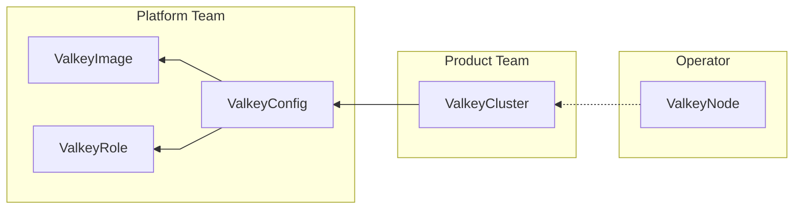

# Momento Valkey Operator

The Momento Valkey Operator runs sharded Valkey clusters on Kubernetes. This page explains what it does, how it splits responsibility between two personas, and where to go next depending on what you're trying to do.

:::note
These docs describe operator release v0.6.0.
:::

## What the operator does

The operator turns a small set of custom resources into running Valkey clusters and keeps them that way. Given a `ValkeyCluster`, it bootstraps the cluster from nothing: creating nodes, forming the topology, assigning hash slots, attaching replicas. It then keeps the cluster converged on the desired spec: scaling shards and replicas, carrying out rolling upgrades, handling primary failover, and enforcing zone-aware placement. It also manages TLS certificate delivery and ACL user provisioning, converging both continuously rather than only at creation time.

Everything the operator does is driven by custom resources, not imperative commands. You declare what you want: a cluster's topology, a config's settings, an image allowlist entry. The operator's control loops then drive the running state toward it, one small step at a time. See [Reconciliation](concepts/reconciliation.md) for how that works.

## Two personas, one governance model

The operator is built around a split between two personas, enforced through Kubernetes RBAC rather than through any custom policy engine. The **platform team** curates a cluster-scoped menu: which Valkey images are allowed to run (`ValkeyImage`), which configuration profiles exist (`ValkeyConfig`), and which reusable ACL permission sets are available (`ValkeyRole`). Because these resources are cluster-scoped, the platform team can grant every namespace read-only visibility into the menu while keeping write access to themselves.

The **product team** provisions Valkey clusters by creating `ValkeyCluster` resources in their own namespace, choosing a config from the menu and stating topology. `ValkeyCluster` is namespace-scoped, so a product team can create any number of clusters in a namespace they control, but every cluster they create is built only from images, configs, and roles the platform team has already approved. This is the whole governance model: no admission webhooks, no external policy service; only which resources live at which scope, and who has write access to each.

The five resource kinds split cleanly along that boundary. A product team writes only `ValkeyCluster`; everything it references lives in the platform team's cluster-scoped menu, and the operator manages `ValkeyNode` resources on the team's behalf:

The arrows are references by name: a cluster's `configRef` selects a `ValkeyConfig` from the menu, and each `ValkeyNode` points at the `ValkeyCluster` that owns it (the operator creates one per cluster member; deleting the cluster cascades to its nodes). Within the menu, a config's `imageRef` and ACL-binding `roleRef` entries compose the other two kinds, and a `ValkeyCluster`'s own ACL bindings can also reference published roles; those edges are left out of the diagram for readability. See [Resource model](concepts/resource-model.md) and [ACLs](security/acls.md).

## Coming from a managed cache offering

If you're evaluating the operator after working with a managed cache offering, the concepts map fairly directly:

| Managed cache offering concept | Operator equivalent |
| ------------------------------ | ------------------- |
| Engine version                 | `ValkeyImage`       |
| Instance type / node size      | `ValkeyConfig`      |
| Replication group / cluster    | `ValkeyCluster`     |

The mapping isn't exact. In particular, `ValkeyConfig` also carries platform-level ACL bindings and raw Valkey settings, and the operator's governance model is Kubernetes RBAC on these resources rather than an IAM policy layer. But it's a reasonable starting mental model. See [Resource model](concepts/resource-model.md) for the real shape.

## Part of the Platform Engineering Toolkit

The operator is one component of Momento's Platform Engineering Toolkit for Valkey. Two other components exist alongside it and are not documented here: **Valkey Router**, a gateway that sits in front of a Valkey cluster to handle client-facing scaling concerns, and **Valkey Enterprise Image**, a hardened container image for Valkey nodes. Nothing in these docs assumes either component is present: the operator runs any allowlisted Valkey image over its own headless Service.

## Find your way around

- **Evaluating the operator?** Read [Why this operator](why-this-operator.md), then [Architecture](concepts/architecture.md), [Failure modes](operations/failure-modes.md), and [Data durability](concepts/data-durability.md); the rest of the [concepts section](concepts/index.md) fills in the model, and the [quickstart](getting-started/quickstart.md) gets you hands-on in about 20 minutes.
- **Platform team setting up the operator?** Start at [Getting started](getting-started/index.md), then move to the [platform team guide](platform-guide/index.md).
- **Product team provisioning a cluster?** Go straight to the [product team guide](team-guide/index.md).
- **Running a security review?** Start at [Security](security/index.md).
- **Something's wrong?** Go to [Troubleshooting](operations/troubleshooting.md); the rest of the [operations section](operations/index.md) covers failure modes, placement, sizing, and teardown.
- **Quick question?** The [FAQ](support/faq.md) gives short answers with pointers, and the [glossary](getting-started/glossary.md) defines the Valkey and operator terms these docs use.
- **Looking something up?** Field-level detail lives in the [reference section](reference/index.md); version floors and support channels in [support](support/index.md); direction in the [roadmap](roadmap.md).
