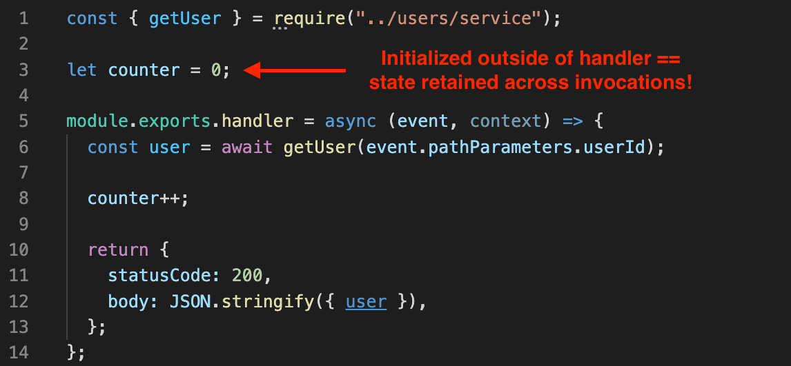
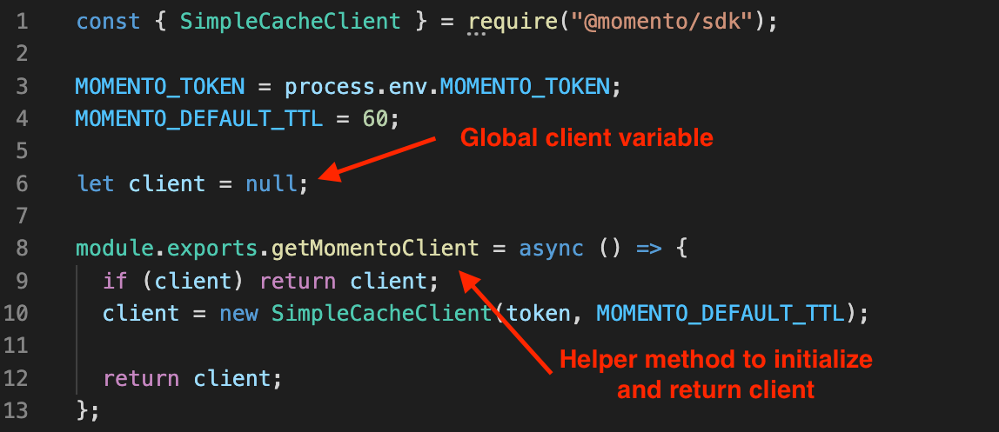
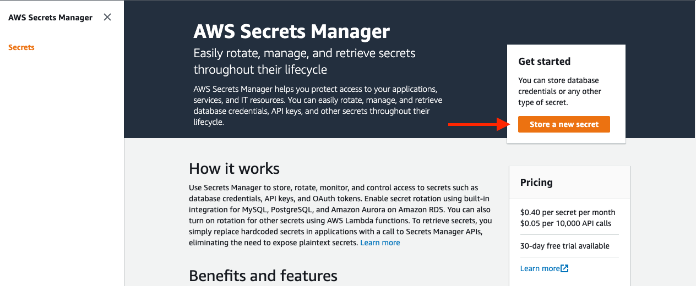

# AWS Lambda でキャッシュ

2014年11月の AWS Lambda のリリースは、ソフトウェアアーキテクチャにおけるサーバーレス革命の始まりを告げました。Lambda のイベント駆動型、関数ベースのコンピューティングソリューションは、クラウドでアプリケーションを構築する方法の本質を変えました。

しかし、Lambda のコンピューティングモデルは、それ以前のインスタンスベースまたはコンテナベースのモデルとは大きく異なります。それは超短命で、必要に応じて入力イベントを処理するために関数インスタンスがオンデマンドで起動します。これは、関数インスタンスの迅速な起動を最適化し、コールドスタートの遅延を増やす可能性があるものをすべて削除する必要があることを意味します。

さらに、Lambda はアプリケーションのトラフィックに基づいて必要に応じて関数インスタンスを削除できるステートレスモデルです。これは、実行中のインスタンスが利用可能であるとは限らないことを意味しますが、既存のコンテナへのリクエストがコールドスタートからのものよりも速くなるようにコードを最適化することができます。

このガイドでは、AWS Lambda で Momento を使用する実用的な側面を見ていきます。具体的には、Lambda で Momento を効率的に使用するための3つの側面をカバーします。

- [接続の再利用](#接続の再利用)

- [クレデンシャル情報の管理](#クレデンシャル情報の管理)

- [パッケージ管理](#パッケージ管理)

これは、サーバーレスアプリケーションで Momento を設定するための、実用的で内容の濃いガイドとなるよう設計されています。

サーバーレスアプリケーションと Momento がなぜうまく機能するのかをより詳しく知りたい場合は、サーバーレスとキャッシングに関するガイド をご参照ください。

## 接続の再利用

Momento をサーバーレスアプリケーションで効果的に使用するための最初のステップは、Lambda 関数内で Momento サービスへの接続が再利用されていることを確認することです。まずは背景について説明し、その後にアプリケーションで実際に取るべき具体的な手順を説明します。

### 背景

Lambda はステートレスで、関数ベースのイベント駆動型のコンピューティングモデルであることを思い出してください。よくある Lambda 関数のハンドラは以下のような形になります。


Lambda 関数のエントリーポイントとなるハンドラがあります。HTTP リクエスト、SQS キューメッセージ、またはストリームレコードのバッチなどの設定されたイベントが到着するたびに、Lambda 関数のインスタンスはそのイベントを受け取り、ハンドラを呼び出してイベントの詳細を処理します。

重要な点は、ハンドラのスコープ内のすべての要素は毎回新しいものになるということです。例えば、ハンドラ内で初期化され、インクリメントされるカウンター変数がある場合、次のようになります。


しかし、変数はハンドラのスコープ内にあるため、リクエスト間で保持されません。この特定の関数インスタンスを実行するたびに、カウンター変数は1に設定されますが、ハンドラがイベントの実行を終えると、カウントは失われます。

関数インスタンス内で状態を再利用することもできます。ハンドラのスコープの外部、つまりグローバルスコープで変数を設定すると、変数は関数インスタンス間で保持されます。



上記の画像では、カウンター変数をグローバルスコープで設定しました。これにより、この関数インスタンスの各呼び出しでカウンターが増加し、集計されたデータがリクエスト間で保持されます。

この状態は、特定の Lambda 関数のインスタンス内で保持されます。Lambda サービスは、同時に複数のイベントが発生した場合に、複数の Lambda 関数のインスタンスを起動する可能性があります。データは時間を超えて単一の関数インスタンスへのリクエスト間で共有されますが、関数インスタンス間では共有されません。


例えば、上記の画像では、3つの別々の Lambda 関数インスタンスが実行されています。複数のユーザーが私たちの関数に対して HTTP リクエストを行っていますが、各関数は一度に1つのリクエストしか処理できません。ただし、関数インスタンスが初期化されると、時間の経過とともに複数のリクエストで再利用することができます。各関数インスタンスにはカウンター変数があり、個々の関数インスタンスの状態に基づいて異なる値が設定されていることがわかります。

変数の再利用はカウンターなどに役立つ場合がありますが、より一般的には初期化に時間がかかる要素の再利用に使用されます。Lambda 関数内で Momento などの外部サービスへのネットワーク呼び出しを行う場合、初期接続の確立はリクエストの最も遅い部分になることがよくあります。リモートサーバーへの TCP ハンドシェイクと TLS 暗号化のための TLS ハンドシェイクを行う必要があります。これには100ミリ秒以上かかることもあります。Momento のクライアント側のレイテンシは1〜2ミリ秒ですので、これではキャッシュの恩恵が打ち消されてしまいます。

しかし、Lambda のグローバル変数の再利用を活用して Momento クライアントをキャッシュすることができます。特定の関数インスタンス内の最初の呼び出しでは、Momento への接続を確立するための時間がかかりますが、その後のすべての呼び出しでは接続を再利用し、全体的なレスポンス時間を劇的に短縮することができます。

### アプリケーション

Lambda における接続の再利用の詳細について理解したところで、具体的な動作方法について説明します。

グローバルスコープ内の要素はリクエスト間で再利用されることを忘れないでください。したがって、Momento クライアントをハンドラのグローバルスコープで次のように初期化することができます。


これは機能するかもしれませんが、各関数ハンドラに大量の冗長なコードが追加されます。また、設定ロジックが複数の異なるファイルに分散されるため、単一のファイルに集約されるのではなく、複製されることになります。

なので、Momento クライアントを初期化するために別のファイルを作成する形もできます。以下のようになります。



このモジュールのグローバルスコープには `client` 変数があります。そして、モジュールからエクスポートされる `getMomentoClient` 関数があります。この関数内では、まず `client` 変数が null でないかをチェックし、null でない場合はそのまま返します。そうではない場合は、Momento クライアントを初期化して `client` 変数に保存します。そして、クライアントを呼び出し元に返します。

このモジュールは、関数インスタンスが初期化されるときにハンドラによってロードされます。最初にクライアントが `getMomentoClient` 関数を呼び出すとき、既存のクライアントは存在せず、新たに初期化されます。ただし、将来のリクエストでは、Momento サービスへの既存の接続を持つ事前に初期化されたクライアントが取得されるため、リクエストが高速化されます。

このモジュールをハンドラ関数やサービスクラスで次のように使用できます。


ここでの例は Node.js でのものですが、同じパターンは他のプログラミング言語にも適用されます。

## クレデンシャル情報の管理

Momento は、Momento サービスへのクライアントの認証に JWT を使用します。このセクションでは、AWS Lambda でこのトークンを管理する方法について説明します。

### 背景

先述の通り、Lambda はステートレスなコンピューティング環境です。つまり、アプリケーション内で使用するすべてのデータは、関数コードに直接組み込まれるか、実行時に動的に読み込まれる必要があります。データをコードに直接組み込む方法は特定のデータには機能しますが、他のデータに対しては柔軟性に欠けます。

コード内でより動的なデータを処理するための主なオプションは2つあります。機密性のない情報の場合、環境変数を介してデータを関数コードに流すことができます。これは、アプリケーション内のステージ間で変化するデータ（たとえば、DynamoDB テーブルや S3 バケットの名前など）に適しています。また、アプリケーションのログレベルやフィーチャーフラグの振る舞いなど、環境ごとのわずかな設定の違いにも適しています。

ただし、環境変数は機密情報にはあまり適していません。すべての環境変数はアプリケーションコードからアクセスできるため、侵害されたサードパーティのライブラリが簡単に機密情報を読み取り、キャプチャすることができます。

認証情報の管理について、AWS Lambda を使うユーザーは通常、2つのサービスのいずれかを利用します。[AWS Systems Manager パラメータストア](https://docs.aws.amazon.com/systems-manager/latest/userguide/systems-manager-parameter-store.html), と [AWS Secrets Manager](https://docs.aws.amazon.com/secretsmanager/latest/userguide/intro.html)です。

これらの2つのシステムは非常に似ています。両方とも、認証情報の保存と取得のためのシンプルな API を提供し、IAM と統合して権限を管理します。Secrets Manager はより高度なソリューションであり、より高いリクエスト制限、自動化された認証情報のローテーション、およびより細かいアクセス制御を提供します。

これらの高度な機能については、ストアするごとに料金が発生し、Secrets Manager サービスへの API 呼び出しにも料金がかかります。一方、Parameter Store は無料で使用できますが、リクエストの制限が少なく、自動化された認証情報のローテーションはありません。

### アプリケーション

AWS Lambda でのシークレットの管理について少し理解したところで、Lambda での Momento 認証トークンの保存と管理方法を見てみましょう。

認証情報の管理には、アプリケーションの部分が3つのコンポーネントから成り立ちます

1. Secrets Manager で Momento 認証トークンを保存すること

2. Lambda 関数がシークレットにアクセスするために必要な IAM の権限を付与すること

3. Lambda 関数内でシークレットにアクセスすること

これら3つを順番に対応させましょう。

#### Momento 認証トークンを Secrets Manager に保存する

まず、Momento の認証トークンを AWS Secrets Manager に保存する必要があります。

[AWS コンソールの AWS Secrets Manager セクション](https://console.aws.amazon.com/secretsmanager/home)に移動します。サーバーレスアプリケーションで使用しているリージョンと同じリージョンにいることを確認してください。次に、**Store a new secret** をクリックして、Secrets Manager に新しいシークレットを追加します。



これにより、新しいシークレットを作成するための Secrets Manager ウィザードが開きます。

**Secret type** では、"**Other type of secret**"を選択します。次に、シークレットキーとして"**MOMENTO_API_KEY**"を入力し、認証トークンをシークレット値として貼り付けます。

デフォルトの暗号化キーを使用することができます。**Next** ボタンをクリックしてウィザードを続行します。


次の画面では、シークレットを識別するための名前を付け、シークレットの簡単な説明を入力します。その後、**Next**をクリックします。


次の画面では、シークレットのローテーションについて設定しますが、ここでは設定しません。**Next** をクリックして最終画面に進んでください。

最終ページで、**Store** をクリックしてシークレットの保存を確認します。

これで、Secrets Manager ページにシークレットがリストされているはずです。


シークレットの詳細画面を開くために、シークレット名をクリックしてください。

**Secret details** には、シークレットの **Secret ARN** があります。この値をコピーしておくと、次のステップで使用する必要があります。

#### シークレットにアクセスするための IAM 権限の付与

AWS Secrets Manager でシークレットを設定したので、AWS Lambda 関数がシークレットにアクセスするための許可を付与する必要があります。

AWS Identity and Access Management（IAM）は、AWS全体で使用される認証システムです。Lambda 関数を作成する際には、関数は IAM ロールに関連付けられます。この IAM ロールは、さまざまなAWSサービスへの認証に使用されます。Momento の認証トークンを AWS Secrets Manager から取得するために、IAM にシークレットへのアクセス許可を付与する必要があります。

一般的に、設定する必要のある IAM ステートメントは次のようになります

```
- Effect: "Allow"
  Action:
    - "secretsmanager:GetSecretValue"
  Resource: "<yourSecretArn>"
```

**"&lt;yourSecretArn>"**の部分を、Secrets Manager コンソールからコピーしたシークレットの ARN で置き換えてください。

IAM ステートメントを設定する方法は、Lambda 関数のデプロイツールによって異なります。

Serverless Framework を使用している場合、次の内容を **serverless.yml** ファイルの **provider:** ブロックに追加することで、この許可を設定できます。

```
provider:
  iam:
    role:
      statements:
        - Effect: "Allow"
          Action:
            - "secretsmanager:GetSecretValue"
          Resource: "<yourSecretArn>"
```

**"&lt;yourSecretArn>"** の部分を、Secrets Manager コンソールからコピーしたシークレットのARNで置き換えてください。

AWS SAM を使用している場合、Momento の認証トークンへのアクセスが必要な各関数の **Policies:** セクションに次の内容を追加してください。

```
Policies:
  - Statement:
      - Effect: "Allow"
        Action:
          - "secretsmanager:GetSecretValue"
        Resource: "<yourSecretArn>"
```

**"&lt;yourSecretArn>"** の部分を、Secrets Manager コンソールからコピーしたシークレットの ARN で置き換えてください。

その他のデプロイツールを使用している場合は、Lambda 関数の IAM ロールに許可を付与するために同様の手順を実行できます。

#### Lambda 関数コード内のシークレットへのアクセス

AWS Secrets Manager に Lambda 関数がシークレットにアクセスできるように権限を設定した後、Lambda 関数内で Momento の認証トークンにアクセスすることができます。

Secrets Manager からシークレットを取得するために、次のようなコードをアプリケーションに追加してください。

```
const AWS = require("aws-sdk");

const getMomentoAuthToken = async () => {
  const secretsmanager = new AWS.SecretsManager({
    httpOptions: {
      connectTimeout: 1000,
      timeout: 1000,
    },
  });

  const response = await secretsmanager
    .getSecretValue({
      SecretId: <yourSecretName>,
    })
    .promise();

  return JSON.parse(response.SecretString).MOMENTO_API_KEY;
};
```

**"&lt;yourSecretName>"** の部分を、Secrets Manager コンソールで使用したシークレットの名前で置き換えてください。

このコードは、AWS Secrets Manager にアクセスするためのクライアントを作成します。その後、Secrets Manager サービスで `GetSecretValue` アクションを呼び出します。最後に、レスポンスを解析して構成された MOMENTO_API_KEY の値を返します。

これにより、外部ネットワーク呼び出しが行われるため、Lambda コードを最適化する必要があります。特定の Lambda 関数インスタンス内で SimpleCache オブジェクトを一度だけ構築するようにする必要があります [接続の再利用で説明済み](#heading=h.rkchdfjttru6)。したがって、特定の関数インスタンス内で Momento の認証トークンを1回だけ取得する必要があります。

## パッケージ管理

Momento を AWS Lambda 関数で使用するための実用的なアドバイスの最後の部分は、パッケージ管理に関するものです。まずは Lambda のコンピュート環境について説明し、その後は Lambda 関数内に Momento SDK を含める方法について詳しく説明します。

### 背景

AWS Lambda は、完全に管理された関数ベースのコンピュート環境です。Lambda には、関数コードの ZIP ファイル[または Docker コンテナイメージの場合もあります](https://aws.amazon.com/blogs/aws/new-for-aws-lambda-container-image-support/)を提供し、Lambda 環境がイベントに応じてコードを実行します。

AWS Lambda を使用する際に、サードパーティの依存関係を考慮する必要があります。アプリケーション開発者としては、以下の2つの側面を考慮する必要があります。

まず第一に、依存関係が関数のZIPファイルに含まれていることを確認する必要があります。[Serverless Framework](https://www.serverless.com/framework)、[AWS SAM](https://aws.amazon.com/serverless/sam/)、[AWS CDK](https://aws.amazon.com/cdk/)、[Architect](https://arc.codes/docs/en/get-started/why-architect)などのデプロイツールは、依存関係の管理をサポートしています。これらのツールは、デプロイプロセスの一部として依存関係をビルドしたり、アプリケーションディレクトリの内容からZIPファイルを作成したりします。具体的な詳細は以下に記載されています。

第二に、依存関係が AWS Lambda 環境で動作することを確認する必要があります。Lambda 関数にコンテナイメージではなく ZIP ファイルを使用している場合、コード自体は Amazon Linux 2 オペレーティングシステム上で実行されます。関数コードと依存関係のほとんどは、ローカルマシンと Lambda 実行環境で同様に動作します。ただし、特定の依存関係は特定のアーキテクチャ用にコンパイルする必要があります。

[Momento の CacheClient クライアントは、Momento サービスに接続するために gRPC を使用します](./../../learn/how-it-works#grpc)。Python の gRPC ライブラリはアーキテクチャ固有のバインディングを使用しているため、Amazon Linux 2 の実行環境に対してコンパイルする必要があります。Mac や Windows のマシン上で直接依存関係をビルドした場合、Lambda の実行環境と互換性がありません。

以下では、人気のあるデプロイメントフレームワークを使用してこれらの問題をどのように解決するかを見ていきます。

### アプリケーション

AWS Lambda 内での依存関係の使用についての背景を理解したので、さまざまなランタイムやデプロイツールを使用して Momento SDK をどのように使用するかを見てみましょう。

#### Node.js

Node.js を使用している場合、特定の実行環境にコンパイルする必要はありません。Momento SDK およびそのすべての依存関係は純粋な JavaScript であり、異なるアーキテクチャで動作します。

Lambda 関数に Momento を追加するには、以下の手順で SDK をインストールし、`package.json` ファイルに保存する必要があります：

```
npm install --save @gomomento/sdk
```

多くの人気のあるデプロイツールは、インストールされたパッケージを自動的に Lambda 関数の ZIP ファイルに含めます。

#### Python

Python を使用して Lambda 関数を作成している場合、gRPC パッケージを Amazon Linux 2 の実行環境に対してコンパイルする必要があります。この方法は、使用しているデプロイツールによって異なります。

もし Serverless Framework を使用している場合、[serverless-python-requirements](https://github.com/serverless/serverless-python-requirements) プラグインを使って Python の依存関係の構築と管理をサポートすることができます。serverless-python-requirements パッケージは、選択した Python パッケージマネージャと連携して、Lambda 関数をデプロイする際に Python の依存関係をビルドします。重要な点は、Lambda の実行環境と一致する Docker コンテナ内で依存関係をビルドすることができるため、正しくビルドされます。

serverless-python-requirements を設定するには、`serverless.yml` ファイルに以下の設定を追加してください。

```
plugins:
  - serverless-python-requirements

custom:
  pythonRequirements:
    dockerizePip: true
```

特定の環境に合わせてカスタマイズするために、[serverless-python-requirements](https://github.com/serverless/serverless-python-requirements)のドキュメンテーションの残りの部分を読むことをお勧めします。

AWS SAM を使用している場合、以下のコマンドを使用して Lambda の実行環境に適切に ZIP ファイルをビルドすることができます。

```
sam build --use-container
```

これにより、SAM に対して Lambda の実行環境に類似した Docker イメージを使用して依存関係をビルドするよう指示します。[詳細はこちらを参照してください。](https://docs.aws.amazon.com/serverless-application-model/latest/developerguide/serverless-sam-cli-using-build.html#build-zip-archive)

AWS CDK を使用している場合、それはあなたの選択した Python パッケージ管理ツールに基づいて、Lambda 互換の Docker コンテナ内ですべての依存関係をインストールします。[詳細はこちらを参照してください。](https://docs.aws.amazon.com/cdk/api/v1/docs/aws-lambda-python-readme.html#packaging)

#### そのほかの言語

他の言語の場合、Momento SDK のインストール手順に従って SDK をインストールする必要があります。その後、各言語の ZIP ファイルをビルドするための AWS Lambda のドキュメンテーションを参照してください。

- [Lambda Java デプロイメントパッケージ](https://docs.aws.amazon.com/lambda/latest/dg/java-package.html)

- [Lambda Golang デプロイメントパッケージ](https://docs.aws.amazon.com/lambda/latest/dg/golang-package.html)

- [Lambda C# デプロイメントパッケージ](https://docs.aws.amazon.com/lambda/latest/dg/csharp-package.html)
