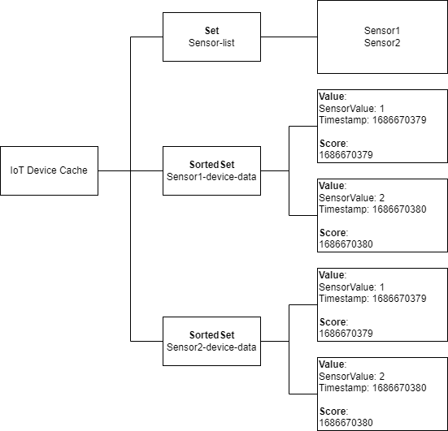

# 時系列データの保存

時系列データを一時的に保存することで、長期間の保存コストを気にすることなくデータを可視化できる。IoTセンサーのような時系列データの一般的なユースケースについて考えてみよう。確かに、最近のデータがどのようなものかを見るのは便利ですが、各センサーの値を無期限に保存する必要があるでしょうか？多数のセンサーがデータベースにメトリクスを送信すると、ストレージ・コストが急上昇します。その代わりにMomentoにデータを保存すれば、Momentoが最も得意とする、スケーリングや長期的なストレージ・コストを心配することなく大量のデータを保存することができます。

[lists](../api-reference/list-collections.md)、[sets](../api-reference/set-collections.md)、[dictionaries](../api-reference/dictionary-collections.md)などのMomentoのコレクションデータ型に関連するデータ要素を格納できます。アプリケーションのアクセスパターンとデータスキーマに適したデータ型を選ぶべきです。時系列データの場合は、Momentoの[SortedSetデータ型](../api-reference/sorted-set-collections.md)を使用します。`SortedSets`については[このブログ](https://www.gomomento.com/blog/were-back-with-another-collection-data-type-sorted-sets)で詳しく説明されています。


### なぜSortedSetsを使うのか？

- 時系列データをタイムスタンプでソートすることで、クライアントアプリケーションはデータを簡単に取得し、ソートされた順序で表示することができます。
- Momento SDKの[SortedSetFetchByRank](../api-reference/sorted-set-collections.md#sortedsetfetchbyrank)および[SortedSetFetchByScore](../api-reference/sorted-set-collections.md#sortedsetfetchbyscore)を使用して、クエリ応答を特定の値数または特定のタイムスパン内の値に制限します。

## 時系列データをSortedSetに格納する
SortedSet にアイテムを挿入するには、Momento SDK の [SortedSetPutElement](../api-reference/sorted-set-collections.md#sortedsetputelement) メソッドを使用します。

IoTセンサーのデータをMomento Cacheに格納するワークロードを考えてみましょう。

- 各センサーは独自のSortedSetを持っています。
- センサーのSortedSet内の各sensor_valueは、値とタイムスタンプを含むJSON文字列です。
すなわち、`JSON.stringify("value":1, "timestamp": 1686583076)` となります。
- SortedSet の各項目のスコアは、データポイントのタイムスタンプである。SortedSet は、スコアを使ってセット内のデータをソートします。

>SortedSetをキャッシュに書き込むコードスニペット

```javascript
const item_value = JSON.stringify({"sensor_value": sensor_value, "timestamp": timestamp})

const response = await cacheClient.sortedSetPutElement("sensor_data", `${sensor_id}-sensor-data`, item_value, timestamp)
```

ソートされたセットから時系列データを取得する：

キャッシュからデータを取得するには、SortedSetFetchByRank を使用する。SortedSet全体を取得したい場合は、startRankとendRankパラメータ値を渡さないでください。

>SortedSetFetchByRank で SortedSet 全体を取得するコードスニペット

```javascript
const sensor_data = await cacheClient.sortedSetFetchByRank("sensor_data", `${sensor_id}-sensor-data`)
```

SortedSetのサブセットだけを取得したい場合は、次のようにstartRankとendRankパラメータ値を設定できます：

>SortedSet のサブセットを取得する SortedSetFetchByRank のコードスニペット。

```javascript
const sensor_data = await cacheClient.sortedSetFetchByRank("sensor_data", `${sensor_id}-sensor-data`, 0, 10)
```

特定の数の値ではなく、指定された期間のデータのみを取得したい場合は、[SortedSetFetchByScore](../api-reference/sorted-set-collections.md#sortedsetfetchbyscore)を使用することができます。

>SortedSetのサブセットを取得するためのSortedSetFetchByScoreのコードスニペット。

```javascript
const sensor_data = await cacheClient.sortedSetFetchByScore("sensor_data", `${sensor_id}-sensor-data`, 1686511076, 1686597476)
```

## 時系列データに関する考察

### Time To Live (TTL) の値

SortedSetの[CollectionTTLオブジェクト](/cache/develop/api-reference/collection-ttl)は、各センサーの時系列データを保持する期間に応じて設定されます。デフォルトでは、SortedSetのTTLは変更されるたびに更新されます。つまり、SortedSetに要素を追加し続ける限り、TTLは増え続けます。

:::caution

CollectionTTLは、コレクション全体、この場合はSortedSet全体のTTLを指定するものであり、SortedSet内の個々の要素のTTLを設定するものではないです。SortedSetが期限切れにならない場合、SortedSet内の要素は期限切れになりません。

:::

### センサーインデックスセット

複数のセンサーがキャッシュにデータをプッシュしている場合は、すべてのセンサー ID を格納する Set データ型の追加を検討してください。SortedSets からデータをフェッチするときに Sensor ID を渡す必要があります。クライアントアプリケーションは、時系列データをフェッチする前に、このSetからすべてのSensor IDを取得し、Sorted Setsからすべてのセンサーのデータをフェッチすることができます。


