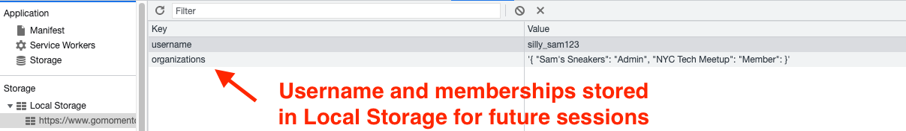

# 一般的なキャッシュ戦略

キャッシング戦略を実装する際に必要な重要な選択がわかったところで、よく使われるキャッシング・パターンをいくつかおさらいしておきましょう。それぞれのパターンについて、そのパターン、上記の3つの質問に対するそのパターンの選択、そのパターンを使いたい場合について説明します。

## ローカル・ブラウザ・キャッシング

最初の、そしておそらく最も単純なキャッシュ戦略は、ローカルブラウザキャッシュです。ブラウザからアクセスするウェブベースのアプリケーションを構築している場合、[ローカルストレージ](https://developer.mozilla.org/en-US/docs/Web/API/Window/localStorage)を使用して、ユーザーのブラウザにキーバリューのデータを保存することができます。例えば、一旦ユーザーがあなたのサービスに認証されると、その後の閲覧時にアプリケーションの表示を高速化するために、サービスにアクセスするために使用されたユーザーのIDとプロファイルに関するいくつかの情報を保存することができます。

ローカルブラウザのキャッシュは、**ローカル**、**サイド**キャッシュであり、おそらく読み取り時に書き込まれます。

ローカルブラウザキャッシュの利点は、ローカルストレージAPIが最新のウェブブラウザに含まれているため、シンプルであることです。さらに、データをキャッシュするためにユーザーのマシン上のスペースを事実上貸し出しているため、事前にキャッシュをプロビジョニングしたり、容量不足を心配する必要がありません。

ローカル・ブラウザー・キャッシュの欠点は、特定の状況でしか使えないことです。ユーザーがブラウザを再利用する場合、特定の操作を簡単にスピードアップできます。しかし、キャッシュされたデータは、異なるデバイスを使用している時、あるいはデバイス上で異なるブラウザインスタンスを使用している時でさえ、ユーザーには適用されません。さらに、基礎となるデータが変更された場合、バックエンドのデータソースがローカル・ストレージ・キャッシュのアイテムをプロアクティブに無効にするメカニズムはありません。

## ローカル・バックエンド・キャッシング

2つ目のキャッシュ戦略は、もう1つのローカル戦略です。ローカル・バックエンド・キャッシングでは、バックエンド・サーバー・インスタンスはネットワーク・レスポンスや他のシステムからの中間データをキャッシュすることができます。このデータは多くの場合、プログラミング言語のキー・バリュー・マップのように、アプリケーション・プロセス内でイン・メモリでキャッシュされます。バックエンドインスタンスがそのデータにアクセスする必要がある場合、まずインメモリオブジェクトをチェックし、キャッシュされた値が存在しない場合はプライマリデータソースにフォールバックします。

ブラウザのローカル・キャッシングと同様、これは**ローカル**、**サイド**のキャッシング戦略であり、読み込み時に書き込まれる可能性が高いと言えます。

この戦略の利点は、使いやすさとシンプルさにあります。頻繁にアクセスされ、比較的寿命の長いデータがある場合、追加のインフラを立ち上げて運用することなく、個々のサーバーインスタンスに素早くキャッシュすることができます。これは、設定データなど動きの遅いデータには効果的です。

このキャッシュ戦略の欠点は、リモート・キャッシング手法よりも効果が低いことです。各バックエンドインスタンスはそれぞれ独立したキャッシュを持つことになります。キャッシュするデータセットが幅広く、そのインスタンスで一度リクエストされたものだけをキャッシュする場合、キャッシュのヒット率はかなり低くなります。さらに、クラスタ・サイズ（そしておそらく全体的な負荷）が大きくなると、キャッシュ・ヒット率はさらに低くなります！これは、AWS Lambdaのような、インスタンスが定期的に生成・破棄されるハイパーエフェメラルなコンピュートでキャッシュする場合に特に厄介です。最後に、ローカルブラウザのキャッシュと同様に、基礎となるデータが変更された場合、バックエンドインスタンスで期限切れのデータを無効にするのは難しいかもしれません。

## リード・アサイド・キャッシング

3番目の、そして最も一般的なキャッシング戦略は、リード・アサイド・キャッシング（一般に「遅延ロード」と呼ばれる）です。リード・アサイド・キャッシングでは、アプリケーションはまずキャッシュから必要なデータを要求しようとします。もしデータがあれば、呼び出し元に返します。もしデータがなければ、プライマリー・データ・ソースにデータを要求します。そして、次のリクエストのためにキャッシュにデータを保存し、呼び出し元にデータを返します。

これは、**リモート、読み取りベース、サイドの**キャッシュ戦略です。

リード・アサイド・キャッシング戦略の利点は、キャッシュ・ヒット率の向上と、ほとんどの問題への汎用性にあります。ほとんどのアクセスパターンにおいて、一度アクセスされたデータ片は、その後すぐに再びアクセスされる可能性が高いと言えます。データの一部が読み込まれた後、一元化された場所にキャッシュすることで、サーバー群全体のキャッシュヒット率を向上させることができます。さらに、リード・アサイド・キャッシュ戦略は、ほぼすべての状況に適用できます。ネットワーク・レスポンス、中間計算の後、HTTPクライアントへの完全な集約レスポンスなどが代表的な例です。

ローカルキャッシュからリモートキャッシュに移行することで、ヒット率は上がりますが、運用の負担が増え、アプリケーションの複雑さも増します。管理すべきインフラが増え、システム全体の可用性への影響も考慮しなければなりません。プライマリ・データ・ソースにフォールバックするので可用性に影響はないと思うかもしれないが、多くの停止は、プライマリ・データ・ソースへの持続不可能な負荷につながる初期キャッシュ障害が原因です。

さらに、リード・アサイド・キャッシュは、データ の最初の読み取りに対してレイテンシ・コストを支払います。アプリケーションの読み取りがアプリケーション内のレコードに分散している場合、キャッシュがほぼ満杯になり、全体的にキャッシュヒット率が低くなる可能性があります。

## ライトアサイド・キャッシング

次のキャッシング戦略も前回と同様です。ライトアサイド・キャッシングでは、リードアサイド・キャッシングと同じように集中型のキャッシュを使用します。しかし、初めてアクセスした後にキャッシュにアイテムをロードするのではなく、データを書き込んだときに積極的にキャッシュにプッシュします。

これは、**リモート、書き込みベース、サイドの**キャッシュ戦略である。

ライト・サイド・キャッシュ戦略の利点の多くは、リード・サイド・キャッシュ戦略と似ています。集中型キャッシュではキャッシュヒット率が高くなります。さらに、各エントリーの最初のミスがなくなるので、キャッシュ・ヒット率はさらに高くなるはずです。これにより、書き込み後すぐにアクセスされることがわかっているデータの待ち時間を短縮することができます。最後に、正しく実装すれば、すべてのデータ更新が即座にキャッシュに反映されるため、データが古くなる可能性を減らすことができます。

ライト・アサイド戦略の欠点は、複雑さが増すことです。リード・アサイド・キャッシングは、単一のデータ・アクセス・パスの中で実装される方法としては単純明快です。ライト・アサイド・キャッシングでは、キャッシュのキーと値のフォーマットを理解するために、読み取りパスと書き込みパスが連携する必要があります。さらに、読み取りと書き込みの両方のアクセスパターンを深く理解する必要があるります。このため、入念な監査と、パターン間のデータの陳腐化を防ぐための絶え間ない警戒が必要となります。

## リードスルー・キャッシングとライトスルー・キャッシング

最後の2つの戦略は、リードスルー・キャッシングとライトスルー・キャッシングです。この2つの戦略は、すべてのデータアクセスがキャッシュを直接経由するという点でユニークです。アプリケーションは、要求されたデータを取得するためにキャッシュにリクエストを行います。データがローカルで利用可能な場合、キャッシュはそれを返します。そうでない場合は、_cache自身_がプライマリ・データ・ソースからデータをフェッチし、データをキャッシュし、それを返します。

たとえば、下の図はライトスルー・キャッシュのフローを示しています。まず、アプリケーションに書き込み要求が来ます。アプリケーションはデータを直接キャッシュに書き込み、キャッシュはそれをメイン・データベースに永続化します。キャッシュが書き込みが永続化されたことをアプリケーションに返すと、アプリケーションはレスポンスを返します。

これは、**リモート、インライン**キャッシュ戦略であり、読み込み側でも書き込み側でも使用できます。

[コンテンツ・デリバリー・ネットワーク](https://en.wikipedia.org/wiki/Content_delivery_network)(CDN)は、下の画像にあるように、リードスルー・キャッシュの一種です。

クライアントはコンテンツの一部に対してHTTPリクエストを行い、CDNは利用可能であればエッジロケーションからそれを提供し、そうでなければオリジンに戻る。CDNがオリジンからコンテンツを取得した場合、その後のリクエストのためにエッジに保存します。他にも、[Varnish](https://varnish-cache.org/)や[Nginx](https://www.nginx.com/)のようなHTTPベースのリードスルーキャッシュもいくつかあります。

データベースベースのインラインキャッシュはもっと稀だが、存在する。[DynamoDB Accelerator](https://aws.amazon.com/dynamodb/dax/) (DAX)は、DynamoDBのリードスルー、ライトスルーキャッシュである。DAXに対してDynamoDBテーブルと同じ操作を実行することができ、DAXインスタンスは必要に応じてDynamoDBテーブルに読み込みと書き込みを転送します。

インライン・キャッシュの利点は、クライアントの視点から見たシンプルさにあります。キャッシュ・キーを管理したり、キャッシュ・ミスを処理するために多段階のロジックを実装したりする必要はありません。インライン・キャッシュがこれを処理してくれます。さらに、インライン・キャッシュはリモート・キャッシュであるため、サイド・キャッシュに見られるような高いキャッシュ・ヒット率というメリットも得られます。

インライン・キャッシュにはデメリットもあります。第一に、データ・ソースのインライン・キャッシュは見つけにくいか、存在しない可能性があります。インライン・キャッシュの作成者は、基礎となるデータ・ソースへのフォールバックを処理するロジックを実装する必要があります。実装によっては、インライン・キャッシュを使用する場合と使用しない場合のアプリケーションの動作に矛盾が生じる可能性があります。さらに、インラインキャッシュを使用すると、アプリケーションに重要なインフラストラクチャが追加され、アサイドキャッシュよりも可用性に影響する可能性があります。
