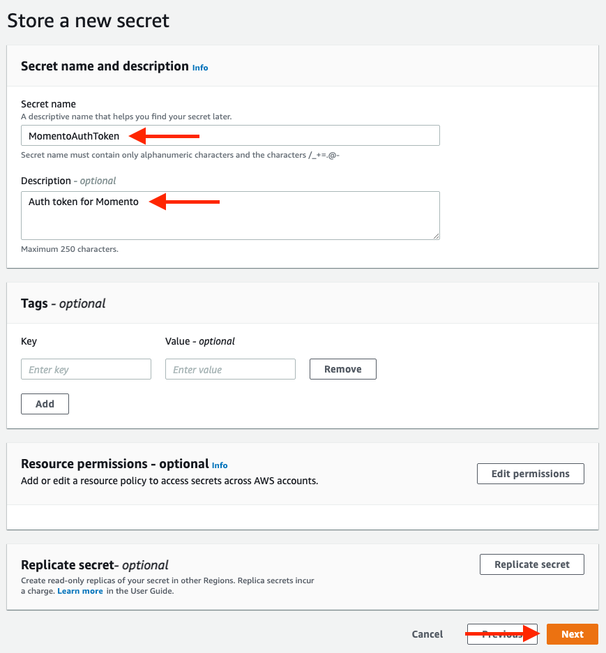

# AWS Lambda でキャッシュ

The release of AWS Lambda in November 2014 kicked off the serverless revolution in software architecture. Lambda's event-driven, function-based compute solution changed the nature of how we build applications in the cloud.

However, Lambda's compute model is quite different from the instance-based or even container-based models that came before it. It is hyper-ephemeral, as function instances are spun up on demand as needed to handle incoming events. This means you need to optimize for quick startup of your function instances and remove anything that could add to cold-start latency.

Further, Lambda is a stateless model where function instances can be removed as needed based on your application traffic. This means you can't assume a running instance will be available, but you can optimize your code so that requests to an existing container will be faster than those from a cold start.

In this guide, we will look at practical aspects of using Momento in AWS Lambda. Specifically, we'll cover three aspects of efficient use of Momento in Lambda:

- [Connection reuse](#connection-reuse);

- [Credential management](#credential-management);

- [Package management](#package-management).

This is designed to be a dense, practical guide on getting Momento configured in your serverless application.

If you want to know more about why Momento works well with serverless applications, please refer to our [guide on Caching with Serverless](./../../learn/how-it-works).

## Connection reuse

The first step to using Momento well in your serverless application is to make sure you're reusing your connection to the Momento service in your Lambda function. We'll describe some background first, then give you the practical steps to take in your application.

### Background

Recall that Lambda is a stateless, function-based, event-driven compute model. Often, your Lambda function handler will look something like the following:


You will have a handler that serves as the entrypoint to your Lambda function. Whenever you have a configured event arrive, such as an HTTP request, an SQS queue message, or a batch of stream records, an instance of your Lambda function will receive the event and invoke your handler with the details of the event.

The important thing to note is that everything within the scope of your handler will be new each time. For example, in our handler, we have a counter variable that is both initialized and incremented within the handler:.


However, because the variable is within the scope of the handler, it is not persisted across requests. Each time we invoke this specific function instance, the counter variable will be set to 1, but the count will be lost once the handler is finished executing for an event.

We can reuse state within a function instance if we want. If we set our variable in the global scope, outside of our handler scope, the variable will be retained across function instances.


In the image above, we've set the counter variable in the global scope. Now, each invocation of this function instance will increment that counter and the aggregated data will be retained across requests.

Note that this state is still retained within a specific instance of our Lambda function. The Lambda service may spin up multiple instances of your Lambda function if you have multiple, concurrent events that trigger your function at the same time. Data will be shared across requests to a single function instance across time but not across function instances.


For example, in the image above, there are three separate instances of our Lambda function running. Multiple users are making HTTP requests to our function, and each function can handle only a single request at a time. However, once a function instance is initialized, it can be reused for multiple requests over time. You can see that each function instance has a counter variable, each with a different value based on the state of that individual function instance.

While this variable reuse can be helpful for things like counters, it is more commonly used for reusing things that can take a long time to initialize. If you are making network calls to external services like Momento in your Lambda function, establishing the initial connection can be the slowest part of your request. You will need to do both the TCP handshake to connect to the remote server and the TLS handshake to set up TLS encryption. This can easily take 100 milliseconds or more. Given that Momento has client-side latency of 1-2 milliseconds, this can defeat all of the gains from our caching!

However, we can take advantage of Lambda's global variable reuse to cache our Momento client. Our first invocation within a specific function instance will take the time to establish the connection to Momento, but all subsequent invocations within that instance will be able to reuse the connection and drastically reduce overall response time.

### Application

Now that we know the details on why connection reuse is necessary in Lambda, let's get to the specifics of how it works.

Remember that anything in the global scope will be reused across requests. This means you could initialize your Momento client in the global scope of your handler as follows:


While this can work, it adds a lot of boilerplate to each function handler in your application. Additionally, it means your configuration logic is replicated across multiple different files rather than centralized in a single file.

I prefer to create a separate file for initializing my Momento client, as follows:


Notice that we have a `client` variable in the global scope of this module. Then, we have a `getMomentoClient` function that is exported from the module. Within that function, we first check if the `client` variable is null and return it if not. Otherwise, we initialize a Momento client and save it to the `client` variable. Then, we return the client to the caller.

This module will be loaded by our handler when our function instance is initialized. The first time a client calls the `getMomentoClient` function, there will not be an existing client available and one will be initialized. However, future requests will get a previously initialized client that has an existing connection to the Momento service, resulting in faster requests.

You can use this in your handler function or service class as follows:


While the example here is in Node.js, the same pattern will apply to other programming languages.

## Credential management

Momento uses a JWT to authenticate your client to the Momento service. In this section, we'll talk about how to manage this token in AWS Lambda.

### Background

As discussed above, Lambda is a stateless compute environment. This means all data used within your application must be either built directly into your function code or must be dynamically loaded at runtime into your application. Building data directly into your code can work for specific bits of data but is less flexible than needed for other bits of data.

There are two main options for handling more dynamic data in your code. For non-sensitive information, you can inject data into your function code via environment variables. This works well for data that changes across stages in your application, such as the names of DynamoDB tables or S3 buckets. It can also work well for slight configuration differences across environments, such as the log level or feature-flagging behavior of your application.

However, environment variables do not work as well for sensitive information. All environment variables can be accessed by your application code, and this means compromised third-party libraries could easily read and capture your sensitive credentials.

To manage credentials, AWS Lambda users generally turn to one of two services: [AWS Systems Manager Parameter Store](https://docs.aws.amazon.com/systems-manager/latest/userguide/systems-manager-parameter-store.html), or [AWS Secrets Manager](https://docs.aws.amazon.com/secretsmanager/latest/userguide/intro.html).

These two systems are quite similar. Both provide a simple API for storing and receiving credentials and integrate with IAM to manage permissions. Secrets Manager is a more advanced solution that provides higher request limits, automated credential rotation, and more fine-grained access control.

For these advanced features, you pay both for each secret you store and for API calls to the Secrets Manager service. Conversely, Parameter Store is free to use but has lower per-second request limits and no automated credential rotation.

### Application

Now that we know a bit about secret management in AWS Lambda, let's see how to store and manage our Momento authentication token in Lambda.

The application portion of credential management has three components:

1. Storing the Momento authentication token in Secrets Manager;

2. Granting the needed IAM permissions for a Lambda function to access the secret;

3. Accessing the secret within your Lambda function.

Let's handle these in order.

#### Storing the Momento authentication token in Secrets Manager

First, we need to store our Momento authentication token in AWS Secrets Manager.

Navigate to the [AWS Secrets Manager section of the AWS console](https://console.aws.amazon.com/secretsmanager/home). Make sure you are in the same region you use for your serverless application. Then, click the **Store a new secret** button to add a new secret to Secrets Manager.


This will open the Secrets Manager wizard for creating a new secret.

For the **Secret type**, select "**Other type of secret**". Then, enter "**MOMENTO_AUTH_TOKEN**" for your secret key and paste your authentication token as the secret value.

You can keep the default encryption key. Click the **Next** button to continue the wizard.


On the next screen, give your secret a name to identify the secret. and enter a quick description of the secret. Then, click **Next.**



The next screen handles secret rotation, which we will not set up here. Click **Next** to continue to the final screen.

On the final page, click the **Store** button to confirm storage of your secret.

You should now see your secret listed on the Secrets Manager page:


Click on the secret name for your secret to open the detail screen for your secret.

In the **Secret details** section, there is a **Secret ARN** for your secret. Copy this value, as you will need it for the next step.

#### Granting IAM permissions to access your secret

Now that we have configured the secret in AWS Secrets Manager, we need to grant permission for your AWS Lambda function to access the secret.

AWS Identify and Access Management (IAM) is the authorization system across all of AWS. When creating a Lambda function, your function will be associated with an IAM role that it will use to authenticate to various AWS services. You must grant permission for that IAM to access your Momento authentication token in order to retrieve the token from AWS Secrets Manager.

In general, the IAM statement you will need to configure will look as follows:

```
- Effect: "Allow"
  Action:
    - "secretsmanager:GetSecretValue"
  Resource: "<yourSecretArn>"
```

Be sure to replace **"&lt;yourSecretArn>"** with the Secret ARN you copied from the Secrets Manager console.

The mechanism you use to configure your IAM statements will depend on the deployment tooling you use for your Lambda functions.

If you are using the [Serverless Framework](https://www.serverless.com/framework), you can configure this permission by adding the following to the **provider:** block of your **serverless.yml** file:

```
provider:
  iam:
    role:
      statements:
        - Effect: "Allow"
          Action:
            - "secretsmanager:GetSecretValue"
          Resource: "<yourSecretArn>"
```

Be sure to replace **"&lt;yourSecretArn>"** with the Secret ARN you copied from the Secrets Manager console.

If you are using [AWS SAM](https://aws.amazon.com/serverless/sam/), add the following in the **Policies:** section for each function that needs access to your Momento auth token:

```
Policies:
  - Statement:
      - Effect: "Allow"
        Action:
          - "secretsmanager:GetSecretValue"
        Resource: "<yourSecretArn>"
```

Be sure to replace **"&lt;yourSecretArn>"** with the Secret ARN you copied from the Secrets Manager console.

If you are using other deployment tooling, you can follow similar steps to attach permissions to the IAM role for your Lambda function.

#### Accessing the secret in your Lambda function code

After you have configured permissions for your Lambda function to access the secret in AWS Secrets Manager, you can now access your Momento authentication token within your Lambda function.

To retrieve the secret from Secrets Manager, add code like the following to your application:

```
const AWS = require("aws-sdk");

const getMomentoAuthToken = async () => {
  const secretsmanager = new AWS.SecretsManager({
    httpOptions: {
      connectTimeout: 1000,
      timeout: 1000,
    },
  });

  const response = await secretsmanager
    .getSecretValue({
      SecretId: <yourSecretName>,
    })
    .promise();

  return JSON.parse(response.SecretString).MOMENTO_AUTH_TOKEN;
};
```

Be sure to replace **"&lt;yourSecretName>"** with the name of the secret you used in the Secrets Manager console.

This code will create a client for accessing AWS Secrets Manager. Then, it will call the `GetSecretValue` action on the Secrets Manager service. Finally, it will parse the response and return the value for the configured MOMENTO_AUTH_TOKEN.

Notice that this will make an external network call, and thus you should optimize your Lambda code around this. Ideally, you are only constructing your SimpleCache object once within a given Lambda function instance, as discussed above in the [Connection reuse section](#heading=h.rkchdfjttru6). Because of this, you should only need to retrieve the Momento authentication token once within a particular function instance.

## Package management

The final piece of practical advice for using Momento in an AWS Lambda function is around package management. We'll first discuss the Lambda compute environment, then we'll discuss specifics around including the Momento SDK within your Lambda function.

### Background

AWS Lambda is a fully-managed, function-based compute environment. You will give Lambda a ZIP file with your function code (or, alternatively, [a Docker container image](https://aws.amazon.com/blogs/aws/new-for-aws-lambda-container-image-support/)), and the Lambda environment will handle running your code in response to events.

As an application developer, there are two aspects you need to consider when using third-party dependencies in AWS Lambda.

First, you need to ensure that the dependency is included within your function ZIP file. Many deployment tools, including the [Serverless Framework](https://www.serverless.com/framework), [AWS SAM](https://aws.amazon.com/serverless/sam/), [AWS CDK](https://aws.amazon.com/cdk/), and [Architect](https://arc.codes/docs/en/get-started/why-architect), will assist you with dependency management. They will either build the dependencies for you as part of a deployment process, or they will create a ZIP file from the contents of your application directory. Specific details can be found below.

Second, you must ensure that your dependencies will work in the AWS Lambda environment. If you are using a ZIP file rather than a container image for your Lambda function, the code itself will be running on top of the Amazon Linux 2 operating system. Most of your function code and dependencies will work the same on your local machine as in the Lambda execution environment. However, certain dependencies must be compiled for specific architectures.

The [Momento SimpleCache clients use gRPC](./../../learn/how-it-works#grpc) to connect to the Momento service. The gRPC library for Python uses architecture-specific bindings and thus must be compiled for the Amazon Linux 2 execution environment. If you build the dependency directly on your Mac or Windows machine, it won't be compatible with the Lambda execution environment.

Below, we will see how to handle both of these problems using popular deployment frameworks.

### Application

Now that we know the background on using dependencies within AWS Lambda, let's see how to use the Momento SDK with different runtimes and deployment tooling.

#### Node.js

If you are using Node.js for your Lambda functions, you don't need to worry about compiling for a specific execution environment. The Momento SDK and all of its dependencies are pure JavaScript and will work across different architectures.

To add Momento to your Lambda function, you need to install it and save it to your `package.json` file:

```
npm install --save @gomomento/sdk
```

Most of the popular deployment tools will automatically include the installed package in your Lambda function ZIP file.

#### Python

If you are using Python for your Lambda function, you need to ensure to compile the gRPC package for the Amazon Linux 2 execution environment. How you do so depends on your deployment tooling.

If you are using the Serverless Framework, you can use the [serverless-python-requirements](https://github.com/serverless/serverless-python-requirements) plugin to assist in building and managing your Python requirements. The serverless-python-requirements package will integrate with your Python package manager of choice to build your Python dependencies when deploying your Lambda function. Importantly, you can choose to build your dependencies in a Docker container that matches the Lambda execution environment and thus will be built correctly.

To configure serverless-python-requirements, be sure to add the following configuration to your `serverless.yml` file:

```
plugins:
  - serverless-python-requirements

custom:
  pythonRequirements:
    dockerizePip: true
```

Be sure to read the rest of the [documentation on serverless-python-requirements](https://github.com/serverless/serverless-python-requirements) to customize for your specific environment.

If you are using AWS SAM, you can use the following command to build your ZIP file properly for the Lambda execution environment:

```
sam build --use-container
```

This will [indicate to SAM that you want to use a Docker image](https://docs.aws.amazon.com/serverless-application-model/latest/developerguide/serverless-sam-cli-using-build.html#build-zip-archive) that is similar to the Lambda execution environment to build your dependencies.

If you are using the AWS CDK, it will [install all dependencies in a Lambda-compatible Docker container](https://docs.aws.amazon.com/cdk/api/v1/docs/aws-lambda-python-readme.html#packaging) based on the Python package management tool of your choice.

#### Other languages

For other languages, you should install the Momento SDK according to the installation instructions. Then, refer to the AWS Lambda documentation for building ZIP files for those languages:

- [Lambda Java deployment package](https://docs.aws.amazon.com/lambda/latest/dg/java-package.html)

- [Lambda Golang deployment package](https://docs.aws.amazon.com/lambda/latest/dg/golang-package.html)

- [Lambda C# deployment package](https://docs.aws.amazon.com/lambda/latest/dg/csharp-package.html)
