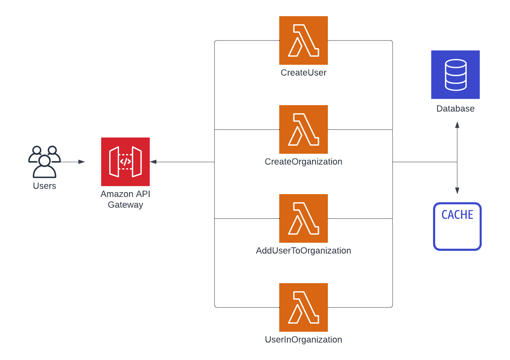

# 導入とセットアップ

本チュートリアルでは、AWS Lambda を使ったサーバーレスアプリケーションにどのようにしてキャッシュを追加していくかを学ぶことができます。ここでは、サーバーレスアプリケーションと深く連携するために作られたキャッシュサービスの 1 つである Momento キャッシュを利用していきます。Momento キャッシュは、すぐに使えて弾力性のあるキャッシュストレージを従量課金モデルで使うことができ、とても高いパフォーマンスを発揮してくれます。

このチュートリアルを進める中で、皆さんにはシンプルなアカウント管理サービスを作って頂きます。そのサービスにはユーザーの作成、組織の作成、そしてメンバーシップを利用してユーザーを組織に追加する、というエンドポイント群を作ります。そうすると、あるユーザーがある組織に所属しているかをチェックするという、頻繁に使われている認可のパターンを実行することができるようになります。

このチュートリアルには、キャッシュとサーバーレスアプリケーションを実装するための概念的な情報だけでなく、前述のアカウント管理サービスを実際にデプロイして使ってみるまでの順を追った手順も含まれています。

これから学んでいく中に出てくる一つの大事な概念として、異なるキャッシュ戦略を使う際のトレードオフを含めた、キャッシュへの複数のアプローチがあげられます。これについてもっと学びたい時は、[キャッシュの戦略とパターン](./../../../introduction/common-caching-patterns) も併せてご覧ください。

加えて、このチュートリアルでは Momento と AWS Lambda を連携させる際の実践的な面も見ることができます。もっと簡潔な情報をお探しでしたら、[AWS Lambda でキャッシュ](./../../guides/caching-with-aws-lambda)もご覧ください。

このチュートリアルには 5 つのステップがあります:

1.  チュートリアルの紹介と環境のセットアップ。

2.  API Gateway、Lambda、DynamoDB を使ったサーバーレスアプリケーションをデプロイする。

3.  Momento をそのアプリケーションに組み込んで設定する。

4.  Read-aside キャッシュパターンをアプリケーションに実装する。

5.  Write-aside キャッシュパターンを使って、パフォーマンスとキャッシュの鮮度を改善する。

## これから作っていくもの

これから、巨大な SaaS アプリケーションのためのアカウント管理サービスを構築していこうと思います。

私たちのアプリケーションは、ユーザーと組織の両方を持っていて、ユーザーは組織の代わりにアクションをすることができます。これを達成するために、アプリケーションの多くの場面で特定のユーザーが特定の組織に属していることを保障する必要があります。

この要件を扱うために、サービス上に 3 つのエンティティをモデリングしていきます:

- ユーザーエンティティ: アプリケーション上の 1 人の人間を表現しています

- 組織エンティティ: アプリケーション内のリソースを管理できる、ユーザーのまとまりを表現しています

- メンバーシップエンティティ: ユーザーと組織の間の関連を表現していて、そのユーザはその組織内の特定のアクションを行うことを許可されています。

これらのエンティティとやり取りするために、以下の HTTP エンドポイントをセットアップします:

- _CreateUser_ (`POST /users`): ユーザーのサインアップに使われます。

- _CreateOrganization_ (`POST /organization`): ユーザーが新しい組織を作るときに呼び出されます。

- _AddUserToOrganization_ (`POST /organization/{organizationName}/members`): ある組織に新しいユーザーを追加するために、組織内の既存のユーザーから呼び出されます。

- _UserInOrganization_ (`GET /organization/{organizationName}/members/{username}`): あるユーザがある組織に属しているかチェックして、その組織内でのユーザーの役割の詳細を取得する時に使われます。

このアプリケーションは、鍵となるポイントをお伝えすることに集中するために、必要最低限に簡素化されています。ユーザーや組織を更新するエンドポイント、全てのユーザと組織を一覧するエンドポイント、およびユーザーを組織から削除するエンドポイントは存在しません。さらに、本物の認証システムもなくて、HTTP ヘッダーでユーザー名を渡すような大雑把な方法に依存しています。

## セットアップ

はじめる前に、このチュートリアルでこの後のステップに従って進められる様に、環境のセットアップをしておきましょう。

まず一つ目に、チュートリアルは Node.js と関連する依存パッケージを利用しているので、それを皆さんのマシンにインストールする必要があります。[Node.js のダウンロードページ](https://nodejs.org/en/download/) にあるインストール手順に従ってください。

二つ目に、サーバーレスアプリケーションをビルドしてデプロイするために、[Serverless Framework](https://www.serverless.com/framework/docs) を利用していきます。Serverless Framework は Node.js で書かれた CLI ツールでなので、ターミナル上で以下のコマンドを実行することでインストールできます:

    npm install -g serverless

三つ目に、アプリケーションをこれから Amazon Web Services (AWS) にデプロイしていきます。そのために、AWS アカウントと認証情報が必要になります。もしローカル環境に AWS 認証情報をまだ設定していなければ、Serverless Framework のドキュメントにある[環境を設定する](https://www.serverless.com/framework/docs/providers/aws/guide/credentials/)ドキュメントのガイドに従ってください。

最後に、このチュートリアル用の全てのコードは GitHub レポジトリから利用可能です。以下のコマンドを使って、マシンにコードをクローンしてください:

    git clone git@github.com:momentohq/serverless-tutorial.git

これで環境のセットアップができました。次のステップに進んで、サーバーレスアプリケーションをデプロイしてみましょう。
