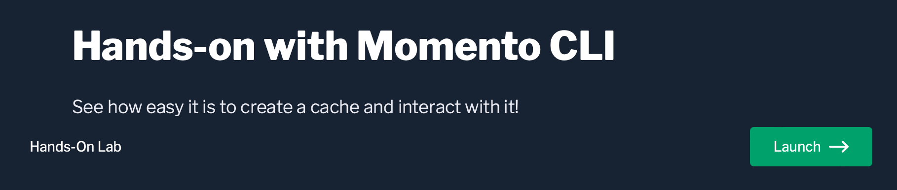
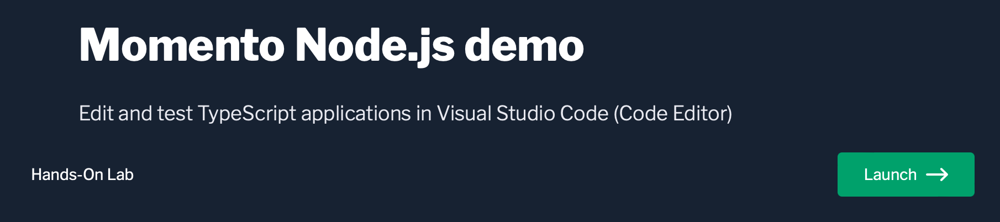

# Momento Serverless Cache をはじめてみる

SDK または CLI を使って Momento Serverless Cache をすぐに使い始める方法をお探しでしたら、ここから始めましょう。ソフトウェアのインストールを全くせずにMomento をすぐに体験してみたいですか？でしたら、[ブラウザを使って](#cli-とsdk-をブラウザ上で試してみる)ここからすぐに始められます。もしくは、既に開発環境を整えてMomento を使ったアプリケーションを使い始める準備ができている場合は、[以下のシンプルな手順](#momento-command-line-interface-cli-をインストールする)に従って下さい。

## CLI とSDK をブラウザ上で試してみる

ブラウザ上で、今すぐにMomento Serverless Cache を試してみることができます。何もソフトウェアをインストールする必要がありません！

:::note
Momento Serverless Cache はAPI ベースのサーバーレスサービスです。皆さんの(AWS、GCP、Azure、等)のアカウントには何もデプロイしません。
:::

<br />

まずはじめに、無料の認証トークンを作成し、キャッシュを作成し、そのキャッシュ上で`set` や`get` コマンドを実行してみましょう。以下を起動します。

[](https://play.instruqt.com/embed/momento/tracks/sandbox-container-1challenge?token=em_14J4EucaTHzL0rXw&finish_btn_target=_top&finish_btn_text=Return+to+Docs&finish_btn_url=https%3A%2F%2Fdocs.momentohq.com%2Fgetting-started#try-our-cli-and-an-sdk-in-your-browser)

<br />
<br />

続いて、Node.js SDK を使ったJavaScript のアプリケーションを動かして、認証トークンと今作成したキャッシュを使ってみましょう。以下を起動します。

[](https://play.instruqt.com/embed/momento/tracks/momento-nodejs-demo?token=em_f8PM8Aob-mHIfOTT&finish_btn_target=_top&finish_btn_text=Return+to+Docs&finish_btn_url=https%3A%2F%2Fdocs.momentohq.com%2Fgetting-started#try-our-cli-and-an-sdk-in-your-browser)

<br />
<br />

## Momento command line interface (CLI) をインストールする

[ブラウザ上で実行する](#cli-とsdk-をブラウザ上で試してみる)のではなく自身のマシン上で CLI を実行してみたい場合には、こちらに沿って各オペレーティングシステムごとの
方法でインストールしてください:

**macOS では [Homebrew](https://brew.sh/)を利用**

```
brew tap momentohq/tap
brew install momento-cli
```

**Linux**

最新の [GitHub release](https://github.com/momentohq/momento-cli/releases) のウェブページに行って下さい。
そこに、x86_64 とaarch64 向けの`.deb` と`.rpm` があります。

`.deb` ファイルは新し目のUbuntu とDebian のバージョンでテストされています。
`.rpm` ファイルは新し目のRHEL、Amazon Linux 2、Rocky Linux、そしてCentOS でテストされています。

もしこれらのパッケージに何か問題があれば、[issue を作成して](https://github.com/momentohq/momento-cli/issues)私たちにお知らせ下さい。

また、x86_64 とaarch64 それぞれにtarball も提供しています。これは `momento` コマンドのバイナリを含んでいて、それを実行パス上の好きなところに追加してお使いになれます。

**Windows**

私たちのCLI はWindows Package Manager (`winget`) から利用可能です。インストールするには、以下のコマンドをPowerShell かコマンドプロンプトから実行します:

```powershell
winget install momento.cli
```

または、最新の[GitHub release](https://github.com/momentohq/momento-cli/releases) のウェブページに行って下さい。
そこに、Windows 用の`.msi` インストーラーと、手動で`momento` 実行可能ファイルを好きな場所に配置したい方向けのWindows 用の`.zip` ファイルがあります。

もしWindows のパッケージに何か問題があれば、[issue を作成して](https://github.com/momentohq/momento-cli/issues)私たちにお知らせ下さい。

CLI が正しくインストールされたかを確認するには、ヘルプコマンドを実行してみます:

```
$ momento -h  
CLI for Momento APIs

Usage: momento [OPTIONS] <COMMAND>

Commands:
  cache        Interact with caches
  configure    Configure credentials
  account      Manage accounts
  signing-key  Manage signing keys
  help         Print this message or the help of the given subcommand(s)

Options:
      --verbose            Log more information
  -p, --profile <PROFILE>  User profile [default: default]
  -h, --help               Print help
  -V, --version            Print version
```

### 認証トークンを取得する

[Momento における認証は認証トークンによって行われ](./learn/how-it-works#authentication-token)、コマンドラインを使って直接 Momento Serverless Cache にサインアップすることもできます。

認証トークンは Momento Serverless Cache の各クラウドプロバイダーとリージョンに紐づいています。`account` コマンドをご希望のクラウドプロバイダーとリージョンを指定しながら使うと、**各リージョン用の**認証トークンを生成することができます:

#### AWS [利用可能リージョンは us-west-2, us-east-1, ap-northeast-1, ap-south-1]

```console
momento account signup aws --email <TYPE_YOUR_EMAIL_HERE> --region <TYPE_DESIRED_REGION>
```

#### GCP [利用可能リージョンは us-east1, asia-northeast1]

```console
momento account signup gcp --email <TYPE_YOUR_EMAIL_HERE> --region <TYPE_DESIRED_REGION>
```

#### Azure (まもなく対応) もしご興味があれば[お問い合わせ下さい](mailto:support@momentohq.com)

```console
momento account signup azure --email <TYPE_YOUR_EMAIL_HERE> --region <TYPE_DESIRED_REGION>
```

`<TYPE_YOUR_EMAIL_HERE>` と`<TYPE_DESIRED_REGION>` を実際の値に置き換えるのを忘れない様にしてください。

_注: もしお使いのクラウドプロバイダーで使いたいリージョンが利用可能でない場合は、それを追加することに関してぜひ私たちに[お問い合わせください](mailto:support@momentohq.com)。_

## 読み書き操作のために、Momento CLI を設定する

Momento から認証トークンが E メールで送られてきます。そうしたら、`momento configure` コマンドを使って、ローカルの CLI がそのトークンを使うように設定することができます:

```
$ momento configure
Token: // < Enter token from email here.
Default Cache [default-cache]: my-first-cache // Name of cache to use on CLI by default.
Default TTL Seconds [600]: 30 // Sets the default TTL for cache entries. For demostration purposes we are setting this lower right now.
[2022-03-31T15:31:25Z INFO  momento::commands::cache::cache_cli] creating cache...
[2022-03-31T15:31:33Z INFO  momento::commands::configure::configure_cli] default cache successfully created
```

これでもうあなたの Momento Serverless Cache は稼働しています！続いて、Momento Serverless Cache にデータをキャッシュするためにどうやって Momento CLI を使うかを見ていきましょう。

## データをいくつかキャッシュしてみる

Momento CLI の`cache` コマンドは Momento Serverless Cache と対話するのに使われます。実際にいくつかのコマンドを見てみましょう。

まず、`set` サブコマンドを使ってデフォルトの Momento Serverless Cache にアイテムを 1 つ保存することができます:

```
$ momento cache set --key test --value value
[2022-03-31T15:45:17Z INFO  momento::commands::cache::cache_cli] setting key: test into cache: my-first-cache
[2022-03-31T15:45:18Z INFO  momento::commands::cache::cache_cli] set success
```

そうしたら、そのキーを`get` サブコマンドを使って取り出すことができます:

```
$ momento cache get --key test
[2022-03-31T15:45:25Z INFO  momento::commands::cache::cache_cli] getting key: test from cache: my-first-cache
value
```

キャッシュを設定する際に、デフォルトの Time to Live (TTL) を 30 秒に設定しています。もし 30 秒待ってからキャッシュを取り出してみると、アイテムが消えているでしょう:

```
$ sleep 30 // wait for item to expire
$ momento cache get --key test
[2022-03-31T15:46:02Z INFO  momento::commands::cache::cache_cli] getting key: test from cache: my-first-cache
[2022-03-31T15:46:03Z INFO  momento::commands::cache::cache_cli] cache miss
```

これらが Momento CLI を使った標準的な`get` と`set` の[データプレーン操作](./learn/how-it-works#data-plane-performant-cache-interactions)になります。

また、Momento CLI を使って[コントロールプレーン操作](./learn/how-it-works#control-plane-simple-efficient-cache-management)、例えばキャッシュを作成したり、削除したり、利用可能なキャッシュ一覧を見たりすることもできます。

`cache` コマンドの利用可能な全てのサブコマンドは `momento cache -h` をターミナルで実行すると見ることができます:

```
$ momento cache -h
Interact with caches

Usage: momento cache [OPTIONS] <COMMAND>

Commands:
  create  Create a cache
  delete  Delete a cache
  list    List all caches
  set     Store an item in a cache
  get     Get an item from the cache
  help    Print this message or the help of the given subcommand(s)

Options:
  -e, --endpoint <ENDPOINT>  An explicit hostname to use; for example, cell-us-east-1-1.prod.a.momentohq.com
      --verbose              Log more information
  -p, --profile <PROFILE>    User profile [default: default]
  -h, --help                 Print help
```

さらに、デフォルトの設定値以外のコマンドオプション、例えば異なるリージョン、キャッシュ名、TTL などを指定することもできます。

サブコマンドの全てのパラメータについての詳しい情報は `momento cache $SUBCOMMAND --help` を実行して学ぶことができます。

## 次のステップ

CLI はMomento Serverless Cache API の基本を試して理解するには良いですが、ほとんどのキャッシュの仕事はアプリケーション上で行われます。それらには、Momento SDK を使うことができます。

現在、以下の言語で SDK が利用可能です。各レポジトリを確認して、詳細な手順と利用例をご確認ください。

- [Go](https://github.com/momentohq/client-sdk-go)
- [Java](https://github.com/momentohq/client-sdk-java)
- [JavaScript](https://github.com/momentohq/client-sdk-javascript)
- [Python](https://github.com/momentohq/client-sdk-python)
- [.NET](https://github.com/momentohq/client-sdk-dotnet)
- [Rust](https://github.com/momentohq/client-sdk-rust)
- [PHP](https://github.com/momentohq/client-sdk-php)
- [Ruby](https://github.com/momentohq/client-sdk-ruby)

## よくある質問

<details>
  <summary>Momento は何かのリソースを私のクラウドアカウント上にデプロイしますか？</summary>
いいえ、しません。Momento Serverless Cache はAPI ベースのサーバーレスサービスで、皆さんのアプリケーションのコードから呼び出します。
</details>
