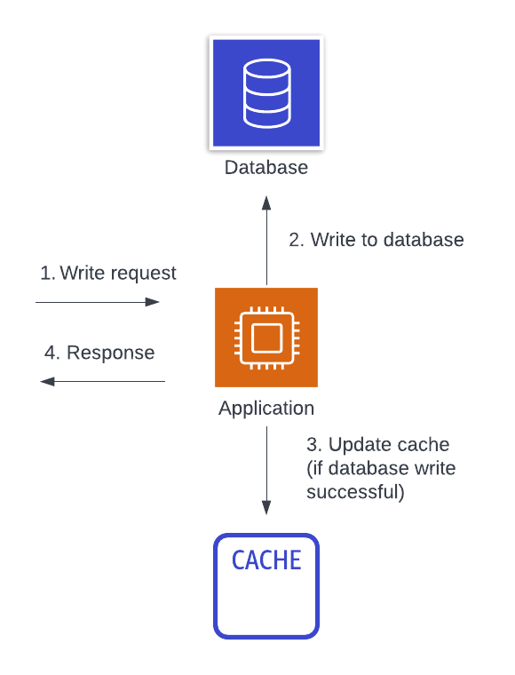
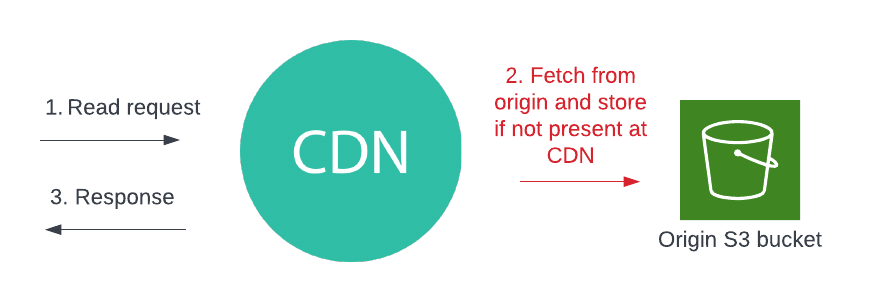

# 一般的なキャッシュ戦略

これまでキャッシュ戦略を選定する際に必要な鍵となる選択肢について見てきました。次にいくつかの有名なキャッシュパターンを見てみましょう。各パターンにおいて、その詳細、以前に見た3つの質問においてどういった選択をしているのか、そしてどういった時にそのパターンを使いたいかを解説していきます。

## ローカルブラウザキャッシュ

まず一つ目、そして最も単純なキャッシュ戦略は、ローカルブラウザキャッシュです。ブラウザからアクセスするウェブベースのアプリケーションを作る場合には、[ローカルストレージ](https://developer.mozilla.org/en-US/docs/Web/API/Window/localStorage)を使ってユーザーのブラウザにキーバリューデータを保存することができます。例えば、ユーザーがサービスで認証をしたら、サービスにアクセスしてきたユーザー ID やプロファイルといった情報を保存して、アプリケーション上でそれ以降の情報表示速度を向上させることができます。

ローカルブラウザキャッシュは**ローカル**で、**アサイド**キャッシュで、読込時に書き込まれることが多いです。

ローカルブラウザキャッシュの利点は、ローカルストレージ API が現代的なウェブブラウザには既に含まれているので、簡潔な点です。加えて、実質的にはユーザのマシンのスペースを間借りしてデータをキャッシュしているので、事前にキャッシュをプロビジョンしたり容量が不足したりすることを心配する必要もありません。

ローカルストレージキャッシュの欠点は、特定の状況下でしか有効ではない点です。もしユーザーがブラウザを再利用してくれていれば、いくつかのオペレーションを簡単に高速化することはできます。しかし異なるデバイスや、同じデバイスでも異なるブラウザインスタンスを使った場合には、キャッシュしたデータは適応されません。更には、データが変更された時に、バックエンドのデータソースからローカルストレージキャッシュを無効化する手段もありません。

## ローカルバックエンドキャッシュ

次のキャッシュ戦略はもう一つのローカルキャッシュ戦略です。ローカルバックエンドキャッシュでは、バックエンドサーバーインスタンス上でネットワークレスポンスや他のシステムからの中間データをキャッシュすることができます。このデータはよく、プログラミング言語のキーバリューマップの様な形でアプリケーションプロセス内にインメモリでキャッシュされます。バックエンドインスタンスがそのデータにアクセスする必要があるときには、まずインメモリのオブジェクトを確認し、もしキャッシュした値が存在しない時にはプライマリデータソースにフォールバックします。

ローカルブラウザキャッシュと同様に、これも**ローカル**で、**アサイド**キャッシュ戦略で、読込時に書き込まれることが多いです。

この戦略の利点は簡単に利用できて、簡潔であるところです。もし頻繁にアクセスされて比較的長期間使われるデータがあれば、追加のインフラを立ち上げて運用をする必要なく、個別のサーバーインスタンス上に素早くキャッシュすることができます。これは設定データや他の動きの遅いデータにはよく当てはまります。

ある意味で、これは[ AWS Lambda で確立した接続を使いまわすために、Momento SimpleClient を再利用(またはキャッシュ)する](./../develop/guides/caching-with-aws-lambda#connection-reuse)方法とよく似ています！

このキャッシュ戦略の欠点は、リモートキャッシュと比べて効率が悪いことです。各バックエンドインスタンスはそれぞれ固有のキャッシュを持っています。もしキャッシュするデータが広範囲で、インスタンス上でそれがリクエストされた時にだけキャッシュした場合、キャッシュヒット率は極めて低いでしょう。更に、クラスターサイズが(そして全体的な負荷も)増加すればするほど、キャッシュヒット率はより悪くなっていきます！これは、定期的にインスタンスが作られては捨てられる AWS Lambda の様な極一時的なコンピュートでは特に問題です。最後に、ローカルブラウザキャッシュ同様に、元になるデータが変更されたときにバックエンドインスタンス上のデータを無効化するのは困難です。

## リードアサイドキャッシュ

3つ目の、最も一般的なキャッシュ戦略がリードアサイドキャッシュです("遅延読込"とよく呼ばれます)。リードアサイドキャッシュでは、アプリケーションは必要なデータをキャッシュから取り出そうとします。もしデータがそこにあれば、呼出し元にそれを返します。もし無ければ、プライマリデータストアからデータをリクエストします。そして、次のリクエストのためにそのデータをキャッシュしてから、呼出し元にデータを返します。

これは、**リモートで、読込みベースのアサイド**キャッシュ戦略です。

リードアサイドキャッシュ戦略の利点は、キャッシュヒット率の高さと、広範囲な問題への適応性です。多くのアクセスパターンで、一度アクセスされたデータはすぐに再度アクセスされる可能性が高いです。データが読み込まれた後それを中央管理された場所にキャッシュすることで、全てのサーバーに渡ってキャッシュヒット率を向上させられます。更に、リードアサイドキャッシュ戦略はほぼどんな場面でも適応可能です。ネットワークレスポンス、いくらかの中間計算結果、または HTTP クライアントのレスポンスの集合といった、ありとあらゆる適応可能な箇所でキャッシュすることができます。

ローカルからリモートへキャッシュを移すことでヒット率は上昇しますが、運用の負荷とアプリケーションの複雑性も上がります。管理する追加のインフラが必要ですし、それによるシステム全体の可用性への影響を考慮しなければなりません。プライマリデータソースにフォールバックするので、可用性は影響を受けないと考えるかも知れませんが、多くの障害は初回キャッシュミスによるプライマリデータソースへの高負荷によって引き起こされています。

加えて、リードアサイドキャッシュはデータの初回読み出し時のレイテンシコストを支払っています。もしアプリケーションの読み出しが広範囲のレコードに散らばっている場合、全体的にキャッシュヒット率が低くほぼ全てのデータをキャッシュしているようなことになるでしょう。

## ライトアサイドキャッシュ

次のキャッシュ戦略は前のものと似ています。ライトアサイドキャッシュでは、リードアサイドキャッシュの様に中央管理されたアサイドキャッシュを利用します。しかし、初回アクセス後に項目をキャッシュに遅延読込するのではなく、書き込み時にキャッシュに積極的にデータをプッシュします。

これは**リモートで、書込みベースのアサイド**キャッシュ戦略です。

ライトアサイドキャッシュの利点の多くは、リードアサイドキャッシュと共通しています。中央管理されたキャッシュによって高いキャッシュヒット率を持ちます。もっと言えば、各エントリで初回ミスが無いのでキャッシュヒット率はもっと高くなります。これは、書き込まれた後すぐにアクセスされることが分かっているデータのレイテンシを削減することになります。最後に、正しく実装することができれば、全てのデータの変更が即座にキャッシュにも反映されるので、古いデータの発生確率を減らすこともできます。

ライトアサイド戦略の欠点は、複雑性が増すことです。リードアサイドキャッシュは単一のデータアクセスパスの中で実装されるので素直です。ライトアサイドキャッシュでは、読込と書込の両方のパスでキャッシュのキーバリューの形式を理解した上で協調動作する必要があります。更には、読込と書込の両方のアクセスパターンへの深い理解も必要です。これには古いデータへのアクセスパターンを防ぐための注意深い観察と継続的な用心が不可欠です。

## リードスルーとライトスルーキャッシュ

残る最後の2つの戦略は、リードスルーとライトスルーキャッシュです。これら2つの戦略は、全てのデータアクセスがキャッシュを直接通過する点で独特です。アプリケーションはキャッシュに対してデータを取得するリクエストをします。もしデータが存在すれば、キャッシュはそれを返却します。そうでなければ、**キャッシュ自身**がプライマリデータソースからデータを取得し、キャッシュし、返却する役割を果たします。

例えば、以下の画像はライトスルーキャッシュのフローを示しています。まず、書込みリクエストがアプリケーションにやってきます。アプリケーションがキャッシュに直接書き込み、キャッシュ自身がそれをメインデータベースに永続化する責任を負います。キャッシュがアプリケーションに返答したらそれは書込みが永続化されたことを示しているので、そうしたらアプリケーションはレスポンスを返します。

これは、**リモートで、インライン**キャッシュ戦略で、リードアサイドでもライトアサイドでも使うことができます。

以下の画像から分かる様に、[コンテンツ配信ネットワーク](https://en.wikipedia.org/wiki/Content_delivery_network) (CDN) はリードスルーキャッシュの一種です。

クライアントがコンテンツを HTTP でリクエストし、CDN はもしあればエッジロケーションから配信し、そうでなければオリジンに向かいます。CDN は、オリジンから取得できたら後続のリクエストのためにそれをエッジに保存します。他にも、HTTP ベースのリードスルーキャッシュとしては、[Varnish](https://varnish-cache.org/) や [Nginx](https://www.nginx.com/) があります。

データベースベースのインラインキャッシュはもっと希少ですが、存在はします。[DynamoDB Accelerator](https://aws.amazon.com/dynamodb/dax/) (DAX) は DynamoDB のためのリードスルーかつライトスルーのキャッシュです。DynamoDB テーブルに対して行うのと同一の DynamoDB 操作を DAX に対して行うことができ、DAX インスタンスは必要に応じてその裏にある DynamoDB テーブルに読み書きのリクエストを転送します。

インラインキャッシュの利点はクライアント視点での簡潔さです。キャッシュキーの管理やキャッシュミスを扱うための複数ステップのロジックを実装する必要がありません。インラインキャッシュが代わりに対応してくれます。加えて、リモートキャッシュなので、アサイドキャッシュでも見てきた高いキャッシュヒット率の利点も持ち合わせています。

インラインキャッシュにも欠点はあります。まず、使っているデータソースに対応するインラインキャッシュを見つけるのが大変だったり、存在しないこともあります。インラインキャッシュの製作者は、裏にあるデータソースに対してフォールバックする実装をする必要があります。実装によっては、インラインキャッシュの有無によってアプリケーションに食い違いが起こる可能性があります。更に、インラインキャッシュはアプリケーションに対して重要なインフラを追加することになり、アサイドキャッシュよりも可用性への影響が大きくなる可能性があります。
