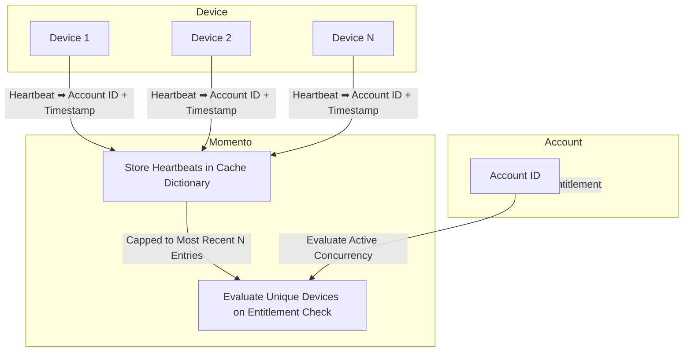

import Tabs from '@theme/Tabs';
import TabItem from '@theme/TabItem';

# アカウントの同時使用デバイスの追跡

アクセス管理、セキュリティの確保、リソースの最適化が最優先されるアプリケーションでは、アカウントごとの同時デバイスやストリームの追跡が不可欠です。サブスクリプション・ベースのサービスでは、デバイスまたはストリームの制限を実施することで、コンテンツへの同時アクセスを指定されたデバイス数に制限します。**通貨追跡**はまた、不正な共有を防止することでアカウントのセキュリティをサポートし、潜在的な悪用からサービスを保護します。これはまた、リアルタイムの需要に基づいて動的にリソースを管理することにより、特にメディアやエンターテイメントなど、トラフィックの多いアプリケーションにおけるリソースの最適化を可能にします。

以下に示すパターンは、Momentoが複雑なインフラストラクチャを必要とせずに**リアルタイム・セッション・モニタリング**を提供する方法を示しています。

## 概要



Momentoで同時実行を監視するには、接続されたプレイヤーから発信される[heartbeats](/media-storage/enhancements/heartbeats)に依存します。サーバーコンポーネントは、Momentoの[キャッシュ辞書](/cache/develop/basics/datatypes#dictionaries)を管理し、指定された間隔で一意のプレーヤーからのハートビートを追跡します。[エンタイトルメントチェック](/media-storage/entitlements/about)の間に、最後の*完全な*インターバル辞書がフェッチされ、同時実行カウントが決定されます。

同時実行追跡の主なコンポーネントは以下の通りです：

* **Device** - 各デバイスまたはストリームは、[Momento Topics](/topics)を介してハートビートを送信します。
* **Momento**
  * **Cache** - 各アカウントの最近のハートビートを、インターバルベースのキャッシュ辞書に格納します。
  * **Auth** - トークンにアカウントIDを直接エンコードして、プレイヤー用の[セッショントークン](/cache/develop/authentication/tokens)を作成します。
* **Account** - システムのユーザーアカウントを表します。

## 同時実行トラッカーの構築

このパターンには4つのコンポーネントが必要です：

* トークン自動販売機
* デバイス・ハートビート
* ハートビートハンドラ
* 同時実行チェッカー

### トークン自動販売機

トークン自動販売機は、限定されたパーミッションを持つ短命のセッショントークンを払い出すパターンです。これはサーバー側のコンポーネントで、通常はAPIエンドポイントで、動的にトークンを生成します。以下は、セッショントークンを生成するために使用されるコードのスニペットです。このコードはAPIエンドポイントハンドラの中に記述する必要があります。

<Tabs>
<TabItem value="node" label="Node.js">

```javascript
const scope = { permissions: [
  {
    role: 'publishonly',
    cache: 'video',
    topic: 'heartbeat'
  }
]};

const response = await authClient.generateDisposableToken(scope, ExpiresIn.minutes(30), { tokenId: accountId });
if(response.type === GenerateDisposableTokenResponse.Success){
  return { token: response.authToken };
}
```
</TabItem>
<TabItem value="go" label="Go">

```go
resp, err := authClient.GenerateDisposableToken(ctx, &momento.GenerateDisposableTokenRequest{
		ExpiresIn: utils.ExpiresInMinutes(30),
		Scope: momento.TopicPublishOnly(
			momento.CacheName{Name: "video"},
			momento.TopicName{Name: "heartbeat"},
		),
		Props: momento.DisposableTokenProps{
			TokenId: &req.PlayerID,
		},
	})

	if err != nil {
		http.Error(w, "Failed to generate token", http.StatusInternalServerError)
		return
	}

  switch r := resp.(type) {
	case *auth_resp.GenerateDisposableTokenSuccess:
		return r.ApiKey
	default:
		http.Error(w, "Failed to generate token", http.StatusInternalServerError)
	}
```

</TabItem>
<TabItem value="dotnet" label=".NET">

```csharp
var response = await _authClient.GenerateDispableTokenAsync(
  DisposableTokenScopes.TopicPublishOnly("video", "heartbeat"),
  ExpiresIn.Minutes(30)
);

return response.AuthToken;
```

</TabItem>
</Tabs>

上のスニペットでは、ユーザが `heartbeat` トピックにメッセージを *発行* できるように明示的なパーミッションを設定しています。これは、プレイヤーのハートビートがハンドラと通信する方法です。トークンは30分間有効で、ユーザーの `accountId` がトークンに埋め込まれています。埋め込まれたアカウントIDは、サーバ上のハートビート購読の引数として表示されます。

:::info
実運用シナリオでは、このコードは既存の authZ メカニズムに組み込まれ、生成されたトークンを claim として返すかもしれません。ここでは、上記のコードスニペットの前に、ユーザが認証され、そのアカウント ID にアクセスでき、そのユーザが見ようとしているコンテンツを安全に識別できていることを前提としています。
:::

### デバイス・ハートビート

トークン自動販売機が設置されたので、これをデバイスで使用して、定期的にハートビートを発行することができます。ハートビートには、ユースケースに応じて、メディア、プレーヤー、デバイスに関するあらゆる情報を含めることができます。この簡単なウォークスルーでは、最小限の情報を提供し、デバイスIDのみを含めることにします。

<Tabs>
<TabItem value="sdk" label="Momento Web SDK (React)">

```jsx
import React, { useEffect, useState, useMemo } from 'react';
import ReactDOM from 'react-dom/client';
import { TopicClient, CredentialProvider } from '@gomomento/sdk-web';

const HEARTBEAT_INTERVAL_MS = 5000;

function getMediaIdFromQuery() {
  const params = new URLSearchParams(window.location.search);
  return params.get('id');
}

function Device() {
  const [topicClient, setTopicClient] = useState(null);

  const mediaId = useMemo(() => getMediaIdFromQuery(), []);
  const deviceId = useMemo(() => {
    const savedDeviceId = localStorage.getItem('deviceId');
    if (savedDeviceId) return savedDeviceId;

    const newDeviceId = crypto.randomUUID();
    localStorage.setItem('deviceId', newDeviceId);
    return newDeviceId;
  }, []);

  const message = useMemo(() => JSON.stringify({ deviceId, mediaId }), [deviceId, mediaId]);

  useEffect(() => {
    async function initTopicClient() {
      const response = await fetch('http://localhost:3000/tokens', {
        method: 'POST',
        headers: {
          'Content-Type': 'application/json',
        },
        body: JSON.stringify({ accountId: 'account-id' }),
      });
      if (response.ok) {
        const { token } = await response.json();
        const topicClient = new TopicClient({
          credentialProvider: CredentialProvider.fromString(token),
        });
        setTopicClient(topicClient);
      }
    }

    initTopicClient();
  }, [mediaId]);

  useEffect(() => {
    if (topicClient) {
      const intervalId = setInterval(() => {
        topicClient.publish('video', 'heartbeat', message);
      }, HEARTBEAT_INTERVAL_MS);

      return () => clearInterval(intervalId);
    }
  }, [topicClient, mediaId, message]);

  return (
    <div>
      <h2>Device {deviceId}: {topicClient ? 'Connected' : 'Not Connected'}</h2>
    </div>
  );
}

const root = ReactDOM.createRoot(document.getElementById('root'));
root.render(<Device />);

```

</TabItem>
<TabItem value="http" label="HTTP only">

```html
<!DOCTYPE html>
<html lang="en">

<body>
  <div id="root">
    <h2>Device <span id="deviceId"></span>: <span id="status">Not Connected</span></h2>
  </div>

  <script>
    const HEARTBEAT_INTERVAL_MS = 5000;
    const mediaId = getMediaIdFromQuery();
    const deviceId = getDeviceId();
    const message = JSON.stringify({ deviceId, mediaId });
    let token;

    function getMediaIdFromQuery() {
      const params = new URLSearchParams(window.location.search);
      return params.get('id');
    }

    function getDeviceId() {
      let deviceId = localStorage.getItem('deviceId');
      if (!deviceId) {
        deviceId = crypto.randomUUID();
        localStorage.setItem('deviceId', deviceId);
      }

      document.getElementById('deviceId').innerText = deviceId;
      return deviceId;
    }

    async function sendHeartbeat() {
      await fetch(`<MOMENTO_REGION_ENDPOINT>/topics/video/heartbeat`, {
        method: 'POST',
        headers: {
          'Content-Type': 'application/json',
          'Authorization': token
        },
        body: message,
      });
    }

    async function getToken() {
      const response = await fetch('http://localhost:3000/tokens', {
        method: 'POST',
        headers: { 'Content-Type': 'application/json' },
        body: JSON.stringify({ accountId: 'account-id' }),
      });

      if (response.ok) {
        const { token } = await response.json();
        return token;
      }
    }

    function startHeartbeat() {
      setInterval(() => {
        sendHeartbeat();
      }, HEARTBEAT_INTERVAL_MS);
    }

    async function init() {
      const statusElement = document.getElementById('status');
      token = await getToken();
      if (token) {
        statusElement.innerText = 'Connected';
        startHeartbeat();
      } else {
        statusElement.innerText = 'Failed to Connect';
      }
    }

    init();
  </script>
</body>
</html>

```

</TabItem>
</Tabs>

上記の例では、プレーヤhtmlにはハートビート・ロジックしか含まれていません。トークンを取得するために、ローカルで実行されているAPIエンドポイントの後ろに置いたステップ1のトークン自動販売機を呼び出します。プレーヤーがトークンを取得すると、デバイスIDとメディアIDを`heartbeat`トピックに公開し始めます。ハートビートは5秒ごとに送信されるので、ハートビートハンドラーはアクティブなインスタンスを追跡できます。

デバイスのハートビートのコードで注意すべき点が2つあります：

1. トークン自動販売機に供給されるアカウントIDはハードコードされています。
2. Momento HTTP APIを呼び出す場合、ベースURLは[region based](/platform/regions)です。プレースホルダを、使用するケースに適したリージョンのエンドポイントに置き換えてください。Momento SDKを使用する場合、リージョン処理は管理されます。

*メダル自動販売機の完全な例については、[このチュートリアルをご覧ください](/media-storage/enhancements/live-reactions#step-1-building-a-token-vending-machine).*

### ハートビートハンドラ

特定のアカウントのデバイスは、一連のキャッシュ辞書で追跡されます。一意のキャッシュ・ディクショナリは、指定された時間間隔にわたってデバイスのハートビートを追跡するために使用されます。時間間隔は、ビジネス要件に応じて変えることができます。この例では、コンカレンシーを*1分に1回*評価します。

インターバル・ベースの辞書の命名規則は `{accountId}-{intervalTime}` です。インターバル時間を計算するには、指定された分の時間を数値で表し、切り捨てます。

<Tabs>
<TabItem value="node" label="Node.js">

```javascript
function getIntervalMarker(minutesBack = 0) {
  const now = new Date();
  now.setTime(now.getTime() - minutesBack * 60000);
  now.setSeconds(0, 0);
  return now.getTime();
}
```

</TabItem>
<TabItem value="go" label="Go">

```go
func getIntervalMarker(minutesBack int) int64 {
	now := time.Now().Add(-time.Duration(minutesBack) * time.Minute)
	rounded := time.Date(now.Year(), now.Month(), now.Day(), now.Hour(), now.Minute(), 0, 0, now.Location())
	return rounded.UnixNano() / int64(time.Millisecond)
}
```

</TabItem>
<TabItem value="dotnet" label=".NET">

```csharp
static long GetIntervalMarker(int minutesBack = 0)
{
  DateTime now = DateTime.UtcNow.AddMinutes(-minutesBack);
  now = new DateTime(now.Year, now.Month, now.Day, now.Hour, now.Minute, 0, DateTimeKind.Utc);
  return new DateTimeOffset(now).ToUnixTimeMilliseconds();
}
```

</TabItem>
</Tabs>

デバイスのハートビート数を追跡するキャッシュ・キーを作成するには、上記の関数の値をユーザのアカウントIDの末尾に追加します。この方法でキーを作成すると、インターバルごとに *専用のキャッシュ・アイテム* が提供されます。適切な[time to live (TTL)](/cache/learn/how-it-works/expire-data-with-ttl)と組み合わせることで、キャッシュアイテムは自動的にクリーンアップされ、このパターンに必要なコードが簡素化されます。

<Tabs>
<TabItem value="node" label="Node.js">

```javascript
// Get the account id through your business logic
const accountId = getAccountId(req);
const { deviceId } = req.body;
const key = `${accountId}-${getIntervalMarker()}`;

await cacheClient.dictionaryIncrement('video', key, deviceId, 1);
```

</TabItem>
<TabItem value="go" label="Go">

```go
accountId := getAccountId(req)
deviceId := req.DeviceID

key := fmt.Sprintf("%s-%d", accountId, getIntervalMarker())
_, err := cacheClient.DictionaryIncrement(ctx, &momento.DictionaryIncrementRequest{
  CacheName:      momento.String("video"),
  DictionaryName: key,
  Field:          deviceId,
  Amount:         1
})
if err != nil {
  fmt.Println("Error incrementing cache:", err)
}
```

</TabItem>
<TabItem value="dotnet" label=".NET">

```csharp
  var accountId = GetAccountId(req);
  var deviceId = req.Body.DeviceId;
  var key = $"{accountId}-{getIntervalMarker()}";

  await cacheClient.DictionaryIncrementAsync("video", key, deviceId, 1);
```
</TabItem>
</Tabs>

ハートビートが受信されると、デバイスIDが辞書に値として格納され、カウントがインクリメントされる。辞書にはインターバル長の2倍のTTLが設定されているため、データが不要になると自動的にクリーンアップされます。

さて、データが保存されたので、何台のデバイスがアクティブにスチームしているかをチェックするコードに移りましょう。

### 同時実行チェッカー

最後に、同時実行チェッカーがある。多くの場合、[entitlement check](/media-storage/entitlements/about)の一部として組み込まれるこのロジックは、ハートビート辞書を読み取り、アカウントが許容限度を超えているかどうかを判断します。同時実行をチェックするには、*前のインターバル*から辞書の長さを取得し、エントリ数を数えます。

<Tabs>
<TabItem value="node" label="Node.js">

```javascript
async function getConcurrentDeviceCount(accountId) {
  const interval = getIntervalMarker(1);
  const intervalKey = `${accountId}-${interval}`;
  let deviceCount = 0;
  const response = await cacheClient.dictionaryLength('video', intervalKey);
  if(response.type === CacheDictionaryLengthResponse.Hit){
    deviceCount = response.value();
  }
  return deviceCount;
}
```

</TabItem>
<TabItem value="go" label="Go">

```go
func getConcurrentDeviceCount(accountId string) int {
  interval := getIntervalMarker(1)
	intervalKey := fmt.Sprintf("%s-%d", accountId, interval)
	deviceCount := 0

	resp, err := client.DictionaryLength(ctx, &momento.DictionaryLengthRequest{
		CacheName:      momento.String("video"),
		DictionaryName: intervalKey,
	})
	if err != nil {
		panic(err)
	}
	switch r := resp.(type) {
	case *responses.DictionaryLengthHit:
		deviceCount = int(r.Length())
	}
	return deviceCount
}
```

</TabItem>
<TabItem value="dotnet" label=".NET">

```csharp
static async Task<int> GetConcurrentDeviceCount(CacheClient cacheClient, string accountId)
{
  long interval = GetIntervalMarker(1);
  string intervalKey = $"{accountId}-{interval}";
  int deviceCount = 0;

  CacheDictionaryLengthResponse response = await cacheClient.DictionaryLengthAsync("video", intervalKey);
  if (response is CacheDictionaryLengthResponse.Hit)
  {
    deviceCount = response.Length;
  }

  return deviceCount;
}
```

</TabItem>
</Tabs>

この関数は、前のステップで作成した `getIntervalMarker` メソッドを使用して最後のインターバルの時間を取得し、Momento Cache を呼び出して辞書のエントリ数を確認します。覚えておいてほしいのは、ハートビートを報告した各デバイスは辞書のエントリとしてカウントされるので、長さは直接、同時プレーヤーの数に対応します。

この値は呼び出し元に返され、そこから先は標準的なビジネスロジックに任されます。

:::tip
このパターンの完全な実例と、メディア・ストリーミングの他の実用的なパターンについては、私たちの[demo on GitHub](https://github.com/momentohq/demo-video-streaming)をチェックしてください！
:::
