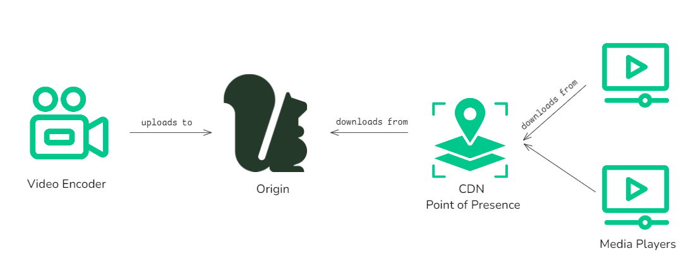

# オリジンとは何ですか？

オリジンは、ストリーミングワークフローにおけるメディアの**真実の**単一ソースです。オリジンはメディアを保存し、コンテンツ配信ネットワーク（CDN）に配信する役割を担い、CDNはそのコンテンツをプレーヤーに配信します。オリジンは、コンテンツが利用可能で、高品質であり、様々な地理的ロケーションに効率的に配信されることを確認する重要な役割を果たします。

## 主な責任

1. **Storage** - ビデオファイルやオーディオファイルを、通常は[アダプティブ・ビットレート・ストリーミング](/media-storage/performance/adaptive-bitrates/how-it-works)用のフォーマットで保存する。
2. **Delivery** - メディア[セグメント](/media-storage/core-concepts/segments)を取得し、CDNに配信する。
3. **Security** - コンテンツ保護のためのアクセス・コントロール。
4. **Scalability** - 単一のビデオファイルの配信から、数百万人の視聴者へのリアルタイムストリーミングまで、さまざまな負荷に対応
5. **Reliability** - リードとライトのアップタイムとフォールトトレランスを維持し、ダウンストリームのレイテンシーを防ぐ。
6.
## メディア・ストリーミングのオリジン

メディアストリーミングのワークフローにおいて、オリジンはエンドユーザーにコンテンツを配信するために連携する複数のコンポーネントの1つです。ここでは、メディア・オリジンがより広範なエコシステムにどのように適合するかを説明します：

* **Video encoder** - 生のビデオ/オーディオファイルを[HLS (HTTP Live Streaming)](/media-storage/performance/adaptive-bitrates/hls)や[DASH (Dynamic Adaptive Streaming over HTTP)](/media-storage/performance/adaptive-bitrates/dash)のようなストリーミングに適した形式に変換します。
* **Origin** - エンコードされたメディアを保存し、配信できるようにする。
* **Content delivery network (CDN)** - 地理的に分散されたPoP（Point of Presence）と呼ばれるサーバーにキャッシュすることで、メディアをエンドユーザーに配信し、遅延を減らしてストリーミング・パフォーマンスを向上させる。
* **Media player** - CDNからメディアセグメントを要求し、再生するデバイス（ブラウザ、スマートテレビ、モバイルアプリなど）。

## オリジンとしてのMomento Media Storage

Momento Media Storageは、[ライブストリーミング](/media-storage/streaming/live-streaming/how-it-works)および[ビデオ・オン・デマンド(VOD)](/media-storage/streaming/video-on-demand/media-storage)アプリケーションの要求を満たすように設計された専用高速オリジンです。当社の超低遅延ストレージを活用することで、Media Storageはコンテンツが常にアクセス可能で、CDNへの配信準備が整っていることを保証し、スムーズで中断のない視聴体験を可能にします。ライブイベントでもオンデマンドコンテンツでも、Media Storageは卓越したパフォーマンスを維持しながらメディア配信の管理プロセスを簡素化します。

信頼性はMomentoプラットフォームのすべてのサービスの中核であり、Media Storageも例外ではありません。Media Storageは、バッファリングを最小限に抑え、デバイスや場所を問わず、視聴者の[ゼロバッファレート（ZBR）](/media-storage/core-concepts/zero-buffer-rate)を実現します。このプラットフォームは、何百万もの同時リクエストを中断することなく処理し、楽に拡張できるように構築されているため、ライブスポーツのようなトラフィックの多いイベントに最適です。

開発者に優しいAPIにより、メディアアセットの統合と管理が容易になり、ワークフローの複雑さが軽減されます。サービスの動的な自動スケーリングにより、Media Storageはトラフィックの急増や停止時にも一貫してコンテンツを配信します。この信頼性とシンプルさの組み合わせは、最新のメディアストリーミングに信頼性が高く使いやすいソリューションを提供します。
