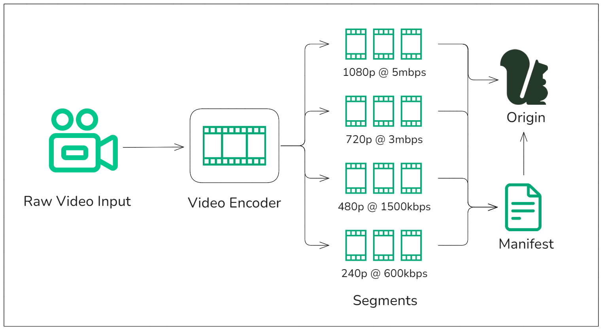

# セグメントとは何か？

セグメントとは、ストリーミング・ワークフローにおけるビデオおよびオーディオ・コンテンツの配信に使用される、メディアの小さな塊のことである。メディアファイルを管理しやすい小片に分割し、理想的には2秒間の長さで、メディアプレーヤーに順次配信されます。メディアをセグメントに分割することで、ストリーミング・プラットフォームは[アダプティブ・ビットレート・ストリーミング](/media-storage/performance/adaptive-bitrates/how-it-works)を提供し、ネットワークの状態が変化しても継続的に再生することができます。

## メディア・ストリーミングにおけるセグメントの役割

セグメントにより、メディアプレーヤーは利用可能な帯域幅に応じてビデオやオーディオの品質を動的に調整できるため、ストリーミングは変動するネットワーク状況により強くなります。同じコンテンツの異なる品質レベルをフェッチすることで、プレーヤーは、中断やバッファリングなしに、可能な限り最高のエクスペリエンスを提供できます。これは、ネットワーク・パフォーマンスが不安定なライブ・ストリーミングやトラフィックの多いイベントで特に重要です。

[HLS（HTTP Live Streaming）](/media-storage/performance/adaptive-bitrates/hls)や[DASH（Dynamic Adaptive Streaming over HTTP）](/media-storage/performance/adaptive-bitrates/dash)のようなアダプティブ・ビットレート・ストリーミング・プロトコルでは、セグメントは品質レベル間のスムーズな移行を可能にする基盤です。メディアファイルは複数のビットレートと解像度でエンコードされ、各バージョンのセグメントは別々に保存されます。メディアプレーヤーはネットワークの状況に応じて最適なセグメントを選択し、視聴者に可能な限りシームレスな体験を提供します。

## ストリーミングワークフローにおけるセグメントの仕組み

* **Raw video input** - ビデオとオーディオは録画機器からキャプチャされ、処理のためにビデオエンコーダに送られます。
* **Video encoder** - 生映像は小さな*セグメント*に分割され、さまざまなビットレートの複数のバージョンにトランスコードされる。
* **Manifest** - さまざまなビットレートと解像度ですべてのセグメントを参照するプレイリスト（マニフェスト）が作成され、ネットワーク条件と希望する結果とビットレートに基づいて、次にどのセグメントをダウンロードするかをプレーヤーにガイドします。
* **Origin** - CDNによる検索のためにセグメントとマニフェストを保存する。

## Momento Media Storageとセグメント

Momento Media Storageは、セグメントを保存し、光速のパフォーマンスと低いエラー率で配信します。当社のプラットフォームは、[ライブストリーミング](/media-storage/streaming/live-streaming/how-it-works)と[ビデオオンデマンド(VOD)](/media-storage/streaming/video-on-demand/media-storage)の両方のユースケースに最適化されており、メディアセグメントを確実に高速検索してCDNに配信します。当社の超低遅延ストレージを活用することで、Media Storageはデバイスや地域を超えた視聴者のシームレスな再生をサポートします。

Momento Media Storageを使用すると、セグメントが保存され、迅速に配信されるため、中断の可能性が低くなり、バッファリングが最小限に抑えられます。パフォーマンスを犠牲にすることなく高トラフィックイベントを処理できるため、大量の需要がある場合でも、セグメントをエラーなく確実に配信し、エラーのないスムーズなストリーミング体験に貢献します。
