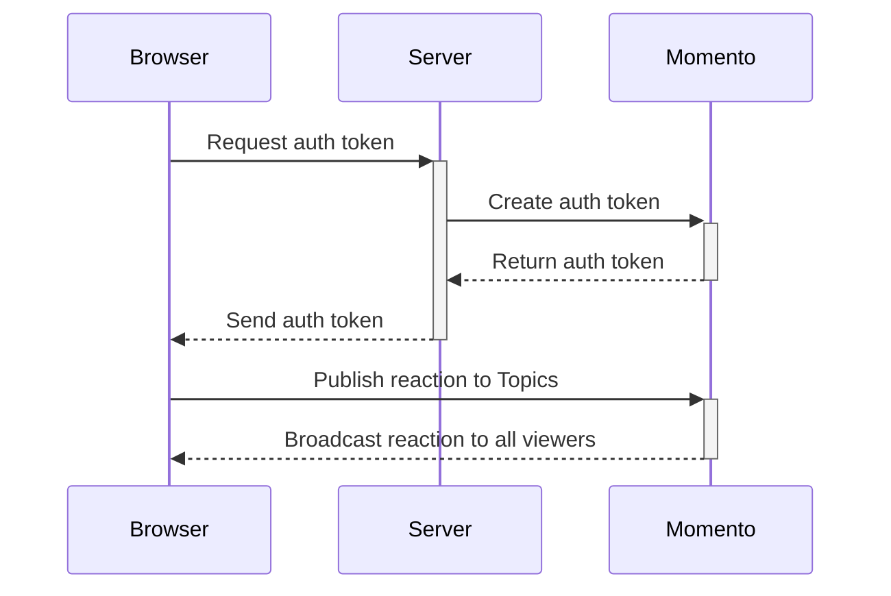

import Tabs from '@theme/Tabs';
import TabItem from '@theme/TabItem';

# ビデオストリームにリアルタイムの絵文字リアクションを追加する

視聴者の体験において、インタラクティブ性は重要な役割を果たしています。リアクションを送ったり、他の視聴者と感情を共有したりすることで、メディアストリーミングだけでは得られないコミュニティ感やエンゲージメントが生まれます。このチュートリアルでは、動画プレーヤにリアルタイムの絵文字オーバーレイを設定します。Momento Topics** を使用すると、ユーザーとのインタラクションに応じて絵文字のリアクションが即座に表示されるため、生き生きとした魅力的な視聴体験が可能になります。

:::info
完全な[GitHubの例](https://github.com/momentohq/demo-video-streaming)に飛ぶこともできますし、以下のチュートリアルに沿って簡単な実装を自分で作ることもできます。
:::

## How it works



まず、ブラウザは*token vending machine*と呼ばれるサーバーコンポーネントに認証トークンを要求します。このサーバーコンポーネントは、短命でスコープが限定された[session tokens](/cache/develop/authentication/tokens)の作成と配布を担当します。このトークンは短期間有効で、リアクションの送受信に必要なリソースへのアクセスのみを許可します。


トークンを受け取ったプレイヤーは、どの絵文字が押されたかを示すメッセージを[Momento Topics](/topics)に公開します。Topicsは、リアクションを購読しているすべてのビデオプレーヤーに絵文字をブロードキャストします。

Momento Topicsによって呼び出されたブラウザのイベントハンドラは、画面上に絵文字をレンダリングし、すべてのユーザーにリアルタイムのリアクションを提供します。

## 前提条件

* [Momento API key](/cache/develop/authentication/api-keys)

## Step 1: トークン発行機の作成

動画プレーヤが絵文字を公開および受信するには、Momento トピックへのアクセスが必要です。アクセスを許可するには、セッション トークンを生成して呼び出し元に返す必要があります。これを行うには、`POST /tokens` エンドポイントを持つ単純な Web サーバーを作成します。

<Tabs>
<TabItem value="node" label="Node.js">

```javascript
import express from 'express';
import { AuthClient, ExpiresIn } from '@gomomento/sdk'

const authClient = new AuthClient();
const app = express();
app.use(express.json());

app.post('/tokens', async (req, res) => {
  const { playerId, streamId} = req.body;
  const scope = {
    permissions: [{
      role: 'publishsubscribe',
      cache: 'video',
      topic: streamId
    }]
  };

  const tokenResponse = await authClient.generateDisposableToken(scope, ExpiresIn.minutes(30), { tokenId: playerId });
  res.status(201).json({ token: tokenResponse.authToken });
});

app.listen(3000, () => {
  console.log('Server is running on port 3000');
});
```

</TabItem>
<TabItem value="go" label="Go">

```go
package main

import (
	"context"
	"encoding/json"
	"log"
	"net/http"
	"time"

	"github.com/gorilla/mux"
	"github.com/momentohq/client-sdk-go/auth"
	"github.com/momentohq/client-sdk-go/config"
	"github.com/momentohq/client-sdk-go/momento"
	auth_resp "github.com/momentohq/client-sdk-go/responses/auth"
	"github.com/momentohq/client-sdk-go/utils"
)

var (
	ctx                context.Context
	authClient         momento.AuthClient
)

type TokenRequest struct {
	PlayerID string `json:"playerId"`
	StreamID string `json:"streamId"`
}

type TokenResponse struct {
	Token string `json:"token"`
}

func generateTokenHandler(w http.ResponseWriter, r *http.Request) {
	var req TokenRequest
	err := json.NewDecoder(r.Body).Decode(&req)
	if err != nil {
		http.Error(w, "Invalid request payload", http.StatusBadRequest)
		return
	}

	credentialProvider, err := auth.NewEnvMomentoTokenProvider("MOMENTO_API_KEY")
	if err != nil {
		panic(err)
	}

	authClient, err = momento.NewAuthClient(config.AuthDefault(), credentialProvider)
	if err != nil {
		panic(err)
	}

	resp, err := authClient.GenerateDisposableToken(ctx, &momento.GenerateDisposableTokenRequest{
		ExpiresIn: utils.ExpiresInMinutes(30),
		Scope: momento.TopicSubscribeOnly(
			momento.CacheName{Name: "video"},
			momento.TopicName{Name: req.StreamID},
		),
		Props: momento.DisposableTokenProps{
			TokenId: &req.PlayerID,
		},
	})

	if err != nil {
		http.Error(w, "Failed to generate token", http.StatusInternalServerError)
		return
	}

	switch r := resp.(type) {
	case *auth_resp.GenerateDisposableTokenSuccess:
		res := TokenResponse{Token: r.ApiKey}
		w.Header().Set("Content-Type", "application/json")
		w.WriteHeader(http.StatusCreated)
		json.NewEncoder(w).Encode(res)
	default:
		http.Error(w, "Failed to generate token", http.StatusInternalServerError)
	}
}

func main() {
	ctx = context.Background()

	r := mux.NewRouter()
	r.HandleFunc("/tokens", generateTokenHandler).Methods("POST")

	srv := &http.Server{
		Handler:      r,
		Addr:         ":8080",
		WriteTimeout: 15 * time.Second,
		ReadTimeout:  15 * time.Second,
	}

	log.Println("Server is running on port 8080")
	log.Fatal(srv.ListenAndServe())
}

```

</TabItem>
<TabItem value="dotnet" label=".NET">

```csharp
using Microsoft.AspNetCore.Mvc;
using Microsoft.Extensions.Configuration;
using Momento.Sdk;
using Momento.Sdk.Auth;
using Momento.Sdk.Config;
using Momento.Sdk.Auth.AccessControl;
using Momento.Sdk.Responses;
using System;
using System.Threading.Tasks;

[ApiController]
[Route("api/[controller]")]
public class TokenController : ControllerBase
{
  private readonly Momento.AuthClient _authClient;

  public TokenController(IConfiguration configuration)
  {
    _authClient = configuration.AuthClient;
  }

  [HttpPost]
  [Route("tokens")]
  public async Task<IActionResult> GenerateToken([FromBody] TokenRequest request)
  {
    try
    {
      var response = await _authClient.GenerateDispableTokenAsync(
        DisposableTokenScopes.TopicPublishSubscribe("video", request.StreamId),
        ExpiresIn.Minutes(30)
      )

      return Created("", new TokenResponse { Token = response.AuthToken });
    }
    catch (Exception ex)
    {
      Console.WriteLine($"Error generating token: {ex.Message}");
      return StatusCode(500, "Failed to generate token");
    }
  }
}

```

</TabItem>
</Tabs>

ここで作成したエンドポイントは、`playerId` と `streamId` プロパティを含むリクエストボディを受け付けます。streamId` は、視聴する動画ストリームの一意な識別子です。これは、リアクションのスコープをリクエストされた動画*に限定するために使用されます。`playerId` は呼び出し元の識別子です。Momento のベストプラクティスでは、*常にセッション トークンに発信者の識別子を含めるように*言われています。私たちは `playerId` を直接埋め込んだトークンを作成しており、このトークンはユーザーが公開するすべてのメッセージに適用されます。

:::tip
Momento AuthClient を正しく初期化するには、Momento API キーを環境変数 `MOMENTO_API_KEY` に設定するか、コンストラクタの `credentialProvider` プロパティに直接渡す必要があります。
:::

トークンで付与されたパーミッションは、呼び出し元が視聴しているビデオストリーム専用のトピックへの*publish*と*subscribe*の両方を許可する。このトピックは `video` という名前の [cache](/cache) に存在します。

成功すると、このエンドポイントは `201 Created` ステータスコードと生成されたトークンを返します。

## Step 2: ビデオプレーヤーと絵文字オーバーレイの作成

視聴者によって互いに送信される絵文字は、実際には埋め込みビデオプレーヤー自体の一部ではありません。実際には、絵文字は動画プレーヤーを囲む `div` 内にオーバーレイされています。絵文字は *絶対* 位置決めで配置され、CSS のキーフレームでアニメーション化されます。

```html
<!DOCTYPE html>
<html lang="en">
<head>
  <meta charset="UTF-8">
  <title>Live emoji reactions with Momento</title>
  <style>
    .video-container {
      position: relative;
    }
    .reaction-buttons {
      position: absolute;
      display: flex;
      top: 1rem;
      right: 1rem;
      gap: 0.5rem;
    }
    .reaction {
      padding: 0.5rem;
      background-color: black;
      opacity: 0.5;
      border-radius: 1.5rem;
    }
    .animated-emoji {
      position: absolute;
      bottom: 0;
      font-size: 30px;
      animation: floatUpAndOut 2s linear forwards;
      pointer-events: none;
    }
    @keyframes floatUpAndOut {
      0% { bottom: 0%; opacity: 1; transform: translateX(0) rotate(0deg); }
      100% { bottom: 100%; opacity: 0; transform: translateX(20px) rotate(15deg); }
    }
  </style>
</head>
<body>
  <!-- Video Player Container -->
  <div id="videoPlayerContainer" class="video-container">
    <video id="videoPlayer" controls autoplay muted></video>

    <!-- Reaction Buttons -->
    <div id="emojiReactions" class="reaction-buttons">
      <button onclick="sendReaction('heart')" class="reaction">❤️</button>
      <button onclick="sendReaction('100')" class="reaction">💯</button>
      <button onclick="sendReaction('thumbsup')" class="reaction">👍</button>
      <button onclick="sendReaction('mindblown')" class="reaction">🤯</button>
    </div>
  </div>
</body>
</html>
```

このHTMLでは、各絵文字ボタンは `sendReaction` 関数をトリガーし、クリックされると絵文字のリアクションを送信します。videoPlayerContainer`にはビデオプレイヤーと絵文字オーバーレイの両方が含まれています。リアクションボタンはビデオプレーヤーの右上に表示されます。❤️, 💯, 👍, ᤯のオプションがあることがわかります。

これが私たちのビデオプレーヤーの基礎です。さて、これを機能させなければなりません！

## Step 3: Momentoトピックスを使ったメッセージの公開

`<script>`タグか外部の `script.js` ファイルに、絵文字ボタンが押されたときにトークン自動販売機を呼び出してメッセージを発行するロジックを追加します。ここでは簡単のため、ローカルで実行されるものと仮定し、トークン自動販売機のベースURLとして `localhost` を使用することにします。

```javascript
let authToken;
let id = crypto.randomUUID();
const url = new URL(window.location.href);
const streamId = url.searchParams.get('videoId');

const response = await fetch('http://localhost/tokens', {
  method: 'POST',
  body: JSON.stringify({
    playerId: id,
    streamId: streamId
  })
});

const data = await response.json();
authToken = data.token;

function sendReaction(reaction) {
  fetch(`<MOMENTO_REGION_ENDOINT>/topics/video/${streamId}`, {
    method: 'POST',
    headers: {
      'Content-Type': 'application/json',
      'Authorization': authToken
    },
    body: reaction
  });
}
```

このコードでは、視聴者に一意の `playerId` を生成し、クエリ文字列パラメータ `videoId` から要求されたビデオ ID を取得し、トークン自動販売機から認証トークンを取得します。そして、トークンをグローバルに保存し、Momento を呼び出す際のスコープを確保します。

また、`sendReaction` 関数を定義し、グローバルにスコープされた認証トークン変数を使用して、[Momento HTTP API](/topics/api-reference/http-api) への呼び出しをラップします。Momento APIへのURLは[region-based](/platform/regions)で、地域によって異なります。この URL を見ると、Momento Topics、特に `video` キャッシュに POST を行い、`streamId` トピックにメッセージを送信していることがわかります。これにより、プレーヤが視聴している動画固有のインタラクションをスコープできます。

:::tip
動画にリアクションを追加する場合、特定のメディアに対してリアクションを行うのがベストプラクティスとされています。一般的な `reactions` トピックにブロードキャストした場合、*すべての動画*にまたがる*すべてのリアクション*が画面全体に表示されます。
:::

## Step 4: 絵文字のスクリーン表示

他の視聴者と絵文字を共有するメッセージを公開したので、それらを画面にレンダリングする必要があります。ダイナミックな効果を得るために、各絵文字は動画プレーヤーを横切るランダムな位置に配置され、下から上に向かって徐々にフェードアウトするようにアニメーションします。フェードアップとフェードアウトのアニメーションは、*step 2* で `floatUpAndOut` キーフレーム CSS クラスで設定済みです。

```javascript
function displayEmoji(emoji) {
  const emoji = document.createElement('div');
  emoji.textContent = emoji;
  emoji.className = 'animated-emoji';

  // Random horizontal position within the video player
  const containerWidth = document.getElementById('videoPlayerContainer').offsetWidth;
  emoji.style.left = `${Math.random() * (containerWidth - 30)}px`;

  document.getElementById('videoPlayerContainer').appendChild(emoji);

  setTimeout(() => { emoji.remove(); }, 2000);
}

async function longPoll(signal) {
  try {
    const response = await fetch('<MOMENTO_REGION_ENDOINT>/topics/video/${streamId}', {
    headers: {
      'Authorization': '{{{momento.token}}}',
    }
    });

    if (response.ok) {
      const data = await response.json();
      if (data && data.items && data.items.length > 0) {
        const emojiMap = {
          'heart': '❤️',
          '100': '💯',
          'thumbsup': '👍',
          'mindblown': '🤯'
        };
        data.items.forEach(item => {
          if (item.item && item.item.value && item.item.value.text) {
            const emoji = emojiMap[item.item.value.text];
            if(emoji){
              displayEmoji(emoji);
            }
          }
        });
      }
    }
  } catch (error) {
    if (error.name !== 'AbortError') {
      console.error('Long polling error:', error);
    }
  } finally {
    if (!signal.aborted) {
      setTimeout(() => longPoll(signal), 0);
    }
  }
}

const pollingController = new AbortController();
longPoll(pollingController.signal);
```

上のコードでは、絵文字 `div` を動画プレイヤーに追加する関数を定義し、アニメーションを含む CSS クラスを適用しています。アニメーションが終わると（CSSで定義されているように2秒かかります）、`div`をページから削除してすべてをきれいにします。

上にあるもうひとつの大きな部分は **ロングポーリング** です。Momento HTTP API を使って `streamId` トピックへのメッセージを *subscribe* しています。ロングポーリングでは、ブラウザは Momento にリクエストを行い、メッセージが公開されたときだけリクエストを返す。その後、ブラウザはすぐに再度リクエストを行い、次のメッセージが公開されるのを待ちます。厳密には、これはメッセージの *プッシュ* ではなく *プル* ですが、Momento からのメッセージをほぼリアルタイムで受け取ることができます。

長いポーリングのレスポンスハンドラは、受信したすべてのメッセージを繰り返し処理し、受信したテキストが有効なリアクションであることを検証し（悪意のある絵文字を防ぐため）、次に `displayEmoji` 関数を呼び出してビデオプレーヤー全体のアニメーションを開始します。

## Step 5: 絵文字を飛ばそう！

コードが書けたので、次はそれをテストする番です！テストする一番簡単な方法は、すべてをローカルで実行することです。では、ここで未解決の部分をいくつか解決しましょう。

### 依存関係の初期化とインストール

このコードを機能させるには、新しいプロジェクトを初期化し、依存関係をインストールする必要がありなす。これは以下のコマンドで実行できます：

```bash
npm init
npm install express @gomomento/sdk
```

最初のコマンドは、プロジェクトをセットアップするためのウィザードを案内してくれます。2番目のコマンドは、サーバーサイドのコードで使用した依存関係をすべてインストールします。

### Server-side code

*ステップ1*のコードは `server.mjs` というファイルに記述します。環境変数 `MOMENTO_API_KEY` に Momento API のキーを設定して、`.env` ファイルを構成することができます。ローカルでサーバを起動するには、以下のコマンドを実行します：

```bash
node server.mjs
```

これでサーバーが起動し、ウェブページが呼び出せるようになります。

### Client-side code

*ステップ2*で作成したhtmlは、`client.html`というファイルにしておく。*ステップ3とステップ4*で作成したJavaScriptは、htmlの`<body>`要素内の`<script>`タグに記述することができます。ここから、ターミナルで以下のコマンドを実行することにより、ウェブページを実行することができます：

```bash
npx serve client.html
```

これにより、htmlをホストする別のサーバーがローカルに起動します。ターミナルに表示されるリンクをクリックすれば、ブラウザでページを開くことができます。ここからすべてが機能するので、絵文字をクリックし、ビデオプレーヤーに送信してください！

## 学んだ概念

このチュートリアルでは、短時間で多くのことを行う方法と、さらに短いコード量を学びました！以下は、あなたが今知っている方法です：

* Momento AuthClient を使ってトークンの自動販売機を作る。
* Momento トピックを使用して、サーバー側のコードを使用せずに、ブラウザ間で直接メッセージを送信する。
* Momento HTTP APIで**ロングポーリング**を実装する。

これらは、どのレベルのプログラマーにとっても基礎的なトピックであり、ビルダーの中核となるスキルです。自宅でサイド プロジェクトを構築する場合でも、エンタープライズ グレードのアプリケーションを設計する場合でも、Momento は自動的に拡張されるため、重要なこと、つまり*ビジネス上の問題の解決*に専念できます。

ハッピーコーディング！
