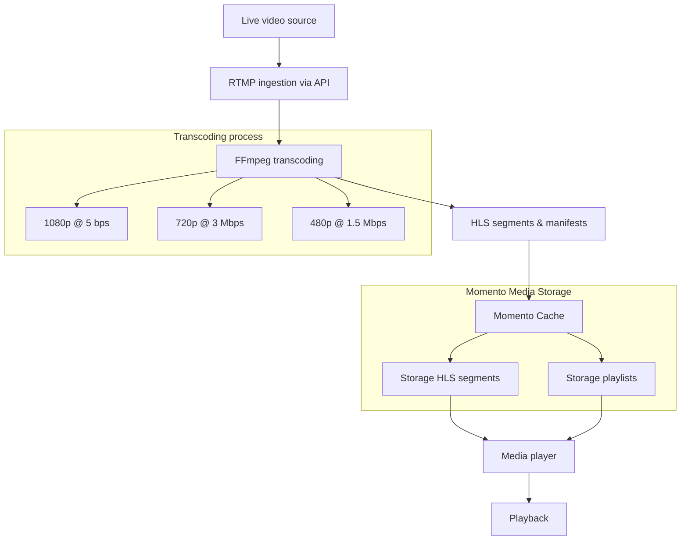

# RTMP、FFmpeg、Momento Media Storageによるライブストリーミング

このチュートリアルでは、HTTP POST リクエストをトリガーとするライブストリーム取り込みワークフローを構築します。リクエストには [RTMP ストリーム](https://en.wikipedia.org/wiki/Real-Time_Messaging_Protocol) の URL とストリーム名が含まれます。このリクエストをトリガーとして、**FFmpeg** がストリームを複数の解像度にトランスコードし、Momento SDK を使用して、結果の [HLS セグメント](/media-storage/performance/adaptive-bitrates/hls) とマニフェスト ファイルを **Momento Media Storage** にアップロードします。

:::info
[GitHubのコード](https://github.com/momentohq/demo-rtmp-streaming)に直接飛んでもいいしですし、以下のチュートリアルに沿って進んでもいいです。
:::

## アーキテクチャ

以下は、このチュートリアルであなたが作るものの図になります。


## Step 1: エクスプレスAPIの設定

まず、`/livestreams` エンドポイントで POST リクエストを受け付ける [Express app](https://expressjs.com/) を作成します。リクエスト・ボディはRTMPのURLとストリーム名を含み、サーバーはストリームを処理するための非同期ワークフローを開始します。

### 依存関係をインストールする

以下のnpmパッケージをインストールし、[FFmpeg](http://www.ffmpeg.org/)がメディアサーバーにインストールされ、`FFmpeg_PATH`環境変数がFFmpegバイナリの場所に設定されていることを確認してください。

```bash
npm install express fluent-ffmpeg @gomomento/sdk
```

### キャッシュの作成

セグメントとマニフェストファイルは [Momento Cache](/cache) に保存されます。コードを実行する前に、[自分のアカウントに](https://console.gomomento.com) キャッシュを作成する必要があります。この例では `livestreams` という名前のキャッシュを使用します。

### Express.jsサーバーの作成

**POST /livestreams**エンドポイントを定義し、非同期処理タスクを開始するには、以下のコードを使用します。

```javascript
import express from 'express';
import fs from 'fs';
import ffmpeg from 'fluent-ffmpeg';
import { CacheClient } from '@gomomento/sdk';

// Initialize Momento CacheClient
const momento = new CacheClient({ defaultTtlSeconds: 3600 });

const NAMESPACE = 'livestreams';
const app = express();
app.use(express.json());

// POST endpoint to trigger livestream processing
app.post('/livestreams', async (req, res) => {
  const { rtmpUrl, streamName } = req.body;

  if (!rtmpUrl || !streamName ) {
    return res.status(400).json({ error: 'RTMP url and stream name are required' });
  }

  const stream = streamName.replace(/[^a-zA-Z]/g, "").toLowerCase();
  res.status(202).json({ stream: `${stream}_playlist.m3u8` });
  startTranscodingWorkflow(rtmpUrl, stream);
});

app.listen(3000, () => {
  console.log('Server running on port 3000');
});
```

上記のコードでは、Momento の `CacheClient` を初期化し、Express アプリが基本的な検証を行いながら `/livestreams` エンドポイントで実行されるように設定しています。また、セグメントとマニフェストファイルのデフォルトの[time to live](/cache/learn/how-it-works/expire-data-with-ttl)を1時間に設定しています。1時間経過すると、それらは自動的に削除されます。

このエンドポイントは、マスタープレイリストのキーを持つ `stream` プロパティを返します。

## 2. トランスコーディング・ワークフローの構築

リクエストが処理されたので、RTMPストリームをインジェストして[異なるビットレートと解像度](/media-storage/core-concepts/abr-ladder)にトランスコードする非同期ワークフローを書く必要があります。

```javascript
function startTranscodingWorkflow(rtmpUrl, streamName) {
  ffmpeg(rtmpUrl)
    // 1080p Output
    .size('1920x1080')
    .videoBitrate('5000k')
    .output(`${streamName}/1080p/playlist.m3u8`)
    .outputOptions([
      '-c:v libx264',
      '-g 48',
      '-sc_threshold 0',
      '-f hls',
      '-hls_time 1',
      '-hls_list_size 0',
      `-hls_segment_filename ${streamName}/1080p/${streamName}_1080p_segment%03d.ts`
    ])
    // 720p Output
    .size('1280x720')
    .videoBitrate('3000k')
    .output(`${streamName}/720p/playlist.m3u8`)
    .outputOptions([
      '-c:v libx264',
      '-g 48',
      '-sc_threshold 0',
      '-f hls',
      '-hls_time 1',
      '-hls_list_size 0',
      `-hls_segment_filename ${streamName}/720p/${streamName}_720p_segment%03d.ts`
    ])
    // 480p Output
    .size('854x480')
    .videoBitrate('1500k')
    .output(`${streamName}/480p/playlist.m3u8`)
    .outputOptions([
      '-c:v libx264',
      '-g 48',
      '-sc_threshold 0',
      '-f hls',
      '-hls_time 1',
      '-hls_list_size 0',
      `-hls_segment_filename ${streamName}/480p/${streamName}_480p_segment%03d.ts`
    ])
    .on('end', () => {
      console.log('Transcoding complete');
    })
    .on('error', (err) => {
      console.error(`Error during transcoding: ${err.message}`);
    })
    .run();

  watchAndUploadSegments(streamName, ['1080p', '720p', '480p']);
  uploadMasterPlaylist(streamName);
}
```

このコードは `fluent-ffmpeg` というラッパーパッケージを使って、RTMP スチームを入力として FFmpeg バイナリにコマンドを渡します。ストリームを*1080p at 5mbps*、*720p at 3mbps*、*480p at 1.5mbps*のビットレートと解像度に1秒のセグメントでトランスコードするコマンドを構築しています。各セグメントは、「(streamName)_(resolution)_segment(number).ts 」という命名規則で、特定の解像度のディレクトリに出力されます。この命名規則により、各セグメントと解像度に一意のキー名が与えられます。出力ファイル名は、ffmpeg によって各マニフェストファイルに自動的に追加されます。

次に、Momento Media Storage にセグメントをリアルタイムでアップロードするウォッチャー関数を実装します。

## 3. Momentoにデータをアップロードする

RTMPストリームからセグメントを作成したので、それらをMomentoにアップロードして、CDNで利用できるようにする必要があります。そのために、出力フォルダにウォッチャーを追加し、ファイルが追加されたらアップロードします。

```javascript
function watchAndUploadSegments(streamName, directories) {
  for (const directory of directories) {
    const streamDirectory = `${streamName}/${directory}`;
    if (!fs.existsSync(streamDirectory)) {
      fs.mkdirSync(streamDirectory, { recursive: true });
    }

    fs.watch(streamDirectory, (eventType, fileName) => {
      if (fileName.endsWith('.ts') || fileName.endsWith('.m3u8')) {
        const location = `${streamDirectory}/${fileName}`;
        const key = `${streamName}_${directory}_${fileName}`;
        uploadToMomento(location, key);
      }
    });
  }
}

async function uploadToMomento(filepath, key) {
  try {
    const fileData = fs.readFileSync(filepath);
    await momento.set(NAMESPACE, key, fileData);
    console.log(`${key} uploaded`);
  } catch (error) {
    console.error(`Failed to upload ${key}:`, error);
  }
}

async function uploadMasterPlaylist(streamName) {
  const masterPlaylist = `#EXTM3U
  #EXT-X-STREAM-INF:BANDWIDTH=5000000,RESOLUTION=1920x1080
  ${streamName}_1080p_playlist.m3u8
  #EXT-X-STREAM-INF:BANDWIDTH=3000000,RESOLUTION=1280x720
  ${streamName}_720p_playlist.m3u8
  #EXT-X-STREAM-INF:BANDWIDTH=1500000,RESOLUTION=854x480
  ${streamName}_480p_playlist.m3u8
  `;

  await momento.set(NAMESPACE, `${streamName}_playlist.m3u8`, masterPlaylist);
}
```

これらの関数は、ファイルの変更をディレクトリで監視し、ファイルを Momento にアップロードします。FFmpeg はセグメントが作成されると自動的に各マニフェストファイルを更新し、それがアップロードのトリガーとなって新しいバージョンで上書きします。

私たちはまた、*マスター・プレイリスト*をハードコーディングし、作成する3つの異なる解像度を指定しています。FFmpegは自分でそれを作成しないので、ここでは手動で行う必要があります。

これで、セグメントが活発に作成され、解像度固有のマニフェストファイルが常に更新されるようになりました。つまり、ストリーム・プロセッサーの構築に成功したということです！

## 4. 試してみる

[OBS (Open Broadcaster Software)](https://obsproject.com/)からのRTMPストリームを使用して、この設定をローカルでテストするには、以下の手順を実行します。

1. **Setup your media server**
    - [RTMPモジュール](https://docs.nginx.com/nginx/admin-guide/dynamic-modules/rtmp/)を搭載したNginxをダウンロードします。
    - `nginx.conf` ファイルに次の rtmp スニペットを含めるように設定します。
    ```conf
    rtmp {
      server {
        listen 1935;

        application live {
            live on;
        }

        application hls {
            live on;
            hls on;
            hls_path temp/hls;
            hls_fragment 8s;
        }
     }
    }
    ```
    - Start Nginx

    *NOTE - コンフィグファイルはrtmpセクション以上のものが必要です。詳細は[Nginx docs](https://docs.nginx.com/nginx/admin-guide/basic-functionality/managing-configuration-files/)を参照してください。
2. **OBSをRTMPでストリーミングするように設定**
    - OBS**を開き、**File > Settings > Stream**に進みます。
    - サービスとして **Custom** を選択します。
    - **Server**フィールドに `rtmp://localhost/live` と入力する。
    - **Stream Key** フィールドに `teststream` と入力する。
    - 設定を適用し、ストリーミングを開始する。
3. **Expressサーバーの実行**
    - [FFmpegがインストールされていること](https://www.ffmpeg.org/)と`FFMPEG_PATH`環境変数にFFmpegのバイナリの場所が設定されていることを確認してください。
    - 以下のコマンドでアプリケーションを実行します：
    ```bash
    node app.js
    ```
4. **エンドポイントの呼び出し**
   - Postmanやcurlのようなツールを使ってPOSTリクエストを送信し、ストリーム処理を開始します。
     ```bash
     curl -X POST http://localhost:3000/livestreams \
     -H "Content-Type: application/json" \
     -d '{"rtmpUrl": "rtmp://localhost/live/teststream", "streamName": "My Momento Stream"}'
     ```

5. **トランスコードとアップロードを監視する**
    - アプリがセグメントを作成し、リアルタイムで**Momento Media Storage**にアップロードすることで、トランスコード処理が開始されます。サーバーはアップロードのプロセスを記録し、完了すると通知します。
    - また、各解像度フォルダに作成されたセグメントをファイルシステムで確認することもできます。

5. **Playback**
    - セグメントとマニフェスト・ファイルが **Momento Media Storage** に格納されると、マスター・プレイリスト URL を使用して、HLS 互換プレーヤーからアクセスできます：
    ```
    https://<your-cdn-url>/<streamName>/playlist.m3u8
    ```
    - ローカルでのテストには、ブラウザで[VLC](https://www.videolan.org/)や[Video.js](https://videojs.com/)のようなプレーヤーを使うことができます。

:::info
このデモで使用したのは、メディア ファイルにアクセスするための [CDN ルート](/media-storage/streaming/decoding-video#using-a-cdn-with-header-forwarding) です。この CDN はリクエストを受け取り、Momento の認証トークンを直接 Momento Media Storage に転送します。これを行う CDN を設定していない場合、メディア プレーヤはマニフェストとセグメントを取得できません。
:::

これで、RTMPライブストリーミング、トランスコード、**Momento Media Storage**へのセグメント保存の準備が整いました。ストリーミングのニーズに応じて、ストリームの品質、セグメントの長さ、その他のパラメータを調整できます。ハッピーコーディング！
