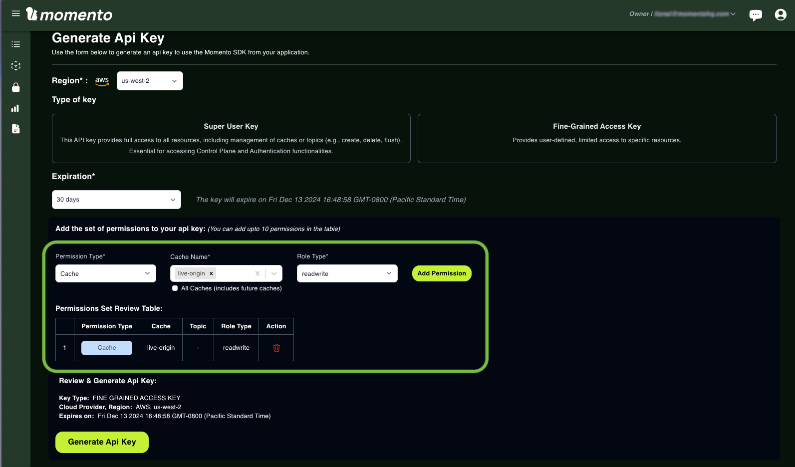
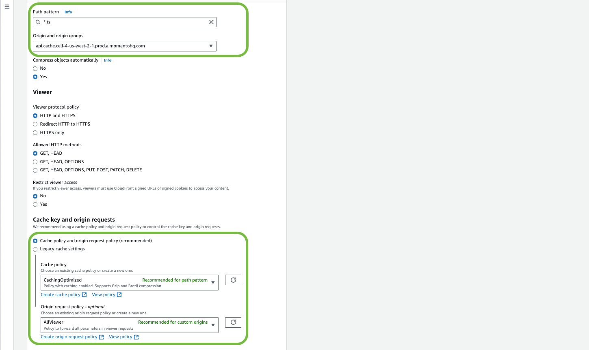

# Momento Media Storage、AWS MediaLive、Amazon CloudFrontを使用したライブビデオオリジンの作成
ライブ・ビデオ・ストリーミングでは、世界中の視聴者の要求に対応するために、高いパフォーマンスとスケーラビリティを備えた[オリジン・サーバー](/media-storage/core-concepts/origin)が必要です。従来のオリジン・サーバーは、最新のクラウド・ワークフローと統合した場合、レイテンシー、スケーラビリティ、または複雑さに苦労することがよくあります。Momento Media Storage は、ライブ・ビデオ・ストリーミング用に調整された、堅牢で低レイテンシー、コスト効率の高いオリジン・ソリューションを提供することで、シンプルで大規模なソリューションを提供します。

このチュートリアルでは、[AWS Elemental MediaLive](https://aws.amazon.com/medialive/) でエンコードされ、[Amazon CloudFront](https://aws.amazon.com/CloudFront/) 経由で配信されるライブ・ビデオ・ストリームのオリジン・サーバーとして、Momento Media Storage を設定する方法を学びます。このガイドの最後には、パフォーマンスと信頼性を最適化したライブ[HLSストリーム](/media-storage/performance/adaptive-bitrates/hls)を配信できるワークフローが完成します。

以下がその内容です：

1. オリジン・サーバーとして動作するストレージ・ネームスペースをMomento Media Storageに作成する。
2. ライブコンテンツをエンコードしてMomentoにプッシュするために、AWS Elemental MediaLiveを設定する。
3. 低レイテンシーで視聴者にコンテンツを提供するためにAmazon CloudFrontを設定する。
4. スムーズな再生を保証するためのセットアップのテストとトラブルシューティング。

このチュートリアルでは、[Momento コンソール](https://console.gomomento.com) を使用しますが、[Momento SDK](/platform/sdks) を使用して、すべてをプログラムで作成および設定することもできます。

## 準備

リソースを作成する前に、ライブ・ビデオ・チャンネルの基本的な特性を決定してください。

**Channel bitrates**: チャンネルのビットレートは解像度、フレームレート、エンコーディングに依存します。下の表は、このガイドで使用されているビットレートの例です。

**Segment duration**: グラス間のレイテンシを最小にするため、セグメントの継続時間は1秒から2.5秒の間であるべきである。このガイドでは2.5秒を使用しています。

**TTL (Time-to-Live)**: TTLは、ストリームデータが再生可能な時間を決定する。このガイドでは、3600秒（1時間）を使用しています。お使いの製品にDVR再生のような機能が含まれている場合、日単位で測定されるもっと長いTTLが必要になる可能性があることに注意してください。

:::tip

Momento Media Storageの最大オブジェクトサイズは10MBです。セグメントサイズを見積もるには、ビットレート（Kbps）を8で割り、セグメント時間（秒）を掛け、ヘッダーを考慮して10%を加えます。例えば、1000Kbpsで2秒のセグメントは、およそ`1000 / 8 * 2 * 1.1 = 275KB`です。

:::

このチュートリアルでは、3つのエンコーディングプロファイルと2.5秒のセグメントを持つ[adaptive bitrate ladder](/media-storage/core-concepts/abr-ladder)用に1つのライブビデオチャンネルを設定します：

| resolution | framerate | bitrate | segment size |
|:-:|:-:|:-:|:-:|
| `720p` | `30` | `2,500 kbps` | `850 KiB`
| `480p` | `30` | `1,500 kbps` | `500 KiB`
| `240p` | `30` |   `750 kbps` | `250 KiB`


## 1. Momentoアカウントでストレージ名前空間を作成する

現在、Momento Media Storageは、主要なデザイン・パートナーによるプライベート・プレビュー・アクセスに制限されています。ストレージ・ネームスペースを作成するには、[Momento Console](https://console.gomomento.com/)に一度ログインし、アカウントを初期化してください。その後、`support@momentohq.com` またはサポート担当者に以下の情報を連絡し、ストレージネームスペースを作成してください：

- **account id**: コンソール](https://console.gomomento.com/)の右上にあるドロップダウンから、あなたのアカウントIDを探します(`a-xxxxxxxxxxx`)。
- **namespace id**: 新しいストレージ名前空間に必要な ID。このガイドでは `live-origin` を使用する。
- **AWS region**: 新しいストレージ名前空間の AWS リージョン。このガイドでは `us-west-1` を使用する。AZ-alignmentが利用可能になったら、リージョン内の2つのAZも指定する必要がある。
- **hot storage capacity**: これにより、低レイテンシのストレージにどれだけのストリームデータを保持するかが決まる。すべてのセグメントのサイズを合計し、ホットストレージに保持するセグメント数を乗じることで、必要な容量を見積もる。例えば、例のビットレートラダーの5分間をホットストレージに保持するには、`(850+500+250)Kib * 300/2.5 ≈ 200 MiB`が必要です。

Momento Media Storageがプライベートプレビューである間、ストレージ*名前空間*はコンソールで*キャッシュ*として表示されます。このガイドでは、*namespace* を *cache* と同じ意味で使用します。Momento Media Storageが一般公開に近づくにつれて、コンソールの更新により、ネームスペースの作成がセルフサービスプロセスになります。

次に、エンコーダーがセグメントファイルとマニフェストファイルを `live-origin` ネームスペースに安全に書き込むために使用する API キーを生成します。Momento コンソールの [API Key セクション](https://console.gomomento.com/api-keys) で、`live-origin` ネームスペースへの *読み書き* アクセス権を持つ、30 日で有効期限が切れる Fine-Grained Access Key を作成します。APIキーを生成する前に、「Add Permission 」をクリックし、権限を付与することを忘れずに。



APIキーの情報は、このページから移動すると利用できなくなるので、APIキーをJSONファイルとしてダウンロードしてください。本ガイドでは、このAPIキーを `encoder_api_key` として参照します。

動画プレーヤは、エンコーダによってプッシュされたコンテンツを、**コンテンツ配信ネットワーク（CDN）**を介して Momento Media Storage に読み込みます。セキュリティのベストプラクティスとして、`live-origin` 名前空間への *読み取り専用* アクセス権を持つ 2 つ目の API キーを作成してください。この新しいAPIキーを作成するには、前回と同じ[API key page](https://console.gomomento.com/api-keys)を使用する。本ガイドではこのAPIキーを `player_api_key` と呼ぶ。

:::info[Checking in]

一つは`live-origin`ネームスペースへの*readwrite*アクセスを許可するもの、もう一つは*readonly*アクセスを許可するものである。これらは今後のステップで使用するために手元に置いておく。

:::

## 2. ライブビデオエンコーディングのためのAWS MediaLiveのセットアップ

AWS Elemental MediaLiveはAWSのライブビデオエンコーディングサービスであり、ライブストリームを処理し、スケーラブルに配信する。MediaLiveはライブビデオを[HLS](/media-storage/performance/adaptive-bitrates/hls)のようなストリーミング形式に変換する。これは、ライブ・スポーツ、主要なライブ・イベント、および24時間365日のチャンネルによく使用されます。

MediaLive は、このライブ動画ワークフローで **エンコーダー** として機能します。エンコードされたビデオは、オリジン サーバーとして機能する Momento Media Storage に直接送信されます。

:::tip

最高のパフォーマンスを得るには、MediaLive サービスと `live-origin` ネームスペースが同じ AWS リージョンにあるか、可能な限り近いことを確認してください。MediaLiveを初めて使用する場合は、[AWSドキュメント](https://docs.aws.amazon.com/medialive/latest/ug/container-planning-workflow.html)に詳細なセットアップ手順が記載されているので参照してください。

:::

1つの出力先である `live-origin` 名前空間に出力する1つのエンコーディングパイプラインを持つ MediaLive チャンネルを設定します。チャネルの出力先URLは以下の形式に従ってください：

> https://\<*momento_rest_endpoint*\>/cache/\<*namespace_id*\>/playlist.m3u8?token=\<*encoder_api_key*\>&ttl_seconds=\<*ttl*\>&role=origin

変数のプレースホルダーは以下のとおりです：

* `momento_rest_endpoint` - Momento HTTP API の地域固有のエンドポイント ([地域のエンドポイントはこちら](/platform/regions))。
* `namespace_id` - セグメントをアップロードする名前空間の ID。
* `encoder_api_key` - ステップ1で生成された*readwrite*エンコーダーキーの値。
* `ttl` - Storageネームスペースにプレイリストとセグメントを保持する秒数。
* 
*Note - クエリパラメータ `role=origin` は AWS MediaLive では必須です。Momento HTTP API では必須のクエリパラメータではありません。

このチュートリアルのコンフィギュレーションを適用すると、宛先URLは次のようになります：

```
https://api.cache.cell-4-us-west-2-1.prod.a.momentohq.com/cache/live-origin/playlist.m3u8?token=ey[...]J9&ttl_seconds=3600&role=origin
```

CDN設定*フィールドを**HLSベーシックプット**に設定し、Momento Media Storageネームスペースの保持期間との互換性を保証するために、以下のように再試行ポリシーを設定します。


Manifest and Segments**セクションで、以下のフィールドを設定する：

* **Output Selection** - MANIFESTS_AND_SEGMENTS
* **Mode** - LIVE
* **TS File Mode** - SEGMENTED_FILES
* **Segment Length** - 2

残りの設定は、以下の設定と一致させます：


最後に、AWS Elemental MediaLive がバリアント プレイリストを更新する方法を設定します。バリアント プレイリストは、マスター プレイリストの選択名の末尾に *Name 修飾子* を追加することで、マスター マニフェストから派生します。各バリアント プレイリスト/出力には、どのプレイリストを見ているのか一目でわかるように、説明的な修飾子を追加します。たとえば、例のビットレート・ラダーの各バリアント・プレイリストには、`_480p30`、`_240p30`、`_720p30` が *Name Modifier* として付きます。マスターマニフェストを `playlist.m3u8`と命名したため、結果のバリアントマニフェストはそれぞれ `playlist_480p30.m3u8`、`playlist_240p30.m3u8`、`playlist_720p30.m3u8` と命名されます。この命名規則は、以下のCloudFront設定で指定する必要があります。


すべての設定が完了したら、*Create channel*ボタンを押してエンコーダーを作成します！

## 3. Amazon CloudFrontによるコンテンツ配信の最適化

Amazon CloudFront は、ライブ・ビデオ・ストリームを世界中の視聴者に迅速かつ確実に配信するコンテンツ・デリバリー・ネットワーク（CDN）です。このステップでは、CloudFrontをMomento Media Storageで動作するように設定し、待ち時間の最適化、コストの管理、アクセスの確保を行います。

CloudFrontは、このワークフローで2つの重要な役割を果たします：

1. PoP（Point of Presence）全体でビデオセグメントをキャッシュすることで、レイテンシーとコストを削減する。
2. リクエストに適切な認証トークンを追加することで、Momentoオリジンへのアクセスを保護する。

[メディアセグメント](/media-storage/core-concepts/segments)は、頻繁に変更されないアセットです。1～5秒のビデオ、オーディオ、またはメタデータを表し、エンコーダーによって生成された後は変更されません。これらのメディアアセットは通常、[live](/media-storage/streaming/live-streaming/how-it-works)と[VOD](/media-storage/streaming/video-on-demand/media-storage)の両方のビデオワークフローにおいて、エンド視聴者の近くにある複数のPoPにまたがるAmazon CloudFrontのようなCDNサービスによってキャッシュされるのが最適である。

VOD ワークフローでは、一度作成された HLS マニフェストは変更されませんが、ライブビデオワークフローの HLS マニフェストは、最新のメディアセグメントを提示するために、エンコーダによって常に 「ライブポイント」 で再作成されます。その結果、*ライブ HLS マニフェストは、CDN によってメディアセグメントのサイズ*よりも長くキャッシュされるべきではありません。そのため、私たちはマニフェストを**キャッシュせず**、代わりに頻繁に変更されるオブジェクトを管理するために設計された Momento オリジンに渡します。

:::tip

適切なCloudFrontビヘイビアで短いTTLを指定することで、マニフェストファイルの取得を最適化できます。

:::

[Amazon CloudFrontコンソール](https://console.aws.amazon.com/cloudfront)で、カスタムCloudFrontビヘイビアによってこれらのルールを有効にするCloudFrontディストリビューションを作成します。


CloudFrontディストリビューションの*オリジンドメイン*は、MediaLiveチャネルを設定するために使用した`momento_rest_endpoint` urlとして設定する必要があります。このワークフローでは*オリジンパス*フィールドが**必須**であることに注意してください。

CloudFront は、API キーやセッション トークンを取得するための認証フローを経由しない動画プレーヤからアクセスされるため、デフォルトのポリシーで、受信リクエストに対して `player_api_key` を含む *Authorization* ヘッダーを追加するように設定する必要があります。これにより、CloudFrontはAPIキーを自動的にMomentoに転送し、生成されたセグメントへの読み取り専用アクセスを許可する。

CloudFrontの*Origin Shield*機能を有効にする必要はありません。

**Web Application Firewall (WAF)**設定では、デモでは*Do not enable security protects*を選択する。

次に、Momentoオリジン・サーバーから読み込む3種類のオブジェクトに対するCloudFrontの動作を定義する必要がある：

1. デフォルトの動作
2. メディアセグメントに対する動作
3. バリアントプレイリストの動作


**Default behavior**: この「動作」は、動画起源のワークフローの一部ではない項目に対するものです。これらのオブジェクトは頻繁に変更されるため、CloudFront にキャッシュしないことを想定し、「CachingDisabled」 ポリシーを使用します。以下のようにポリシーを設定します。


**Media segments behavior**: これらのファイルはエンコーダーがオリジンに送信した後に変更されることはないので、CloudFrontとその 「CachingOptimized 」ポリシーによってキャッシュされるのに適した候補となる。AWS MediaLiveの設定から、オーディオ/ビデオを含むセグメントは常にファイル拡張子`.ts`を持ちます：



**Variant playlists behavior**: これらの `playlist_*.m3u8` ファイルは、AWS Elemental MediaLive から新しいメディアセグメントが利用可能になるたびに更新される。MediaLive がプレイリストを再作成するとき、URI に `encoder_api_key` トークンのクエリパラメータが自動的に追加される。デフォルトのルールでは、これらのセグメントをリクエストするときに *Authorization* ヘッダーに異なる競合する値（`player_api_key`）を適用するので、これらのリクエストに対して *Authorization* ヘッダーを削除する動作を定義する必要がある。これを実現するには、*Origin request policy* を None に設定する。


## 4. Playback and troubleshooting

これでストリーミングの準備が整いました！お気に入りのHLSプレイヤー（[VLC media player](https://www.videolan.org/)でネットワークストリームを開き、.m3u8のパスを貼り付ける）を`https://<cloudfront_id>.CloudFront.net/playlist.m3u8`に指定し、AWS Elemental MediaLiveによってエンコードされたライブストリームを再生することができます。

うまくいかず、ストリームが再生されない場合、トラブルシューティングの最善の方法は、HLS ビデオプレーヤーによって実行される各ステップを手動で確認することです。

### MediaLive and Momento

マスターマニフェストが `player_api_key` でアクセス可能で、バリアントプレイリストを正しく返すことを確認します。以下の `curl` コマンドを使用してテストするか、[Momento コンソール](https://console.gomomento.com/caches/live-origin) を使用してネームスペースのデータを表示します。

```
$ curl "https://<momento_rest_endpoint>/cache/live-origin/playlist.m3u8?token=<player_api_key>"

#EXTM3U
#EXT-X-VERSION:3
#EXT-X-INDEPENDENT-SEGMENTS
#EXT-X-STREAM-INF:BANDWIDTH=2648800,AVERAGE-BANDWIDTH=1790800,CODECS="avc1.77.30,mp4a.40.2",RESOLUTION=640x480,FRAME-RATE=30.000
playlist_480p30.m3u8?token=<encoder_api_key>&ttl_seconds=3600&role=origin
#EXT-X-STREAM-INF:BANDWIDTH=1394800,AVERAGE-BANDWIDTH=965800,CODECS="avc1.4d400d,mp4a.40.2",RESOLUTION=320x240,FRAME-RATE=30.000
playlist_240p30.m3u8?token=<encoder_api_key>&ttl_seconds=3600&role=origin
#EXT-X-STREAM-INF:BANDWIDTH=4391200,AVERAGE-BANDWIDTH=2961200,CODECS="avc1.4d401f,mp4a.40.2",RESOLUTION=960x720,FRAME-RATE=30.000
playlist_720p30.m3u8?token=<encoder_api_key>&ttl_seconds=3600&role=origin
```

各バリアントプレイリストにアクセスできるかどうか、バリアントプレイリストにリストされている最後のメディアセグメント（別名 *ライブポイント*）をダウンロードできるかどうかを確認します。以下は、480p マニフェストとライブ ポイントを表示するための `curl` コマンドです。

```
$ curl "https://<momento_rest_endpoint>/cache/live-origin/playlist_480p30.m3u8?token=<player_api_key>"

#EXTM3U
#EXT-X-VERSION:3
#EXT-X-TARGETDURATION:2
#EXT-X-MEDIA-SEQUENCE:891
#EXTINF:2.00000,
playlist_480p30_00891.ts
#EXTINF:2.00000,
playlist_480p30_00892.ts
#EXTINF:2.00000,
[...]
#EXTINF:2.00000,
playlist_480p30_00939.ts
#EXTINF:2.00000,
playlist_480p30_00940.ts

$ curl -o test.ts  "https://<momento_rest_endpoint>/cache/live-origin/playlist_480p30_00940.ts?token=<player_api_key>"
```

ライブポイントを見るときは、`test.ts`ファイルが正しくダウンロードされ、お気に入りのテストツール（[ffprobe](https://ffmpeg.org/ffprobe.html)、[mediainfo](https://mediaarea.net/en/MediaInfo)など）で問題ないことを確認する。

これらのステップのいずれかに失敗した場合、通常次のようなことが考えられます：


* `encoder_api_key`または`player_api_key`は、名前空間への適切なアクセス・レベルを持っていない可能性があります。
* AWS Elemental MediaLiveが正しく設定されていないか、実行されていません。
* HLS 出力グループレベルの *Destination URL* フィールドで指定された URI をダブルチェックし、クエリパラメー タ `&ttl_seconds=<ttl>&role=origin` を追加することを忘れないでください。

### CloudFront

MediaLiveとMomentoですべてが正しく見えるなら、CloudFrontからのリクエストを検証する。配信ルールにはすでに認可ヘッダーが埋め込まれているので、URIに`player_api_key`を追加する必要はありません。CloudFrontが適切に挿入していることを確認してください。

以下の3つのコマンドは、プレーヤーからCloudFrontを通じてMomento Media Storageに送信されるリクエストと同じ結果を生成します。最後のコマンドの `<id>` は、取得したプレイリストの有効な値に置き換えてください：

```
$ curl "https://<cloudfront_id>.CloudFront.net/playlist.m3u8"

$ curl "https://<cloudfront_id>.CloudFront.net/playlist_480p30.m3u8"

$ curl -o test.ts "https://<cloudfront_id>.CloudFront.net/playlist_480p30_<id>.ts"
```

これらのステップのいずれかに失敗した場合、通常考えられるのは次のようなことです：

* CloudFrontディストリビューションの作成時に、*Authorization*ヘッダーに `player_api_key` が正しく設定されていません。
* CloudFrontの動作が正しく設定されていない可能性があります。ファイルパターンと関連するキャッシュポリシーを再度確認してください。

## That's it!

おめでとうございます！Momento Media Storage、AWS MediaLive、Amazon CloudFrontを使用したライブ動画ストリーミングワークフローのセットアップに成功しました。このモダンでスケーラブルなソリューションは、ライブ HLS ストリームを配信するための低レイテンシー、信頼性、最適なパフォーマンスを保証します。

***ここで学んだこと:**

* パフォーマンスとコスト効率の高いオリジン・サーバーとしてMomento Media Storageを設定。
* AWS MediaLiveを設定し、アダプティブ・ビットレート・ストリームをエンコードしてMomentoに直接プッシュ。
* CloudFrontを使用したコンテンツ配信の最適化により、レイテンシーを削減し、コストを管理し、再生アクセスを保護。
* オリジンから視聴者へのシームレスなストリーミングを保証するためのセットアップのテストとトラブルシューティング。

**Next Steps**

ライブ・ストリーミングのワークフローが稼働し始めたら、さらなる機能や最適化を検討してください：

* ワークフローへの [エンタイトルメントの追加](/media-storage/entitlements/about) について学びます。
* Momentoにストリーミングするための[ffmpegとRTMPストリームの使い方](/media-storage/streaming/capture/rtmp)を学びます。
* リアルタイムリアクション](/media-storage/enhancements/live-reactions)をストリームに追加します。

私たちは、あなたが作るものを見るのが待ちきれない。ハッピー・コーディング！
